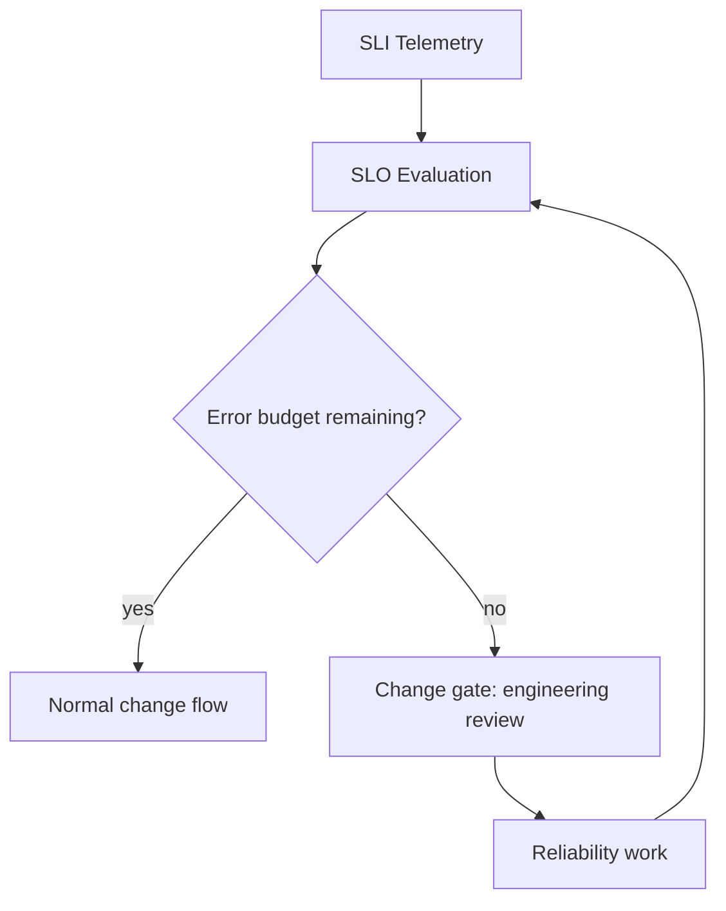
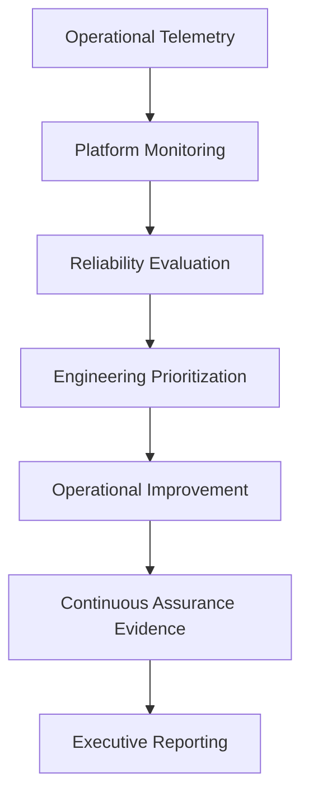

# EAODS Site Reliability Engineering Guidance and Service Levels

## 1. Purpose

This document defines how reliability is measured, targeted, budgeted, and governed for EAODS platform services. It establishes what a service level indicator, objective, and agreement are in this suite; how an error budget is derived from an objective and how its exhaustion gates production change; how services are classified for reliability; how toil is identified and reduced; how capacity is planned; and the cadence at which objectives themselves are reviewed.

It exists because the Enterprise Reference Operating Model requires that services have named owners and measurable reliability objectives, and because reliability targets that are aspirational, unowned, or unreviewed produce the failure that error-budget governance was written to prevent: release pace negotiated ad hoc, reliability eroding silently, and no objective arbiter when delivery pressure and stability conflict.

## 2. Scope and governing authority

This guidance applies to every production service operated under the Enterprise Platform Operations Center (EPOC), and to the indicators, objectives, budgets, thresholds, and reliability initiatives associated with those services.

Authority is layered. EAODS v17.3 Volume 10 is the operational north star and establishes the EPOC as the operational authority for the health, reliability, performance, and continuous improvement of the EAODS platform. Where the Enterprise Cyber Command directs cybersecurity operations, the EPOC governs the operational engineering of the platform itself — service ownership, reliability, capacity, and performance — so that governed AI-assisted operations run predictably at enterprise scale. PAT-0002 is the approved pattern that converts an exhausted error budget into an enforced delivery gate. The v8.4.0-alpha Enterprise Operational Metrics and Service Level Objectives transmission supplies the metric taxonomy, metric lifecycle, mandatory metric attributes, SLI/SLO governance attributes, and threshold and escalation governance that this document applies to platform reliability.

This document creates no governance body, no capability, and no organizational unit. Where it names one, that body or capability is named in Volume 10, in the v8.4.0-alpha transmission, or in the approved architecture siblings cited in Section 18.

## 3. Reliability operating principles

Platform operations shall remain service-oriented, measurable, observable, automation-assisted, continuously improving, evidence-driven, resilient, and constitutionally governed. Operational decisions shall prioritize long-term platform stability over short-term convenience.

Enterprise metrics — including every indicator and objective governed by this document — shall be objective, reproducible, evidence-backed, operationally relevant, comparable over time, policy-governed, continuously monitored, and independently verifiable. Three consequences follow, and the rest of this document makes them operational: an objective that cannot be reproduced from an authoritative data source is not governed; an objective that no owner is accountable for is not governed; and an objective that is never reviewed silently disables the gate that depends on it.

## 4. Reliability accountability and service ownership

The EPOC organizes reliability work across eight capability domains.

| Capability | Primary responsibility |
|---|---|
| Service operations | Daily platform operations |
| Site reliability engineering | Reliability improvement |
| Capacity engineering | Growth planning |
| Platform performance | Performance optimization |
| Service ownership | Operational accountability |
| Operational analytics | Engineering metrics |
| Platform optimization | Continuous improvement |
| Operational governance | Engineering policy enforcement |

Every production service shall identify a business owner, an engineering owner, an operational owner, an executive sponsor, a recovery authority, an architecture authority, and an assurance owner. Ownership shall remain continuously documented. A service whose ownership record is incomplete is not eligible for a governed objective, because there is no accountable party to hold the resulting error budget.

The canonical service ownership record carries `service_id`, `service_name`, `service_owner`, `operations_owner`, `executive_sponsor`, `availability_target`, `reliability_classification`, `error_budget_policy`, and `continuous_validation`. The reliability properties of a service are therefore recorded fields on that service, not commentary held elsewhere.

## 5. The service level framework

Reliability measurement uses four instruments, each with a distinct purpose.

| Instrument | Purpose |
|---|---|
| SLI | Measured operational indicator |
| SLO | Expected operational objective |
| SLA | Business commitment (where applicable) |
| Error budget | Controlled reliability risk |

These sit inside the wider enterprise metrics taxonomy — KPI for strategic performance, KRI for risk exposure, SLI for measured service behavior, SLO for target operational objective, SLA for external service commitment, OPI for operational process indicator, AQI for AI quality indicator, and CSI for cybersecurity indicator — which distinguishes them from strategic and risk measures so that a reliability objective is never reported as a strategic performance claim or the reverse.

### 5.1 Service level indicator

An SLI is a measured operational indicator of service behavior. It is measured, not asserted: it resolves to a value produced by an authoritative data source on a stated measurement frequency, and the calculation method behind it is documented. Reliability-relevant indicator families available to platform services include the platform reliability and operational resilience executive KPI families, the Domain 03 operational metrics — mean time to detect, acknowledge, contain, and recover, detection coverage, false positive rate, automation success rate, and incident recurrence rate — and the AI operational measurements: model availability, inference latency, workflow completion rate, prompt success rate, trust assurance level, policy compliance, human intervention frequency, and evaluation regression rate.

### 5.2 Service level objective

An SLO is the expected operational objective set against an indicator. Service level objectives shall be based on observed service behavior rather than aspirational targets. This is the load-bearing rule of the framework: an objective set above what the service has been observed to do produces a budget that is exhausted on arrival, and an objective set below observed behavior produces a budget that never binds. Either outcome disables the gate in Section 8 without anyone deciding to disable it.

### 5.3 Service level agreement

An SLA is a business commitment, where applicable, and an external service commitment in taxonomy terms. Not every service carries one. An SLA is downstream of an objective, never upstream of it: a commitment is made from behavior the service has been observed and objectively targeted to deliver, not adopted as the objective because it was committed.

### 5.4 Error budget

An error budget is controlled reliability risk — the difference between the objective and total reliability, expressed as the unreliability the service is permitted to spend within its measurement window. It is the mechanism by which a reliability objective becomes a delivery constraint rather than a report.

## 6. Required attributes of a governed objective

Each critical service shall establish the following, all six of which are required.

| Attribute | Required |
|-----------|:--------:|
| Service identifier | ✓ |
| Service indicator | ✓ |
| Target objective | ✓ |
| Error budget | ✓ |
| Measurement window | ✓ |
| Escalation threshold | ✓ |

Every governed metric shall additionally define a unique identifier, business objective, calculation methodology, owner, authoritative data source, reporting frequency, target threshold, alert thresholds, evidence source, and review cadence. The canonical metric schema expresses these as record fields — identifier, name, owner, business objective, calculation method, measurement frequency, target value, data source, and evidence-required flag — so that objectives are machine-readable objects under STD-0001 and STD-0002 rather than prose.

## 7. Metric and objective lifecycle

An objective moves through a fixed lifecycle: proposal, definition, governance approval, implementation, measurement, executive review, and optimization. No objective becomes binding before governance approval, and no objective remains binding without measurement and executive review.

| Stage | What must exist to leave the stage |
|-------|-----------------------------------|
| Proposal | A named service with complete ownership, and the reliability concern the objective addresses |
| Definition | Indicator, target objective, measurement window, error budget, escalation threshold, calculation methodology, authoritative data source, evidence source, and review cadence |
| Governance approval | Approval under the gate in Section 17; targets derived from observed behavior rather than aspiration |
| Implementation | Indicator emitting from its authoritative data source; budget computed; gate wired into the delivery pipeline |
| Measurement | Continuous monitoring against target, warning, and critical thresholds |
| Executive review | SLO compliance and service health presented through the Executive Control Tower |
| Optimization | Trend analysis, variance investigation, root cause analysis, corrective actions, and effectiveness validation completed |

## 8. Error budgets and the gating policy

PAT-0002 is the approved pattern. Delivery pressure and reliability pull in opposite directions; without an objective arbiter, release pace is negotiated ad hoc and reliability erodes silently. The pattern answers a single question — how teams decide, without escalation battles, when to ship and when to stop shipping and stabilize.

Objectives are defined from observed service behavior and an error budget is derived per service. While budget remains, changes flow normally. Exhausted error budgets shall trigger engineering review before additional production changes: further production change for that service is gated on engineering review until reliability work restores headroom. **The gate is policy, not judgment — it is enforced in the delivery pipeline.**

The gating policy is expressed on the service record itself through `error_budget_policy`, which the reference record carries as `Enforced`. A service whose record does not carry an enforced error-budget policy is not gated by this document, and the absence is visible as a field value rather than as an undocumented practice.

Three consequences are accepted with the pattern and shall be managed rather than assumed away:

1. Reliability disputes become arithmetic instead of negotiation. This is the intended benefit and it is only available while the arithmetic is trusted.
2. The gate requires trustworthy SLI telemetry and honest objectives based on observed behavior, not aspiration. Telemetry integrity is therefore a reliability control, not a convenience.
3. A gamed or stale objective silently disables the gate. Objectives shall be reviewed on the Volume 10 cycle in Section 15, and threshold modifications require governance approval.

SLO exceptions shall initiate corrective action reviews. Execution of the response to an exhausted budget is carried by the error-budget exhaustion runbook (RUN-0002), which this document does not restate.

## 9. Reliability tiers and service classification

Reliability classification is a recorded field, `reliability_classification`, held on the canonical service ownership record beside `availability_target`, `error_budget_policy`, and `continuous_validation`. Classification therefore travels with the service and is auditable as data.

The reference service record (SVC-00387) is classified `Tier1`, with an availability target of 99.95%, an enforced error-budget policy, and continuous validation enabled. Among the sources read for this document — Volume 10, the v8.4.0-alpha operational metrics transmission, and PAT-0002 — this is the single worked classification, and none of those three enumerates a tier ladder below Tier 1 or assigns availability targets to other tiers. This document therefore states none. Additional tiers are established through the register in Section 10 under the gate in Section 17, subject to constraints the sources do state:

- targets at every tier are derived from observed service behavior, not from the tier label;
- a tier does not alter the ownership requirements in Section 4, which apply to every production service;
- a tier that does not carry an enforced error-budget policy shall record that fact in `error_budget_policy` rather than leave the gate ambiguous.

## 10. The service level objective register

The SLO Register is a standard generated artifact of the Artifact Factory, alongside the Enterprise KPI Catalog, Executive Performance Dashboard, Cybersecurity Operations Scorecard, AI Operations Performance Report, KRI Trend Analysis, Continuous Improvement Register, and Annual Enterprise Performance Review.

Each register record carries the following fields. No sample record is minted here; identifiers are allocated under STD-0001.

| Field | Source of the requirement |
|-------|---------------------------|
| Service identifier | Required SLI/SLO governance attribute; ties the record to the service ownership record |
| Service indicator | Required attribute; names the measured indicator |
| Target objective | Required attribute; derived from observed behavior |
| Error budget | Required attribute; the permitted unreliability for the window |
| Measurement window | Required attribute; the period over which budget is computed |
| Escalation threshold | Required attribute; the point at which escalation is raised |
| Owner and business objective | Mandatory metric attributes; the accountable party and what the objective serves |
| Calculation methodology and authoritative data source | Mandatory metric attributes; how the indicator resolves to a value, and from which system of record |
| Reporting frequency and alert thresholds | Mandatory metric attributes; cadence of measurement and reporting, and warning and critical points |
| Evidence source and review cadence | Mandatory metric attributes; where assurance evidence is drawn from, and when the objective is reassessed |

Register records follow the lifecycle in Section 7. A record is not retired by deletion: an objective replaced by a later one is superseded, consistent with the operating model requirement that historical content be preserved and that current approved artifacts take precedence over earlier drafts. Register entities maintain governed relationships in the Enterprise Knowledge Graph with business objectives, controls, services, AI agents, operational procedures, evidence, executive decisions, maturity assessments, and corrective actions.

## 11. Thresholds, escalation, and corrective action

Each metric shall define a target range, a warning threshold, a critical threshold, automatic notification criteria, an executive escalation trigger, and a corrective action owner. Threshold modifications require governance approval — a threshold that any team can move is not a control. Escalation is therefore graduated and pre-declared rather than improvised at the moment of breach: automatic notification fires on its stated criteria, executive escalation fires on its stated trigger, and a named corrective action owner exists before either fires.

## 12. Toil reduction and reliability engineering

Reliability engineering shall focus on reducing operational toil, improving service stability, increasing automation maturity, validating resilience, optimizing recovery, and reducing incident recurrence. Reliability initiatives shall be prioritized using measurable operational data — not by advocacy, seniority, or the recency of the last incident.

- Reducing operational toil — measured against automation success rate and human intervention frequency.
- Improving service stability — measured against service level indicators and objective attainment.
- Increasing automation maturity — measured against automation success rate and workflow completion rate.
- Validating resilience — measured against `continuous_validation` on the service record and resilience validation under Domain 03 integration.
- Optimizing recovery — measured against mean time to recover and mean time to contain.
- Reducing incident recurrence — measured against incident recurrence rate.

Reliability work released by an error-budget gate is prioritized on this basis, which closes the loop in Section 8: the gate stops change, measurable operational data selects the reliability work, and restored headroom reopens the flow.

## 13. Capacity planning

Capacity engineering is an EPOC capability domain whose primary responsibility is growth planning, and one of the four operational lines — with service operations, site reliability engineering, and platform performance — that report into Continuous Assurance and, through it, to the Executive Control Tower.

Capacity forecasting runs on the Quarterly Capacity Forecast cadence in Section 15 and consumes the same operational telemetry pipeline as reliability evaluation, so that growth planning and reliability prioritization draw on one measured record of service behavior. Forecasts are integration-bearing: they touch the Enterprise Automation Fabric, Enterprise Data Platform, Enterprise Identity Platform, DevSecOps Platform, and Business Continuity Program among the Volume 10 integration points. The sources read for this document establish capacity engineering's accountability, cadence, reporting line, and data basis. They do not specify a forecasting method, a headroom threshold, or a saturation model, and none is asserted here; those are defined through the register and gate in Sections 10 and 17.

## 14. Telemetry, evidence, and executive reporting

Reliability evidence follows one workflow from measurement to executive visibility.

Continuous Assurance independently verifies operational evidence; verification does not sit with the team whose objective is being verified. The Executive Control Tower presents SLO compliance, service health, AI operational quality, enterprise KPI scorecards, KRI heat maps, cybersecurity trends, capability maturity, and executive action tracking. Executive scorecards summarize strategic objectives, KPI attainment, KRI trends, SLO compliance, capability maturity, operational risk, corrective action progress, and executive decisions. Continuous improvement cycles shall include trend analysis, variance investigation, root cause analysis, corrective actions, effectiveness validation, and executive review.

## 15. Review cadence for objectives

Objectives, budgets, and forecasts are reviewed on the Volume 10 operational cycle. PAT-0002 makes this cadence load-bearing rather than administrative: a stale objective disables the gate without any decision being taken to disable it.

| Forum | Frequency | Reliability subject |
|-------|-----------|--------------------|
| Operations Review | Weekly | Service health, active gates, corrective action progress |
| Reliability Review | Monthly | Objective attainment, error budget consumption, incident recurrence, reliability prioritization |
| Capacity Forecast | Quarterly | Growth planning and capacity position |
| Operational Excellence Certification | Annual | Whole-of-platform operational assurance |

The enterprise performance standard that governs metric definitions carries a quarterly review cycle, and every governed metric additionally carries its own review cadence as a record field under Section 10. Where a service's recorded review cadence is more frequent than the forum cadence above, the record governs; the forum cadence is a floor, not a ceiling.

## 16. Requirements on governed service artifacts

Every governed service artifact shall identify its governing authority, accountable owner, approval workflow, review cadence, and escalation path. For a service under this document that means, at minimum: a complete ownership record under Section 4; the six required objective attributes under Section 6; the mandatory metric attributes under Section 6 expressed as register fields under Section 10; a recorded `reliability_classification`, `availability_target`, `error_budget_policy`, and `continuous_validation` state; and declared thresholds and escalation triggers under Section 11. A service that names no accountable owner and no authoritative data source is not governed by this document and is not eligible for acceptance.

## 17. Human review gate

Approval requires confirmation by Platform Engineering Leadership and the Program Owner that:

- no capability domain, ownership role, metric family, forum, or cadence has been introduced beyond those in the cited sources;
- no reliability tier, availability target, error budget value, or threshold has been asserted that the cited sources do not state;
- objectives remain derived from observed service behavior rather than aspiration;
- the error-budget gate remains policy enforced in the delivery pipeline rather than case-by-case judgment;
- Volume 10 remains the operational north star and this document does not redefine it.

Because changes to this document may affect SLI/SLO targets, threshold governance, and performance reporting standards, material change additionally passes the review established for that class of change: the Enterprise Governance Board, Executive Leadership, Security Operations Leadership, Enterprise Architecture Review Board, AI Governance Council, Internal Audit, Enterprise Risk Committee, and the Enterprise Performance Review Board. Enterprise approval of the governing volume itself remains with the roster named in Volume 10, which includes the Chief Technology Officer, Chief Information Officer, Chief Information Security Officer, Platform Engineering Leadership, Site Reliability Engineering Leadership, Enterprise Architecture Review Board, AI Governance Council, Continuous Assurance Office, Internal Audit, the Enterprise Cyber Command Director, and the Executive Governance Council.

## 18. Sources and traceability

| Source (repo-relative path) | Contribution |
|-----------------------------|--------------|
| docs/frameworks/EAODS-v17.3/volume-10-platform-operations.md | EPOC as operational authority and its relation to Enterprise Cyber Command (Sections 1, 2); engineering principles (Section 3); capability domains table and service ownership framework (Section 4); canonical service ownership record fields and the SVC-00387 reference record — `reliability_classification: Tier1`, `availability_target: 99.95%`, `error_budget_policy: Enforced`, `continuous_validation: Enabled` (Sections 4, 8, 9); service level framework table and the observed-behavior rule (Section 5); exhausted-budget trigger for engineering review (Section 8); reliability engineering model and measurable-data prioritization (Section 12); capacity engineering capability, reference-architecture reporting lines, and integration points (Section 13); operational telemetry-to-executive-reporting workflow and Continuous Assurance verification (Section 14); Weekly Operations Review, Monthly Reliability Review, Quarterly Capacity Forecast, and Annual Operational Excellence Certification cadence (Section 15); Volume 10 enterprise approval roster (Section 17) |
| history/original-sources/conversation-evidence/v6.7-v16-band/EAODS-v8.4.0-alpha-enterprise-operational-metrics-service-level-objectives-slos.md (v8.4.0-alpha, conversation-derived evidence) | Performance management principles applied to indicators and objectives (Section 3); enterprise metrics taxonomy placing SLI, SLO, and SLA among KPI, KRI, OPI, AQI, and CSI (Section 5); Domain 03 operational metrics, AI operational performance measurements, and executive KPI families used as indicator families (Sections 5.1, 12); SLI/SLO governance required-attributes table (Section 6); mandatory metric attributes and canonical metric schema fields (Sections 6, 10); metric lifecycle stages (Section 7); SLO exceptions initiating corrective action reviews (Section 8); threshold and escalation governance, and governance approval for threshold modification (Sections 8, 11); Artifact Factory outputs including the SLO Register (Section 10); Knowledge Graph relationship set (Section 10); Executive Control Tower dashboards, executive scorecard model, and continuous optimization cycle (Section 14); quarterly review cycle for the metrics standard (Section 15); multi-body review roster for changes to SLI/SLO targets and threshold governance (Section 17) |
| docs/patterns/PAT-0002-error-budget-gated-delivery.md | Context and problem statement for the gate (Sections 1, 8); the solution — objectives from observed behavior, budget per service, normal flow while budget remains, engineering review gate on exhaustion, gate as policy enforced in the delivery pipeline (Section 8); gating flow diagram (Section 8); consequences — reliability disputes as arithmetic, dependence on trustworthy telemetry and honest objectives, and stale or gamed objectives silently disabling the gate (Sections 3, 8, 15); governing control expressed as `error_budget_policy: Enforced` (Sections 8, 9) |
| docs/architecture/ENTERPRISE_OPERATING_MODEL.md (EAODS-ARCH-EOM-001) | Principle that services have named owners and measurable reliability objectives, as the reason this document exists (Section 1); Volume 10 as operational north star and its enumerated elements — SRE, service ownership, SLIs and SLOs, error budgets, telemetry, capacity, resilience, continual improvement (Sections 2, 17); preservation of historical content and precedence of current approved artifacts, applied to superseded register records (Section 10) |
| docs/architecture/architecture-governance-model.md (EAODS-ARCH-GOV-001) | House style — front matter fields, numbered sections, governed prose and table conventions, human review gate and sources-and-traceability formatting; the pattern of stating purpose against the failure the document prevents (Section 1); layered-authority framing in scope (Section 2); the requirement that every governed artifact name its governing authority, accountable owner, approval workflow, review cadence, and escalation path, and that an artifact naming none is not eligible for acceptance (Section 16) |
| docs/runbooks/RUN-0002-error-budget-exhaustion-response.md | Referenced by identifier and title only, as the runbook that executes the response to an exhausted error budget; no procedural content is drawn from it into this document (Section 8) |
