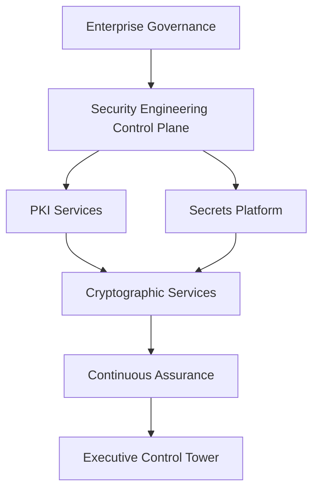

# EAODS Identity, Access and Secrets Management Standard

## 1. Purpose

This standard consolidates the identity, access and secrets requirements of Cybersecurity Domain 03 into one normative document. It states how identities are created, authenticated, authorized, monitored, governed and retired; how privileged and delegated authority is bounded; and how secrets, keys and certificates are issued, distributed, rotated and revoked.

Identity is treated as the primary security control plane for the enterprise. No operation shall execute without an attributable identity.

## 2. Scope

This standard applies to every identity category that transacts with EAODS platform capabilities: workforce, customer, privileged, service, workload, device, AI agent and third-party identities, together with the secrets and cryptographic material those identities depend on. It governs the identity control plane itself — the identity authority, policy services, the secrets platform and PKI services — and every protected service that relies on their verdicts.

## 3. Governing principles

1. Never assume trust; verify every request.
2. Authenticate every identity; authorize every action.
3. Enforce least privilege and continuously evaluate risk.
4. Keep authorization separate from authentication.
5. Make authorization decisions explicit; implicit privilege inheritance is prohibited.
6. Preserve complete auditability of identity, authorization and cryptographic events.
7. Maintain explicit trust boundaries and separation of duties.
8. Grant delegated authority only with traceability, scope, duration and a revocation method.

Trust shall be continuously evaluated rather than permanently granted.

## 4. Identity taxonomy

Every identity category shall have a documented lifecycle owner and a globally unique identifier registered under the identifier discipline of STD-0001.

| Identity domain | Examples | Governance focus |
|---|---|---|
| Workforce | Employees, contractors | Employment lifecycle |
| Customer | External users | Privacy and consent |
| Privileged | Administrators | Elevated access governance |
| Service | APIs and applications | Machine authentication |
| Workload | Containers, VMs, serverless | Runtime identity |
| Device | Managed endpoints | Device trust |
| AI agent | Autonomous systems | Operational authorization |
| Third-party | Vendors and partners | Federation and contractual controls |

Two further execution-scoped identity types are recognised for governed work: the **workflow identity**, a temporary execution identity associated with a single workflow, and the **emergency identity**, a restricted break-glass authority reserved for exceptional circumstances.

## 5. Trust domains and zones

The enterprise trust fabric spans human, workload, machine and AI agent identity, all of which resolve through authentication services, then authorization services, then policy enforcement, then continuous assurance. Administrative authorities and audit authorities are distinct trust domains and shall not be collapsed into operational roles.

| Zone | Characteristics |
|---|---|
| Executive | Governance, approval, strategic reporting |
| Operational | Workflow execution and orchestration |
| Knowledge | Retrieval, indexing, evidence association |
| Publishing | Release preparation and publication |
| External | Third-party systems and integrations |

Requests that cross a trust zone require policy evaluation. A caller's presented identity versus its actual identity is the trust boundary recorded in THR-0001; everything downstream of a successful verification inherits that boundary's integrity.

## 6. Identity lifecycle

The canonical lifecycle is: request, identity proofing, provisioning, authentication, authorization, continuous verification, privilege review, deprovisioning. Every lifecycle transition shall generate an immutable audit event.

Each governed identity shall carry a canonical record. The registered example identity `ID-009428` records the required attribute set:

```yaml
identity_id: ID-009428
identity_type: Workload
owner: PlatformEngineering
authentication_method: MutualTLS
authorization_profile: DetectionEngineeringRuntime
risk_level: Moderate
certificate_authority: EnterprisePKI
lifecycle_state: Active
continuous_verification: Enabled
```

## 7. Authentication requirements

Authentication shall support phishing-resistant methods where feasible, federated identity, certificate-based authentication, workload authentication, service authentication, adaptive authentication and step-up authentication for elevated risk. Authentication mechanisms shall additionally support organizational identity providers, cryptographic credentials, hardware-backed authentication where available, multi-factor authentication for privileged operations, service-to-service authentication and credential rotation.

Authentication policy shall vary according to risk and business context. Authentication events shall be recorded in the audit log.

## 8. Authorization model

Authorization decisions shall evaluate the verified identity, the assigned role, workflow participation, the requested resource and action, classification level and resource sensitivity, business context, device posture where available, environmental signals, governing policy, approval state and the policy evaluation outcome.

Authorization remains architecturally separate from authentication. Decisions are explicit; no privilege is inherited implicitly.

## 9. Policy decision architecture

```text
Access Request → Identity Verification → Risk Evaluation
→ Policy Decision Point → Policy Enforcement Point → Audit Logging
```

Policies shall be version-controlled and independently reviewed. The governed execution path extends this decision flow with role validation, approval verification, resource authorization, execution and audit recording.

## 10. Role model and separation of duties

| Role | Primary responsibilities |
|---|---|
| Executive Sponsor | Strategic approval |
| Governance Administrator | Policy administration |
| Platform Administrator | Runtime administration |
| Documentation Lead | Documentation governance |
| Security Reviewer | Security validation |
| Workflow Operator | Workflow execution |
| Auditor | Independent verification |
| Observer | Read-only operational visibility |

Organizations may extend the role model while preserving documented authorization boundaries.

## 11. Privileged access and delegated authority

Privileged operations require multi-factor authentication and step-up authentication at elevated risk. Delegation shall never exceed the authority possessed by the delegating identity, and shall record the following attributes.

| Required attribute | Purpose |
|---|---|
| Delegating identity | Accountability |
| Receiving identity | Traceability |
| Scope | Authorized activities |
| Duration | Time limitation |
| Approval reference | Governance linkage |
| Revocation method | Immediate withdrawal capability |

Emergency administrative access procedures are part of identity resilience and are exercised through the emergency identity type, under the same audit requirements as routine privileged access.

## 12. Machine, workload and agent identity

Every service identity shall maintain a unique identifier, an owner, an operational purpose, authorized interfaces, a credential lifecycle, a last validation date, a rotation schedule and a current status. Unused service identities shall be retired through the Change Management process.

Every AI system shall possess a unique enterprise identity, a defined operational owner, an authorized capability scope, bounded permissions, complete audit logging, lifecycle governance and revocation capability. AI systems shall never inherit unrestricted enterprise privileges; AI agents and automation remain least privileged, observable, auditable, bounded by policy, subject to human approval for material actions, and traceable to owners, controls and evidence.

Service-to-service authentication is implemented per PAT-0001 and governed by control `EAODS-CTRL-000184`: short-lived scoped credentials issued by a central identity authority, verified per privileged call for signature, expiry and revocation, failing closed on any ambiguity, with allow-listed scopes per role and delegation off by default. The Enterprise Orchestrator validates identity context before assigning work to agents; Publishing Automation verifies publication authority before releasing externally visible artifacts.

## 13. Secrets platform

Enterprise secrets management shall govern API credentials, workload secrets, encryption keys, certificates, signing keys and automation credentials. Secrets shall never be embedded in application code or infrastructure definitions.

The security engineering control plane places PKI Services and the Secrets Platform alongside runtime protection and platform integrity, all feeding cryptographic services and continuous assurance:



Provisioning follows a fixed order: platform provisioning, security baseline, cryptographic provisioning, secrets distribution, runtime protection, integrity validation, continuous assurance. PKI and secrets ownership shall be assigned before a platform is certified.

## 14. Key and certificate management

Certificate governance shall include issuance, validation, rotation, renewal, revocation and archival. Certificate expiration shall be continuously monitored. The cryptographic lifecycle shall be documented and recovery procedures tested as a condition of platform security certification.

## 15. Rotation and revocation

| Requirement | Applies to | Basis |
|---|---|---|
| Documented rotation schedule and last validation date | Service identities | Service identity governance |
| Credential rotation support in the authentication mechanism | All authenticated identities | Authentication requirements |
| Short-lived credentials issued per call context | Workload and agent identities | PAT-0001 · EAODS-CTRL-000184 |
| Central revocation checked on verification; no long-lived verification caches | Protected services | THR-0001 revocation-lag mitigation |
| Revocation capability for every AI agent identity | AI agent identities | AI identity governance |
| Rotation, renewal, revocation and archival | Certificates and signing keys | Certificate lifecycle |

Rotation is a lifecycle property of the identity record, not an incident response measure. Credential lifetime tuning trades availability against exposure and is an explicit, reviewable decision rather than a default.

## 16. Identity telemetry and audit

Identity observability shall collect authentication attempts, authorization decisions, policy evaluations, privileged actions, federation events, certificate operations and lifecycle changes, and shall integrate with enterprise observability.

Authorization logs shall record identity, timestamp, requested action, authorization outcome, governing policy, workflow identifier, resource identifier and approval reference. Audit records shall be immutable after creation. Knowledge Memory associates identity metadata with evidence, workflows and generated artifacts to strengthen provenance. The Executive Control Tower displays active identities, privileged operations, delegated authorities, authorization failures and authentication trends.

## 17. Resilience of the identity control plane

Identity resilience shall include redundant identity providers, replicated policy services, resilient certificate infrastructure, emergency administrative access procedures and recovery validation exercises. Identity recovery shall be periodically tested.

The identity authority is classified Tier 1 in THR-0001: issuer compromise is the highest-impact scenario, recovery proceeds through governed orchestration under PAT-0004 and RUN-0001, and issuance anomalies feed continuous assurance, with anomalies triggering RUN-0003 and immediate Enterprise Cyber Command escalation.

## 18. Threat alignment

| THR-0001 scenario | Requirement in this standard |
|---|---|
| Credential theft and replay | Section 12 short-lived credentials, per-call verification, fail closed |
| Scope escalation | Sections 8 and 12 allow-listed scopes per role, delegation off by default |
| Identity authority compromise | Section 17 Tier 1 resilience, governed recovery, assurance monitoring |
| Revocation lag | Section 15 central revocation on verification, no long-lived caches |

Residual risk is unchanged from THR-0001: a credential remains valid between issuance and theft detection for its full short lifetime.

## 19. Conformance measures

| Measure | Target |
|---|---|
| Authenticated executions | 100% |
| Authorization decision logging | 100% |
| Privileged MFA coverage | 100% |
| Orphaned service identities | 0 |
| Delegation expiration compliance | 100% |
| Unauthorized execution attempts | Continuously monitored |

## 20. Integration points

Enterprise Identity Platform; Enterprise Service Catalog; Enterprise Data Platform; Automation Fabric and Automation Platform; Enterprise DevSecOps Platform; Security Validation; Enterprise Cyber Command; Continuous Assurance; Enterprise Knowledge Graph; Enterprise Digital Twin; Executive Control Tower.

## 21. QA checklist

- [ ] YAML front matter validated; identity taxonomy and lifecycle owners documented.
- [ ] Trust zones and cross-zone policy evaluation documented.
- [ ] Authentication and authorization requirements separated and complete.
- [ ] Role model, privileged access and delegation attributes documented.
- [ ] Machine, workload and AI agent identity governance documented.
- [ ] PKI and secrets ownership assigned; cryptographic lifecycle documented.
- [ ] Rotation, renewal and revocation requirements stated per identity class.
- [ ] Identity telemetry and immutable audit requirements documented.
- [ ] Threat alignment to THR-0001 recorded; recovery procedures tested and evidence registered.
- [ ] Human review gate completed.

## 22. Human review gate

Approval requires review by the Security Architecture Review Board and final approval by the Program Owner, consistent with the decision and accountability model of the Enterprise Operating Model and the change discipline of ADR-0002. Changes affecting identity models, authorization logic, delegated authority, privileged operations, trust boundaries, or key and secrets lifecycles shall undergo architecture review, governance validation, security review and executive approval before implementation.

Reviewers shall confirm that identity remains the primary control plane, that authorization stays separate from authentication, that AI authority remains bounded, that no identifier is used before registration under STD-0001, and that historical drafts do not silently redefine current architecture.

## 23. Sources and traceability

| Source (repo-relative) | Contribution |
|---|---|
| `docs/frameworks/EAODS-v17.3/volume-04-identity-zero-trust.md` | Zero Trust principles; identity domain taxonomy; canonical identity record `ID-009428`; identity lifecycle; authentication architecture; authorization inputs; policy decision architecture; secrets and cryptographic governance scope; certificate lifecycle; identity telemetry; AI identity governance; identity resilience; integration points. |
| `docs/frameworks/EAODS-v17.3/volume-08-security-engineering.md` | Security engineering control plane with PKI Services and Secrets Platform; provisioning-to-assurance workflow; PKI and secrets ownership, cryptographic lifecycle and tested-recovery QA conditions; integration points. |
| `history/original-sources/EAODS_AI_Operator_Suite_transmissions/units/v4.6-v4.21-longgap/EAODS-v4.12-alpha-enterprise-trust-identity-authorization-architecture-standard.md` | Identity-first execution objectives; identity types including workflow and emergency identities; trust zone table; authentication requirements; explicit authorization and prohibition of implicit inheritance; role model; delegation attributes; service identity governance record; audit record fields and immutability; conformance measures; Executive Control Tower, Orchestrator, Knowledge Memory and Publishing Automation integration. |
| `docs/threat-models/THR-0001-compromised-service-identity.md` | Trust boundary statement; threat scenarios and mitigation mapping in section 18; revocation-lag requirement; Tier 1 classification of the identity authority; residual risk; assurance escalation via RUN-0001 and RUN-0003 with PAT-0004 recovery. |
| `docs/patterns/PAT-0001-zero-trust-service-identity.md` | Service-to-service identity solution shape and its governing control `EAODS-CTRL-000184`. |
| `docs/architecture/ENTERPRISE_OPERATING_MODEL.md` | House structure and governed-prose style; AI operating boundaries; decision and accountability model referenced in the human review gate. |
| `docs/standards/canonical-terminology-and-identifiers.md` (STD-0001) | Identifier registration-before-use discipline applied to identity records; ADR-0002 change authority. |
