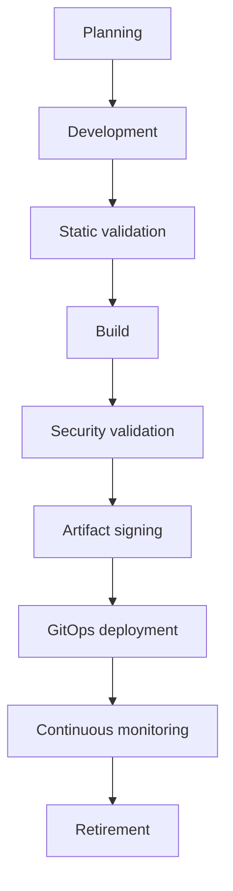

# EAODS Secure Development Lifecycle Standard

## 1. Purpose and scope

This standard defines how Domain 03 platform services, AI components, and their supporting infrastructure are designed, built, validated, released, and operated under a single governed lifecycle. It normalizes three bodies of prior work into one enforceable sequence: the secure delivery lifecycle and engineering quality gates of EAODS v17.3 Volume 7, the AI software supply-chain, provenance, and artifact-integrity requirements of the v7.7 standard, and the secure configuration and hardening baselines of the v4.21 standard.

Scope covers every executable artifact that reaches an EAODS environment: application and infrastructure code, AI models, AI agents, governed prompts, orchestration workflows, policy objects, approved datasets, evaluation suites, container images, infrastructure definitions, and configuration bundles.

Delivery pipelines shall produce verifiable, reproducible, and auditable releases. Security is embedded across every lifecycle stage rather than applied as a terminal review.

## 2. Governing principles

Platform delivery shall remain declarative, reproducible, version-controlled, policy-driven, continuously validated, cryptographically verifiable, observable, and constitutionally governed.

Enterprise artifacts shall be uniquely identifiable, cryptographically verifiable, immutable after publication, reproducible where technically feasible, policy-governed, continuously monitored, fully attributable, and lifecycle managed.

Every configuration baseline shall satisfy secure-by-default, least privilege, defense in depth, Zero Trust, explicit authorization, configuration as code, continuous validation, immutable evidence, and continuous improvement.

## 3. Canonical lifecycle

The secure delivery lifecycle proceeds through eight stages. The artifact lifecycle and the configuration-baseline lifecycle run inside that sequence rather than beside it.

The artifact view of the same lifecycle runs design, development, security validation, signing, publication, deployment, continuous verification, and retirement. The baseline view runs security benchmark, baseline development, architecture review, security approval, version publication, deployment, continuous validation, exception handling, and periodic review. A change that alters code, artifacts, and configuration traverses all three views at the corresponding stage boundary.

## 4. Stage gates

Each stage terminates in a gate. A gate has explicit validations, produces evidence, and blocks progression when unsatisfied. Pipeline failures shall block promotion until resolved or formally waived through documented exception approval.

| # | Stage | Gate validations | Evidence produced | Blocking rule |
|---|---|---|---|---|
| 1 | Planning | Repository ownership, branching strategy, release process, and dependency policy defined; supply-chain risk tier assigned | Repository governance record | No governed repository, no pipeline |
| 2 | Development | Mandatory code review; protected branches; commit signing policy; secret scanning | Review and signing records | Unreviewed change cannot merge |
| 3 | Static validation | Static analysis; code quality; infrastructure definition peer review | Static analysis report | Findings above policy threshold stop the build |
| 4 | Build | Authenticated source retrieval; isolated build environment; approved toolchain; successful compilation; automated testing; immutable build logs | Build integrity record | Manual modification of production build output is prohibited |
| 5 | Security validation | Security scanning; dependency validation; licence and advisory review; infrastructure validation; integrity validation before publication | Validation summary | Integrity failure prevents deployment pending investigation |
| 6 | Artifact signing | Signature applied under the enterprise signing profile; provenance record completed; SBOM generated | Signed artifact and provenance record | Unsigned production artifacts are prohibited |
| 7 | GitOps deployment | Deployment readiness; promotion approval criteria met; production approval under human authority; integrity validation before deployment | Release attestation | Deployment not traceable to a reviewed commit is a drift event |
| 8 | Continuous monitoring | Runtime verification; baseline compliance validation; drift detection; dependency and signature monitoring | Assurance evidence | Critical drift triggers vulnerability reassessment |

## 5. Engineering quality gates for production promotion

Every production promotion shall validate successful compilation, automated testing, code quality, static analysis, dependency validation, security scanning, infrastructure validation, and deployment readiness. These eight checks are cumulative: a promotion inherits the gate results of all preceding stages, and a waived check is recorded as a governed exception rather than silently cleared.

## 6. Repository, infrastructure, and GitOps governance

Every repository shall define ownership, branching strategy, protected branches, review requirements, commit signing policy, release process, dependency policy, and archival procedures. Repository governance shall be enforced through platform policy, not convention.

Infrastructure definitions shall remain declarative, undergo peer review, support deterministic deployment, include rollback capability, produce audit evidence, and maintain version history. Manual production infrastructure changes shall require documented exception approval.

GitOps implementations shall ensure that Git is the authoritative desired state, that deployments occur through approved controllers, that production changes are traceable to reviewed commits, that configuration drift is detected and reported, and that reconciliation activities generate audit events. Emergency overrides shall require post-implementation review.

## 7. Release promotion and rollback

| Environment | Purpose | Promotion condition |
|---|---|---|
| Development | Active engineering | Stage 1–3 gates satisfied |
| Integration | Cross-service validation | Stage 4–5 gates satisfied |
| Staging | Production simulation | Stage 6 gate satisfied; release attestation drafted |
| Production | Enterprise operations | Documented approval criteria met; production approval executive-controlled |

Rollback procedures shall define triggering conditions, recovery objectives, validation steps, communication requirements, and post-rollback review. Rollback testing shall occur periodically rather than on first use during an incident.

## 8. AI software supply-chain security

### 8.1 Artifact governance

Every artifact shall possess a globally unique enterprise identifier and carry type, version, owner, status, integrity status, signature profile, provenance reference, and deployment scope. The governed artifact types are source code, AI model, AI agent, prompt, workflow, policy, dataset, evaluation suite, container image, infrastructure definition, and configuration bundle.

### 8.2 Provenance

Every production artifact shall maintain origin repository, originating organization, build pipeline identifier, build timestamp, approving authority, validation evidence, dependency inventory, and deployment history. Provenance records shall remain immutable after publication and shall be independently verifiable.

### 8.3 Dependency and third-party governance

Production artifacts shall maintain a governed dependency inventory covering direct dependencies, transitive dependencies, licensing information, maintenance status, known security advisories, and approval status, under continuous monitoring for newly disclosed risks.

Third-party artifacts shall undergo supplier evaluation, security review, dependency analysis, licence review, operational approval, and periodic reassessment. Unsupported or unmaintained components shall require documented risk acceptance before continued use.

### 8.4 Integrity verification points

Integrity validation shall occur before publication, before deployment, during runtime, after restoration, and during periodic assurance reviews. Runtime environments shall verify artifact signature, approved version, deployment authorization, configuration integrity, dependency integrity, workload identity, and policy compliance. Verification failures shall generate security events within the Enterprise Security Data Fabric.

### 8.5 Release attestation

Every production release shall include a release identifier, artifact inventory, validation summary, approval authority, provenance reference, integrity status, and deployment scope. Release attestations become governed evidence objects.

### 8.6 Supply-chain risk classification

| Tier | Description |
|---|---|
| SC-0 | Experimental |
| SC-1 | Internal development |
| SC-2 | Operational |
| SC-3 | Business-critical |
| SC-4 | High-impact enterprise |
| SC-5 | Mission-critical infrastructure |

Supply-chain controls shall increase proportionally with artifact criticality. The tier assigned at the planning gate determines the depth of review, the reproducibility expectation, and the reassessment frequency applied to the artifact for the remainder of its lifecycle.

## 9. Hardening baselines

Baselines apply to operating systems, identity services, network infrastructure, cloud platforms, containers, Kubernetes, endpoints, applications, databases, AI platforms, source control, and security tooling. The baselines most load-bearing for this lifecycle are:

| Domain | Minimum controls |
|---|---|
| Source control | Branch protection; signed commits where applicable; secret scanning; dependency scanning; mandatory code review; release provenance; immutable tags; automated security workflows |
| Containers | Trusted base images; image signing; vulnerability scanning; non-root execution; minimal packages; immutable deployment; secret injection; runtime monitoring |
| Kubernetes | Namespace isolation; RBAC; admission policies; pod security standards; audit logging; network policies; image verification; secret encryption |
| Cloud | Least privilege IAM; MFA for privileged users; logging enabled; encryption at rest and in transit; storage exposure review; public resource inventory; key rotation |
| Server | Unnecessary services disabled; unused accounts removed; SSH hardened; RDP restricted; centralized logging; NTP and secure time synchronization; package integrity verification |
| AI infrastructure | Prompt boundary enforcement; tool allowlists; retrieval isolation; context separation; model version control; inference logging; approval workflows; memory governance; secret isolation; output validation |

Identity baselines (MFA, least-privilege roles, administrative separation, conditional access, session expiration, privileged account inventory, credential rotation), endpoint baselines (full disk encryption, EDR, secure boot, automatic updates, local firewall, administrative restrictions, screen lock), and network baselines (deny-by-default, segmentation, encrypted management interfaces, secure DNS, authenticated administration, management-plane isolation) apply to the environments that host the pipeline itself.

Deployed configuration passes through automated validation, baseline comparison, deviation detection, risk assessment, remediation, compliance verification, and executive reporting.

| Drift level | Description | Lifecycle consequence |
|---|---|---|
| Authorized | Approved deviation | Recorded as a governed exception |
| Temporary | Planned operational change | Time-bounded; reverts to baseline |
| Unplanned | Unexpected change requiring investigation | Investigated before further promotion |
| Critical | Security-impacting deviation | Automatically triggers vulnerability reassessment |

## 10. AI-assisted engineering boundaries

AI assistance may support code review recommendations, pipeline optimization, deployment planning, dependency analysis, infrastructure validation, and release documentation, and may assist with baseline comparison, configuration summarization, policy validation, compliance mapping, drift detection, remediation recommendations, and documentation generation.

Final production approval shall remain under human governance, and AI shall not autonomously deploy production configuration changes without human approval. The instruction-injection exposure of AI components participating in the pipeline is modelled in THR-0002; the prompt-boundary, tool-allowlist, and output-validation baselines in section 9 are the corresponding configuration requirements.

## 11. Delivery telemetry

Platform delivery telemetry shall include deployment duration, deployment success rate, rollback frequency, change failure rate, recovery time, approval latency, and artifact verification status. Configuration telemetry shall include baseline compliance percentage, configuration drift rate, unauthorized changes, exception count, hardened asset percentage, remediation time, policy compliance score, and validation coverage.

Metrics shall feed enterprise operational dashboards. Continuous assurance shall monitor artifact integrity, provenance completeness, dependency changes, signature validity, unauthorized modifications, deployment drift, and release compliance.

## 12. Traceability to repository objects

| Lifecycle element | Related governed object |
|---|---|
| Change gating on reliability headroom | PAT-0002 |
| Assurance evidence emission from gates 5–8 | PAT-0003 |
| AI components participating in the pipeline | THR-0002 |
| Evidence integrity for attestations and provenance | THR-0003 |
| Compliance deviation and drift response | RUN-0003 |
| Artifact and object identifier discipline | STD-0001, STD-0002 |
| Traceability mandate | ADR-0002 |

Only verified artifacts shall participate in enterprise cybersecurity workflows.

## 13. Human review gate

Approval of this standard requires confirmation that the eight lifecycle stages and their gates are enforceable in pipeline policy; that unsigned production artifacts and manually modified production build outputs remain prohibited; that provenance and release attestation are complete and immutable; that hardening baselines are validated continuously rather than at deployment only; that critical drift triggers vulnerability reassessment; and that final production approval remains under human authority.

Changes affecting artifact signing requirements, provenance controls, build pipeline governance, dependency management policies, runtime verification procedures, release attestation standards, third-party component governance, supply-chain risk classifications, hardening baselines, configuration validation logic, or drift thresholds require re-review under this gate.

## 14. Sources and traceability

| Source file (repo-relative) | Contribution |
|---|---|
| `docs/frameworks/EAODS-v17.3/volume-07-devsecops-gitops.md` | Secure delivery lifecycle stages; engineering principles; repository governance; Infrastructure-as-Code standards; GitOps governance; engineering quality gates; release promotion model; rollback architecture; deployment observability; AI-assisted engineering boundary; canonical pipeline attributes (artifact signing, SBOM generation, policy validation, rollback, executive-controlled production approval) |
| `history/original-sources/EAODS_AI_Operator_Suite_transmissions/units/v7.0-v8.3/EAODS-v7.7-alpha-enterprise-ai-software-supply-chain-security-provenance-and-artifact-integrity-standard.md` | Artifact taxonomy and schema attributes; artifact lifecycle; provenance requirements; dependency governance; build pipeline governance; integrity verification points; release attestation contents; third-party component governance; runtime verification; SC-0–SC-5 risk tiers; continuous assurance monitoring set; Domain 03 verified-artifact rule |
| `history/original-sources/EAODS_AI_Operator_Suite_transmissions/units/v4.17.1-v4.28/EAODS-v4.21-alpha-enterprise-secure-configuration-and-hardening-baseline-standard.md` | Security principles; configuration domains; baseline lifecycle; identity, endpoint, server, network, cloud, container, Kubernetes, source control, and AI infrastructure baselines; configuration validation workflow; drift classification; configuration metrics; AI-assisted configuration review boundary |
| `docs/architecture/ENTERPRISE_OPERATING_MODEL.md` | House style and front-matter shape; governing architecture reference; the principle that security is embedded across every lifecycle stage and that AI authority remains bounded by human approval |
| `docs/threat-models/THR-0001-compromised-service-identity.md` | House style for governed prose, gate and mitigation tables, and cross-referencing of registered repository objects |

The v4.21 hardening baseline was read at `history/original-sources/EAODS_AI_Operator_Suite_transmissions/units/v4.17.1-v4.28/`; the `v4.6-v4.21-longgap` unit directory does not contain that file.
