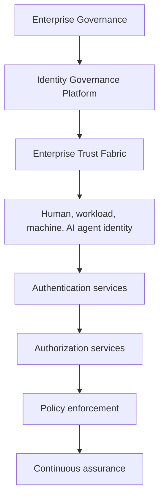
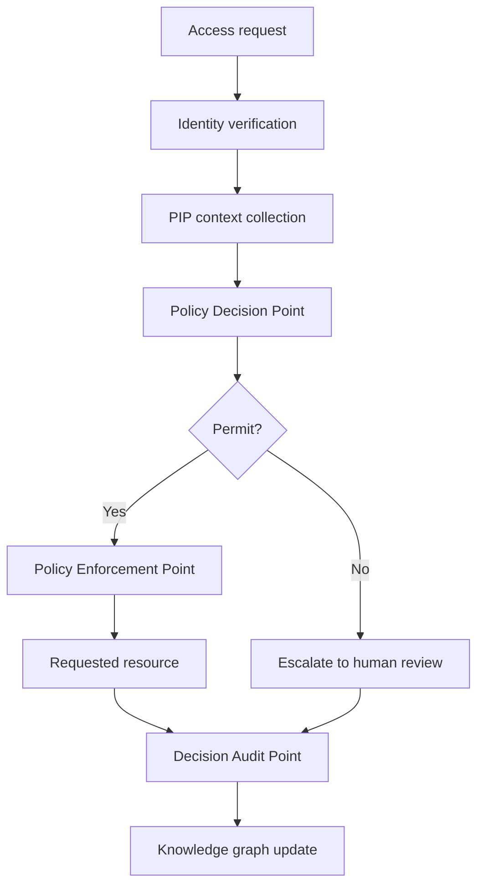

# EAODS Zero Trust Architecture

## 1. Purpose and scope

This document is the Domain 03 Zero Trust reference for EAODS Enterprise Edition. It consolidates the enterprise identity fabric, the authorization architecture that separates policy decision from policy enforcement, the trust zones those components occupy, and the continuous verification obligations that keep granted trust from becoming permanent.

Scope covers every identity that transacts on the platform — workforce, service, workload, device, and AI agent — and every privileged call between them. Identity is the primary security control plane for the enterprise; network position is not a control.

## 2. Zero Trust principles

The platform operates according to these principles:

1. Never assume trust.
2. Verify every request.
3. Continuously evaluate risk.
4. Enforce least privilege.
5. Authenticate every identity.
6. Authorize every action.
7. Continuously monitor behavior.
8. Preserve complete auditability.

Trust is continuously evaluated rather than permanently granted, and no privileged operation executes without a prior policy evaluation.

## 3. Reference architecture



Governance defines the fabric; the fabric issues identity; authentication establishes who is calling; authorization decides what is permitted; enforcement applies the decision; assurance observes the result. Each layer is independently reviewable, and each layer fails closed on its own.

## 4. Identity fabric

Each identity category has a documented lifecycle owner.

| Identity domain | Examples | Governance focus |
|---|---|---|
| Workforce | Employees, contractors | Employment lifecycle |
| Customer | External users | Privacy and consent |
| Privileged | Administrators | Elevated access governance |
| Service | APIs and applications | Machine authentication |
| Workload | Containers, VMs, serverless | Runtime identity |
| Device | Managed endpoints | Device trust |
| AI agent | Autonomous systems | Operational authorization |
| Third-party | Vendors and partners | Federation and contractual controls |

The canonical identity record binds an identity object to its owner, authentication method, authorization profile, and verification state:

```yaml
identity_id: ID-009428
identity_type: Workload
owner: PlatformEngineering
authentication_method: MutualTLS
authorization_profile: DetectionEngineeringRuntime
risk_level: Moderate
certificate_authority: EnterprisePKI
lifecycle_state: Active
continuous_verification: Enabled
```

The identity lifecycle runs request, identity proofing, provisioning, authentication, authorization, continuous verification, privilege review, deprovisioning. Every lifecycle transition generates an immutable audit event.

## 5. Service and workload identity

Service identity is implemented by PAT-0001 and enforced by EAODS-CTRL-000184:

- every workload receives a short-lived, scoped, verifiable credential from a central identity authority;
- the credential is verified on each privileged call — signature, expiry, revocation — and any ambiguity fails closed;
- scopes are allow-listed per role, and delegation is off by default;
- revocation is central and immediate, so withdrawal of trust never requires redeployment.

The consequence is architectural rather than incidental: compromise blast radius is bounded by scope and credential lifetime, and the identity authority becomes a Tier 1 dependency that must itself follow governed recovery orchestration (PAT-0004).

Secrets, keys, certificates, and automation credentials are governed centrally and are never embedded in application code or infrastructure definitions. Certificate governance covers issuance, validation, rotation, renewal, revocation, and archival, with expiration continuously monitored.

## 6. Trust zones

Zones partition the reference architecture in section 3. Zone membership confers no privilege: implicit trust relationships are eliminated, and every crossing is an evaluated event rather than an assumed one.

| Zone | Components | Crossing condition |
|---|---|---|
| Governance | Policy Administration Point | Only approved governance authorities may publish policy |
| Identity | Identity governance platform, trust fabric, enterprise PKI | Proofed identity with an assigned lifecycle owner |
| Decision | Policy Information Point, Policy Decision Point | Authenticated request plus collected runtime context |
| Enforcement | Policy Enforcement Point | A deterministic decision issued by the Decision zone |
| Resource | Protected services, tools, and data | Enforced permit, with obligations satisfied |
| Assurance | Decision Audit Point, continuous assurance, telemetry | Every crossing emits evidence; assurance never grants access |

The primary trust boundary is a caller's presented identity versus its actual identity (THR-0001). Everything downstream of a successful verification inherits the integrity of that boundary, which is why verification is per-call and verification results are not held in long-lived caches.

## 7. Authorization architecture

Policy definition, evaluation, enforcement, and audit are independent architectural components, and authorization remains separate from authentication.



| Component | Responsibility | Boundary |
|---|---|---|
| Policy Administration Point (PAP) | Policy authoring, version control, approvals, lifecycle management, publication, rollback | Only approved governance authorities publish |
| Policy Information Point (PIP) | Collects runtime context: identity, trust level, device posture, geolocation, asset classification, sensitivity, active incidents, business hours, workflow state, AI confidence, regulatory requirements | Supplies facts, never decisions |
| Policy Decision Point (PDP) | Evaluates policy, calculates authorization, verifies context, determines obligations and conditions, issues the decision, produces the explanation | The PDP never executes actions |
| Policy Enforcement Point (PEP) | Applies the PDP decision at the resource boundary | Enforces only what the PDP issued |
| Decision Audit Point (DAP) | Preserves request, identity, policy version, evidence, decision, obligations, reviewer, timestamp | Records; does not authorize |

Authorization decisions are deterministic, explainable, version-controlled, evidence-backed, continuously logged, and replayable for audit.

## 8. Policy evaluation inputs

Authorization inputs fall into two sets.

**Required inputs**, evaluated on every request regardless of identity class:
identity, authentication strength, trust level, resource classification, action
requested, and policy version. A missing required input is an ambiguity and
resolves fail-closed.

**Contextual inputs**, evaluated where the identity class makes them available:
device health and posture, network context, time, business risk, and active
incident status. Absence of a contextual input is not by itself a denial; the
policy states how each is weighted when present. This matches
EAODS-SEC-IAM-001 §8 ("device posture where available") and keeps the
fail-closed rule enforceable for workload and service identities, which have no
device posture to report. ## 9. Decision outcomes and enforcement actions

| Outcome | Description |
|---|---|
| Permit | Immediate execution |
| Permit with obligations | Additional controls required |
| Require human approval | Manual authorization |
| Require executive approval | High-risk action |
| Deny | Request blocked |
| Quarantine | Temporary isolation |
| Break glass | Emergency workflow |
| Escalate | Governance review |

The PEP acts on a decision by permitting, denying, requiring approval, requiring MFA, requiring risk review, requiring break glass, quarantining, delaying, or escalating.

## 10. Authorization models

Several authorization strategies operate simultaneously:

- **RBAC** — administrative functions, organizational roles, governance bodies.
- **ABAC** — user attributes, asset attributes, environmental context, operational state, and regulatory conditions; the preferred model for enterprise AI.
- **ReBAC** — graph relationships evaluated from the Enterprise Knowledge Graph, for example owner *owns* application and application *uses* service.
- **Risk-adaptive** — authorization changes with active threats, incident severity, asset exposure, AI confidence, regulatory posture, and business criticality.

## 11. Standing privilege, just-in-time elevation, and break glass

Persistent privilege is minimized. Temporary elevation requires justification, approval, expiration, monitoring, and an audit trail, and the privilege expires automatically at the end of the approved duration.

Emergency access requires a documented emergency, executive notification, automatic evidence collection, mandatory post-event review, privilege expiration, and retrospective governance assessment. Break-glass events appear immediately within the Executive Control Tower.

## 12. AI agent and automation identity

Every AI system holds a unique enterprise identity, a defined operational owner, an authorized capability scope, bounded permissions, complete audit logging, lifecycle governance, and a revocation capability. AI systems never inherit unrestricted enterprise privileges.

Before any tool invocation, an agent validates its registered identity, trust classification, approved capability, workflow authorization, policy compliance, requested tool permissions, data classification, and human approval requirements. Agents may never elevate their own privileges, and direct agent-to-agent privilege delegation is prohibited.

**Ladder reconciliation.** This is the *automation authority* ladder (A0–A5), derived from v5.1. It is distinct from the **agent trust ladder T0–T5** published in EAODS-SEC-AIRISK-001 §5 (v7.6 Trust Fabric), which is what the `trust level` authorization input carries. An agent holds both: a trust level (T) and an automation authority (A). Neither implies the other.

| Trust level | Description |
|---|---|
| A0 | Advisory only |
| A1 | Read-only enterprise access |
| A2 | Controlled recommendations |
| A3 | Limited approved actions |
| A4 | Human-approved operational execution |
| A5 | Emergency automation, pre-approved playbooks only |

Newly registered agents default to A0 automation authority, and to T0 on the EAODS-SEC-AIRISK-001 §5 trust ladder. Human approval is mandatory before production configuration changes, privileged identity modifications, destructive operations, enterprise policy publication, risk acceptance decisions, legal or regulatory submissions, and financial transactions.

## 13. Continuous verification

Continuous verification is what prevents a granted decision from hardening into a standing entitlement:

1. Credentials are short-lived and verified per privileged call, not per session.
2. Revocation is checked at verification time; long-lived verification caches are not used.
3. Authentication policy adapts to risk and business context, with step-up authentication for elevated risk and phishing-resistant methods where feasible.
4. Certificate expiration, issuance volume, and verification failures are monitored continuously.
5. Privilege review is a named lifecycle stage rather than a periodic exception.

## 14. Telemetry, evidence, and assurance

Identity observability collects authentication attempts, authorization decisions, policy evaluations, privileged actions, federation events, certificate operations, and lifecycle changes, and integrates with enterprise observability.

Executive dashboards visualize authorization requests, approval latency, denied requests, policy violations, privilege elevation, break-glass events, policy utilization, AI authorization decisions, and trust-level trends. Every authorization decision also creates knowledge-graph relationships — agent *requested* action, action *evaluated by* policy, policy *authorized* resource — which allows historical reconstruction of any enterprise decision.

Issuance volume, verification failure rates, and revocation latency are emitted as assurance evidence through PAT-0003; anomalies trigger RUN-0003 with Enterprise Cyber Command escalation.

## 15. Policy governance and identity resilience

Policies are version-controlled and independently reviewed. Each published policy declares its identifier, version, effective date, supersession, owner, approval authority, review cycle, rollback version, and status. No runtime decision evaluates an unpublished policy.

Every policy undergoes syntax validation, semantic validation, conflict detection, regression testing, simulation, approval testing, and production validation. Every decision generates evaluated policies, matching conditions, rejected conditions, obligations, a reasoning summary, confidence, and evidence references; explainability is mandatory.

Identity resilience requires redundant identity providers, replicated policy services, resilient certificate infrastructure, emergency administrative access procedures, and recovery validation exercises. Identity recovery is periodically tested, and recovery of the identity authority is executed as governed orchestration (PAT-0004, RUN-0001).

## 16. Integration points

This architecture integrates with the Enterprise Service Catalog, Enterprise Data Platform, Automation Platform, Security Validation, Enterprise Cyber Command, Continuous Assurance, Enterprise Knowledge Graph, Enterprise Digital Twin, and Executive Control Tower.

Identifier usage follows STD-0001, and the practice of referencing governed objects by stable identifier rather than by prose description follows ADR-0002.

## 17. Human review gate

Approval requires the Security Architecture Review Board and the Program Owner to confirm that:

- identity remains the primary control plane and no zone confers implicit trust;
- decision and enforcement remain architecturally separate, and the PDP never executes;
- fail-closed behavior holds for every ambiguous verification and every missing policy input;
- AI agent authority remains bounded, defaults to A0 automation authority and T0 trust level, and self-elevation stays prohibited;
- just-in-time and break-glass privilege expire automatically and are reviewed after the event;
- every authorization decision is explainable, replayable, and traceable to a policy version.

Changes affecting authorization logic, policy evaluation, privilege elevation, break-glass workflows, policy testing, AI agent permissions, or enterprise trust decisions require review before publication.

## 18. Sources and traceability

| Source file (repo-relative) | Contribution |
|---|---|
| `docs/frameworks/EAODS-v17.3/volume-04-identity-zero-trust.md` | Zero Trust principles; trust fabric layering; identity domains table; canonical identity record; identity lifecycle; authentication and authorization models; secrets and certificate governance; identity telemetry; AI identity governance; identity resilience; integration points |
| `docs/patterns/PAT-0001-zero-trust-service-identity.md` | Service and workload identity pattern: short-lived scoped credentials, per-call verification, fail-closed behavior, allow-listed scopes, central revocation, Tier 1 identity authority and its recovery dependency; governing control EAODS-CTRL-000184 |
| `history/original-sources/EAODS_AI_Operator_Suite_transmissions/units/v5.0-v6.6/EAODS-v5.2-alpha-enterprise-policy-decision-point-pdp-policy-enforcement-point-pep-and-authorization-architecture-standard.md` | PAP, PIP, PDP, PEP, and DAP responsibilities and boundaries; authorization flow; policy evaluation inputs; decision outcomes and enforcement actions; RBAC, ABAC, ReBAC, and risk-adaptive models; just-in-time privilege; break-glass governance; AI agent authorization checks; policy version governance; explainability; policy testing; Executive Control Tower and knowledge-graph integration |
| `history/original-sources/EAODS_AI_Operator_Suite_transmissions/units/v5.0-v6.6/EAODS-v5.1-alpha-enterprise-ai-agent-operating-framework-and-multi-agent-coordination-standard.md` | Agent trust classification T0–T5 and the T0 default; prohibition on direct agent-to-agent privilege delegation; mandatory human approval gates |
| `docs/threat-models/THR-0001-compromised-service-identity.md` | Presented-versus-actual identity trust boundary; revocation-lag and verification-cache constraint; assurance hooks and escalation path; document structure reference |
| `docs/architecture/ENTERPRISE_OPERATING_MODEL.md` | House style, front-matter shape, review-gate framing, and Domain 03 cross-pillar positioning |
| `docs/standards/canonical-terminology-and-identifiers.md` | Identifier discipline under STD-0001: registered prefixes only, identifier stability, one object one identifier |
