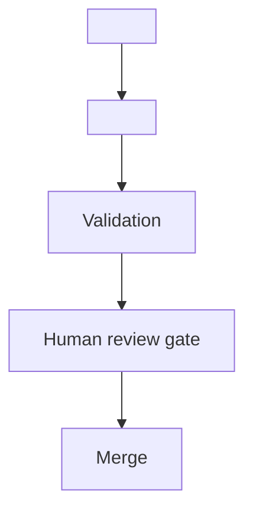
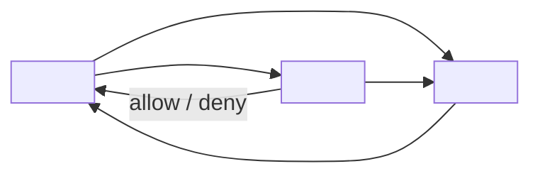

# EAODS Document Templates

## 1. Purpose

This document provides fill-in templates for the governed document types of EAODS Enterprise Edition: enterprise standards and framework documents, architecture patterns, operational runbooks, threat models, and architecture decision records. The templates are transcriptions of approved exemplars already in this repository, not an abstract style guide. Each reproduces the section order its library already mandates, so a completed template joins the ADR-0002 traceability model — and the checked relationship graph of STD-0002 — without later restructuring.

## 2. Scope and use

These templates apply to new and revised artifacts under `docs/` and `architecture/`, the surface STD-0002 places under traceability validation.

| Document type | Location | Template | Structure authority |
|---|---|---|---|
| Enterprise standard (governance tier) | `docs/standards/` and comparable trees | §4, Template A1 |
| Framework volume | `docs/frameworks/` | §4, Template A2 | STD-0001, STD-0002, approved `docs/architecture/` siblings |
| Architecture pattern | `docs/patterns/` | §5 | `docs/patterns/index.md`, PAT-0001 |
| Operational runbook | `docs/runbooks/` | §6 | `docs/runbooks/index.md`, RUN-0001 |
| Threat model | `docs/threat-models/` | §7 | `docs/threat-models/index.md`, THR-0001 |
| Architecture decision record | `architecture/adr/` | §8 | ADR-0002 |

Copy the fenced block, replace every `<angle-bracket>` placeholder, expand the skeleton with blank lines and detail as needed, then work the checklist in §10 before opening a pull request.

## 3. Requirements common to every template

ADR-0002 requires every major artifact to define, where applicable, eleven elements. The templates fix where each lands, so reviewers can find them without reading the whole document.

| ADR-0002 contribution element | Where the templates carry it |
|---|---|
| Stable identifiers; ownership | Front matter `document_id` and `owner`; or the `<ID> — <Title>` heading and **Owner:** metadata line |
| Purpose and scope | Purpose and Scope (§4); Context (§5); Scope & assets (§7) |
| Dependencies; architecture relationships | Related objects, and front matter `related`, cited by stable ID |
| Governing controls | Governing controls (§5); Mitigations table (§7); Authoritative sources (§4) |
| Implementation guidance; operational workflows | Solution and Structure (§5); Procedure and Escalation (§6); workflow (§4) |
| Evidence and assurance requirements; measurable outcomes | Evidence (§6); Assurance hooks (§7); Validation (§6); Consequences (§5, §8) |
| Human review gates | Human review gate section; explicit approval steps inside procedures |

Two front-matter conventions are in use. Documents under `docs/architecture/`, and this standard, carry the YAML block of §4. The library exemplars read for this document — PAT-0001, RUN-0001, THR-0001 — instead open with a single bolded metadata line, and ADR-0002 uses the distinct YAML field set reproduced in §8. Follow the convention of the library you are contributing to.

## 4. Template A — standard or framework document

**Two schemas are in force.** `scripts/validate_front_matter.py` enforces a
nine-key schema over `docs/frameworks/` and `frameworks/` in CI. Documents
elsewhere use the eight-key governance schema. Using the wrong block fails the
build, so pick by location before copying.

### Template A2 — framework volume (`docs/frameworks/`)

```yaml
---
title: "<full canonical title>"
version: "<x.y.z-stage>"
owner: "<owning authority>"
suite: "<suite identity>"
status: "<lifecycle status>"
classification: "<classification>"
purpose: "<one-line purpose>"
architecture_domain: "<domain>"
review_cycle: "<cadence>"
---
```

All nine keys are required by CI. Additional keys (`extends`,
`constitutional_authority`, `migrated_from`) are permitted.

### Template A1 — governance tier (everything else)

````markdown
---
title: <Document title>
document_id: <EAODS-AREA-KEY-NNN>
version: 1.0.0
status: proposed
owner: <Accountable role or function>
review_gate: <Reviewing body> and Program Owner approval
governing_architecture: EAODS v17.3 Volume <n>
related:
  - <related document_id, stable ID, or repo-relative path>
---
# <Document title>
## 1. Purpose
<What this document makes normative, and which ADR or framework obligation it discharges.>
## 2. Scope
<Which artifacts, directories, volumes, or activities are bound by it.>
## 3. Authoritative sources
| Source | Location | Role |
|---|---|---|
| <Registry, volume, or validator> | `<repo-relative path>` | <Why it is authoritative> |
## 4. Normative rules
1. **<Rule name>.** <Imperative statement, testable by a reviewer or by CI.>
## 5. Contribution or application workflow

## 6. Integration points
- <Artifact, library, or workflow that consumes or enforces this document>
## 7. QA checklist
- [ ] <Verifiable condition>
- [ ] Human review gate completed.
## 8. Human review gate
<Reviewing body, approving authority, and the conditions they confirm.>
## 9. Sources and traceability
| Source (repo-relative path) | Contribution |
|---|---|
| `<path>` | <Which sections it supplied> |
````

**Guidance.** Numbered `##` sections with a terminal sources table follow the approved siblings `ENTERPRISE_OPERATING_MODEL.md` and `architecture-principles.md`. Sections 3, 4, 7 and 8 mirror STD-0001 and STD-0002, which pair every normative rule with the registry or validator that enforces it — a rule no reviewer or script can test belongs in a principle catalog, not a standard. Documents under `docs/frameworks/` or `frameworks/` are additionally validated by `scripts/validate_front_matter.py`, which requires `title`, `version`, `owner`, `suite`, `status`, `classification`, `purpose`, `architecture_domain` and `review_cycle`.

## 5. Template B — architecture pattern

````markdown
# <PAT-nnnn> — <Pattern Name>
**Domain:** <Primary domain> · **Status:** <Draft | Approved> · **Source:** EAODS v17.3 Volume <n>
## Context
<The recurring situation and the trust or operational boundary that creates the problem.>
## Problem
<One question the pattern answers, stated so a design either satisfies it or does not.>
## Solution
<The normative mechanism, including its default posture — what fails closed, what is off by default.>
## Structure

## Consequences
- <Benefit, stated as a bounded property rather than an unquantified claim.>
- <Cost or new dependency introduced, including any tier reclassification.>
## Governing controls
- <EAODS-CTRL identifier> — <Control name> (<Preventive | Detective | Corrective>)
## Related objects
<TERM- term> · <Volume reference> · <PAT- / RUN- / THR- identifiers and the relationship each carries>
````

**Guidance.** The section set is mandated by `docs/patterns/index.md`: Context, Problem, Solution, Structure, Consequences, Governing controls, Related objects. Consequences must be honest in both directions — PAT-0001 records that its identity authority becomes a Tier 1 dependency recovering through PAT-0004, so an entry listing only benefits is incomplete. Cite governing controls by registered `EAODS-CTRL` identifier. Patterns are normative once approved: a design covered by an approved pattern either applies it or records a justified exception under Volume 11 architecture exception governance.

## 6. Template C — operational runbook

````markdown
# <RUN-nnnn> — <Runbook Name>
**Owner:** <Operating authority> · **Status:** <Draft | Approved> · **Source:** EAODS v17.3 Volume <n>, <PAT- identifier>
## Trigger
<The single observable condition that starts this procedure.>
## Preconditions
- <Record, map, or control plane that must be current and reachable before step 1.>
## Procedure
1. <Detection and impact classification.>
2. **Human approval gate — <named authority> authorizes <irreversible action>.**
3. <Execution step, in dependency order.>
4. <Validation step; state the halt condition explicitly.>
5. <Measurement against the service objective.>
6. **Human approval gate — <named authority> approves <resumption or closure>.**
## Validation
- <Condition confirming the procedure achieved its objective.>
## Escalation
- <Failure condition> → <escalation authority>.
## Evidence
<What is emitted to Continuous Assurance, and before which record closes.>
## Related objects
<RES- or SVC- record> · <PAT- identifier> · <TERM- term>
````

**Guidance.** The section set is mandated by `docs/runbooks/index.md`: Trigger, Preconditions, Procedure, Validation, Escalation, Evidence, Related objects, with steps numbered and idempotent where possible. Every human approval point is explicit and every irreversible step names its authority — RUN-0001 gates both entry into recovery and business resumption this way, and halts on any validation failure rather than continuing the sequence. Separate operational failure from suspected cyber cause in Escalation, since the two route to different authorities; evidence emission is a closure precondition, not an afterthought.

## 7. Template D — threat model

````markdown
# <THR-nnnn> — <Threat Model Name>
**Owner:** <Security authority> · **Status:** <Draft | Approved> · **Source:** EAODS v17.3 Volume <n>, <PAT- identifier>
## Scope & assets
<The assets in scope and the systems that trust them.>
## Trust boundary
<The claim-versus-reality boundary analysed, and what inherits its integrity.>
## Threat actors
<External, compromised-internal, and defective-automation actors relevant to this boundary.>
## Threat scenarios
1. **<Scenario name>.** <What the adversary achieves — not how to reproduce it.>
## Mitigations
| Scenario | Mitigation | Implemented by |
|---|---|---|
| <Scenario> | <Control behaviour> | <EAODS-CTRL / PAT- / RUN- identifiers> |
## Residual risk
<What remains after mitigation, and the trade-off governing any tuning.>
## Assurance hooks
<Signals emitted as evidence, and the runbook and escalation an anomaly triggers.>
````

**Guidance.** The section set is mandated by `docs/threat-models/index.md`: Scope & assets, Trust boundary, Threat actors, Threat scenarios, Mitigations mapped by ID, Residual risk, Assurance hooks. These are defensive artifacts — scenarios state what the attacker achieves and how the platform resists, and per `SECURITY.md` and the lawful-lab scope of this repository they carry no offensive tooling or exploitation procedures. Every mitigation maps to an existing control, pattern, or runbook by stable ID; a threat with no mapped mitigation is a finding, so open a corrective workflow instead of leaving the row blank. Residual risk is mandatory and specific: THR-0001 names credential lifetime as an availability-versus-exposure trade-off.

## 8. Template E — architecture decision record

````markdown
---
title: "<ADR-nnnn>: <Decision in imperative form>"
status: "<Proposed | Accepted | Superseded>"
date: "<YYYY-MM-DD>"
decision_owner: "<Name or role>"
scope: "<What the decision binds>"
supersedes: <null or prior ADR identifier>
related:
  - "<ADR identifier>"
  - "<Framework volume>"
---
# <ADR-nnnn> — <Decision title>
## Context
<The situation, and the structural risk of continuing unchanged — as a list where there are several.>
## Decision
<The decision in one sentence, then the obligations it creates.>
## <Normative model section — optional>
<A model the decision establishes: a contribution model, a required metadata set, or a traceability chain. Add a mermaid diagram where the model is a chain or graph.>
## Consequences
### Positive
- <Capability the decision unlocks.>
### Costs
- <Migration, governance, or review burden it imposes.>
## Governance
<Which changes to this decision require Architecture Board review and program owner approval.>
````

**Guidance.** Required sections are Context, Decision, Consequences and Governance. ADR-0002 demonstrates the optional normative-model sections — its contribution model and its mermaid traceability chain — which belong in an ADR when the decision defines a model other artifacts must join. Record costs plainly alongside benefits: ADR-0002 accepts document normalization, central terminology governance, stricter review, and structural growth as the price of the decision. Governance names the trigger for re-review; for ADR-0002 it is material change to the four-pillar model, canonical terminology, metadata structure, or cross-volume architecture. Keep `supersedes` explicit — `null` when nothing is replaced — because superseded provisions remain preserved rather than deleted.

## 9. Placeholder and identifier conventions

1. **Placeholders are not identifiers.** Templates ship `<PREFIX>-<nnnn>` forms so an unregistered identifier is never committed; STD-0002 fails CI on any identifier-shaped token whose prefix is not registered under STD-0001.
2. **Register before minting.** Mint the next identifier from the registry sequence at authoring time, per the contributing steps in each library index.
3. **Format.** `<PREFIX>-<zero-padded integer>` matching `^[A-Z][A-Z0-9-]*-[0-9]{4,6}$`; padding width is fixed when a prefix is registered, and new prefixes use six digits.
4. **Stability.** Published identifiers are never reused, renumbered, or reassigned; retired objects keep their identifier with a retired status.
5. **Relationships use the registered edge vocabulary.** State relationships with the STD-0002 edge types — `implements`, `operationalizes`, `mitigates`, `applies_to`, `emits_evidence_to`, `governed_by` — and add the matching graph edge, since the graph records what the documents claim.

## 10. Pre-submission checklist

Framework-located documents use the nine-key schema of Template A2; confirm `python scripts/validate_front_matter.py` passes before review.

- [ ] Correct template used for the document type and location; every `<angle-bracket>` placeholder replaced.
- [ ] Applicable ADR-0002 contribution elements present, or consciously not applicable.
- [ ] Every cited identifier registered, and every stated relationship carried by a graph edge.
- [ ] Every irreversible or material step names a human approval authority.
- [ ] Evidence and assurance obligations stated where the artifact produces or consumes evidence.
- [ ] Sources and traceability table complete, with repo-relative paths.
- [ ] `python scripts/validate_traceability.py` passes, alongside front-matter validation and the strict build.
- [ ] Human review gate for the relevant library obtained (§11).

## 11. Human review gates by document type

| Document type | Reviewing body |
|---|---|
| Enterprise standard | Enterprise Architecture Review Board, with final program owner approval |
| Architecture pattern | Enterprise Architecture Review Board |
| Operational runbook | Enterprise Platform Operations Center |
| Threat model | Enterprise Cyber Command |
| Architecture decision record | EAODS Enterprise Architecture Board, with final program owner approval |

Approval of this document requires confirmation by Engineering Governance and the Program Owner that each template reproduces the structure its library already mandates, that no template introduces a section, field, or obligation absent from the cited sources, and that no template carries a mintable identifier.

## 12. Sources and traceability

| Source (repo-relative path) | Contribution |
|---|---|
| docs/architecture/ENTERPRISE_OPERATING_MODEL.md (EAODS-ARCH-EOM-001) | House style for numbered sections and YAML front matter; human review gate framing (§11) |
| docs/architecture/architecture-principles.md (EAODS-ARCH-PRIN-001) | Front-matter field set and mixed identifier/path `related` list (§4); terminal sources-and-traceability table convention (§12) |
| architecture/adr/ADR-0002-eaods-enterprise-reference-operating-model.md | Eleven-element contribution model (§3); ADR front matter, section order, split consequences, governance trigger (§8) |
| docs/patterns/PAT-0001-zero-trust-service-identity.md | Pattern metadata line, section content, mermaid structure block, honest-consequence example (§5) |
| docs/patterns/index.md | Mandated pattern entry structure, contributing steps, normative-once-approved rule and exception route (§5) |
| docs/runbooks/RUN-0001-service-recovery-execution.md | Runbook metadata line, numbered procedure with approval gates, halt condition, escalation split, evidence-before-closure rule (§6) |
| docs/runbooks/index.md | Mandated runbook entry structure, idempotence and named-approval-authority requirements (§6) |
| docs/threat-models/THR-0001-compromised-service-identity.md | Threat-model section content, mitigations table shape, residual-risk and assurance-hook examples (§7) |
| docs/threat-models/index.md | Mandated threat-model entry structure, defensive-scope constraint, unmapped-threat-is-a-finding rule (§7) |
| SECURITY.md | Repository security policy the threat-model defensive-scope constraint is attributed to, and its prohibition on committing credentials and sensitive data (§7) |
| docs/standards/canonical-terminology-and-identifiers.md (STD-0001) | Standard section pattern (§4); identifier format, registration, stability and padding rules (§9) |
| docs/standards/cross-artifact-traceability.md (STD-0002) | Validated scope (§2); registered edge-type vocabulary and graph-follows-prose rule (§9); CI validation command (§10) |
| scripts/validate_front_matter.py | Additional front-matter fields required under `docs/frameworks/` and `frameworks/` (§4) |
