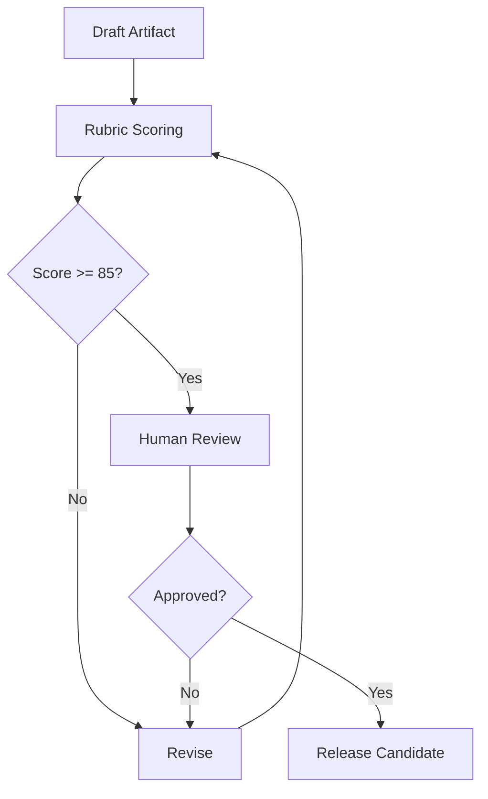

# EAODS Agent Evaluation Rubric

## Purpose

This rubric converts quality from opinion into measurement. Each agent output should be scored before publication.

## Scoring Model

| Score | Meaning |
|---:|---|
| 0 | Missing |
| 1 | Weak or vague |
| 2 | Present but incomplete |
| 3 | Acceptable |
| 4 | Strong |
| 5 | Enterprise-ready |

## Evaluation Criteria

| Criterion | Weight |
|---|---:|
| YAML completeness | 5% |
| Mission clarity | 5% |
| Scope boundaries | 5% |
| Workflow specificity | 10% |
| Governance controls | 10% |
| Risk analysis | 10% |
| Human approval gates | 10% |
| Evidence discipline | 10% |
| QA checklist | 10% |
| Case study depth | 10% |
| Integration with other agents | 5% |
| Reusability | 5% |
| Publishing readiness | 5% |

## Publication Threshold

| Rating | Score Range | Release Decision |
|---|---:|---|
| Draft | 0–59 | Do not publish externally |
| Internal Alpha | 60–74 | Internal use only |
| Portfolio Candidate | 75–84 | Acceptable after review |
| Enterprise Candidate | 85–94 | Strong public candidate |
| Commercial Candidate | 95–100 | Ready for packaging/licensing review |

## Mandatory Failure Conditions

An artifact fails regardless of score if it:

- omits source code appendix for a code-derived agent,
- confuses legal obligation with best practice,
- lacks human review gates for high-impact work,
- makes unsupported regulatory claims,
- exposes sensitive private information unnecessarily,
- lacks a defined scope,
- contains no QA process.

## Review Workflow

