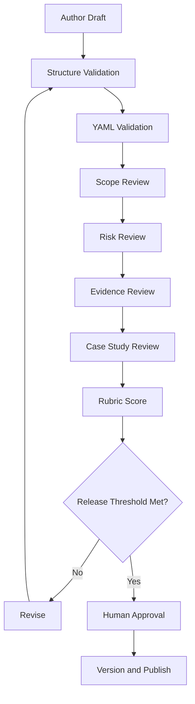

# EAODS Documentation QA Pipeline

## Pipeline Objective

Every EAODS artifact should pass through a documented review path before release.

## Pipeline Stages

## Structural Checks

- YAML front matter present.
- Version field present.
- Owner present.
- Classification present.
- Mission present.
- Scope present.
- Workflow present.
- QA checklist present.
- Case studies present where required.
- Source appendix present for code-derived agents.

## Release Gates

| Gate | Owner | Required Evidence |
|---|---|---|
| Draft QA | Documentation owner | Completed checklist |
| Risk Review | Governance reviewer | Risk table |
| Security Review | Security reviewer | Guardrail confirmation |
| Final Approval | Human owner | Release decision |
