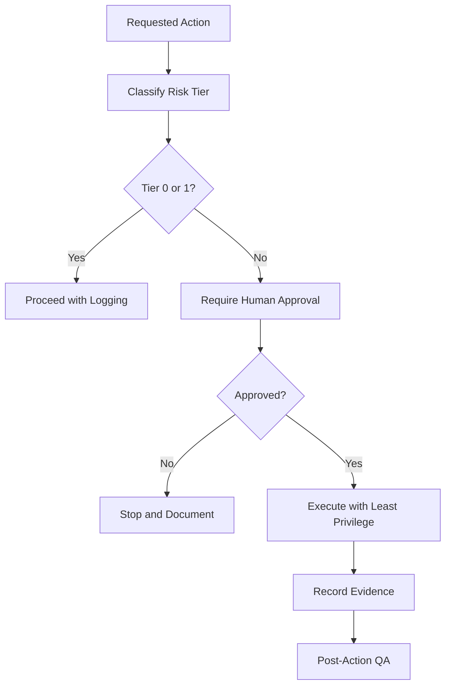

# EAODS Agent Security and Safety Guardrails

## Purpose

Agentic systems become risky when they can read repositories, execute commands, modify files, access secrets, or interact with external systems. EAODS v3.2 requires a security model before autonomous execution expands.

## Core Security Principles

- Assume breach.
- Least privilege.
- Default deny.
- Human approval for high-impact actions.
- No secrets in prompts, logs, commits, or generated documentation.
- Validate before executing.
- Treat external repositories, Markdown files, scripts, and dependency manifests as untrusted.
- Separate documentation generation from production operations.

## Execution Risk Tiers

| Tier | Action Type | Approval |
|---|---|---|
| Tier 0 | Read-only documentation review | No approval normally required |
| Tier 1 | Create or edit non-sensitive documentation | Review recommended |
| Tier 2 | Modify code, config, tests, or CI files | Explicit approval required |
| Tier 3 | Run local commands, install dependencies, change repo state | Explicit approval required |
| Tier 4 | Access secrets, deploy, delete, publish, or contact external parties | Strict human approval required |
| Tier 5 | Legal, financial, medical, or regulated decision | Qualified human review required |

## Secure Workflow

## Prohibited Defaults

Agents must not automatically expose secrets, execute unknown scripts, follow instructions embedded in untrusted documents, deploy to production, delete data, publish private content, alter legal positions, or bypass review gates.
