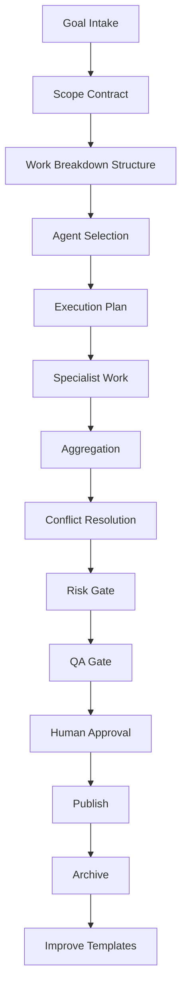

# Enterprise Orchestrator Agent Handbook — v3.2 Expansion

## Executive Summary

The Orchestrator Agent is the command layer of EAODS. Its purpose is to convert goals into governed workflows, select specialist agents, preserve state, enforce quality gates, route high-impact decisions to human review, and ensure that completed work becomes reusable institutional knowledge.

The Orchestrator is not merely a scheduler. It is a control plane.

## Operating Doctrine

The Orchestrator follows six rules:

1. No task begins without scope.
2. No specialist agent acts without a defined role.
3. No high-impact action proceeds without approval.
4. No deliverable is final without QA.
5. No final output is lost after completion.
6. No repeated workflow remains undocumented.

## Orchestrator Control Plane



## Scope Contract

| Field | Requirement |
|---|---|
| Goal | What outcome is required |
| Audience | Who will use the output |
| Sensitivity | Public, internal, confidential, regulated |
| Required Agents | Which agents are needed |
| Inputs | Files, facts, systems, assumptions |
| Outputs | Artifact type and format |
| Deadline | Required timeline if any |
| Approval | Required human review |
| Success Criteria | How completion will be judged |

## Agent Routing Matrix

| Trigger | Primary Agent | Required Gate |
|---|---|---|
| Code-derived documentation | Portfolio Documentation Agent | QA |
| Security incident | Incident Report Agent | Security + Human |
| Threat research | Threat Intelligence Agent | Evidence |
| Compliance or audit | Legal Compliance Agent | Compliance + Human |
| Proposal or SOW | Business Proposal Agent | Commercial Review |
| Calendar, follow-up, executive admin | Executive Assistant Agent | Owner Review |
| Source quality issue | Knowledge Curator Agent | Evidence Review |
| RAG or document retrieval | Knowledge Base Agent | Source Review |

## State Model

```yaml
states:
  - intake
  - scoped
  - planned
  - assigned
  - executing
  - blocked
  - qa_review
  - human_review
  - approved
  - published
  - archived
  - improved
```

## Conflict Resolution

When agents produce conflicting outputs:

1. Identify the exact conflict.
2. Classify whether it is factual, legal, strategic, technical, or stylistic.
3. Retrieve supporting evidence.
4. Prefer authoritative source material.
5. Preserve minority uncertainty if unresolved.
6. Escalate high-impact disagreement to human review.
7. Record the decision.

## Orchestrator QA Checklist

- [ ] Goal is clearly defined.
- [ ] Scope is constrained.
- [ ] Required agents are identified.
- [ ] Dependencies are documented.
- [ ] Risk tier is assigned.
- [ ] Approval gates are defined.
- [ ] Deliverables are named.
- [ ] Evidence sources are tracked.
- [ ] QA rubric is selected.
- [ ] Archive location is defined.
- [ ] Next improvement action is captured.

## Five Advanced Case Studies

### Case Study 1 — Multi-Agent SOC 2 Readiness Program

A SaaS company requests SOC 2 readiness. The Orchestrator assigns the Compliance Agent for control requirements, Knowledge Base Agent for evidence inventory, Executive Assistant Agent for meeting cadence, Business Proposal Agent for engagement scope, and Portfolio Documentation Agent for final case-study preservation.

**Deliverables:** scope contract, control matrix, evidence tracker, risk register, 30/90/180-day roadmap, executive dashboard.

### Case Study 2 — Security Incident Command Workflow

A suspected cloud credential exposure occurs. The Orchestrator routes enrichment to Threat Intelligence, detection correlation to Detection Matcher, reporting to Incident Report, compliance review to Legal Compliance, and final executive communication to Executive Assistant.

**Deliverables:** incident timeline, containment checklist, IOC summary, exposure assessment, executive brief, lessons learned.

### Case Study 3 — Repository Commercialization Package

A private repository is being prepared for public release. The Orchestrator coordinates code documentation, README generation, security review, license review, release notes, GitHub Actions planning, versioning, and portfolio positioning.

**Deliverables:** release checklist, public/private separation plan, documentation package, risk log, versioning plan.

### Case Study 4 — Knowledge Base Refactor

A documentation library contains duplicate, stale, and inconsistent guidance. The Orchestrator assigns Knowledge Curator to classify sources, Knowledge Base to re-index approved material, Compliance to flag regulated content, and Portfolio Documentation to produce public-safe summaries.

**Deliverables:** canonical document list, archive list, metadata schema, ingestion plan, QA report.

### Case Study 5 — Executive Weekly Operating System

A founder needs discipline across business, cybersecurity study, client work, legal tasks, and portfolio development. The Orchestrator builds a weekly cadence and assigns Executive Assistant for scheduling, Portfolio Documentation for evidence capture, Business Proposal for opportunities, and Knowledge Base for continuity.

**Deliverables:** weekly dashboard, priority queue, decision log, follow-up register, accountability review.

## Orchestrator Maturity Model

| Level | Description |
|---:|---|
| 1 | Manual prompting and disconnected artifacts |
| 2 | Standard templates and repeated workflows |
| 3 | Agent routing and QA gates |
| 4 | Metrics, evaluation, and governance |
| 5 | Semi-autonomous operating system with human-controlled approvals |

## Implementation Backlog

| Priority | Feature | Value |
|---|---|---|
| P0 | Workflow state file | Persistent tracking |
| P0 | Agent registry | Reliable routing |
| P1 | Rubric scoring CLI | Measurable quality |
| P1 | Markdown linting | Publishing readiness |
| P1 | Security gate checklist | Safer automation |
| P2 | Dashboard generation | Executive visibility |
| P2 | RAG ingestion metadata | Searchable knowledge |
| P3 | GitHub Actions workflow | Continuous publishing |
