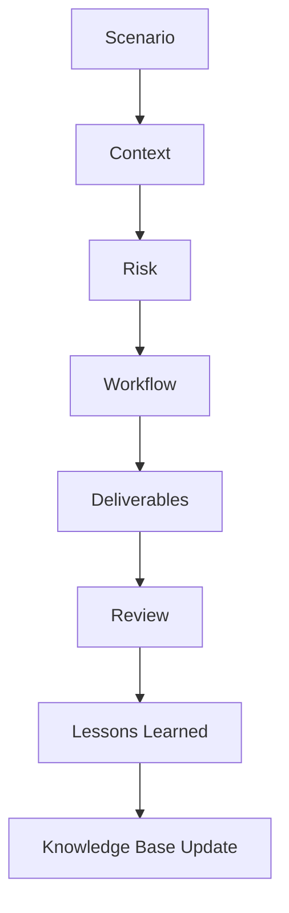

# Enterprise Case Study Framework

Each case study must include:

1. Executive Scenario
2. Business Context
3. Stakeholders
4. Trigger Event
5. Applicable Standards or Obligations
6. Agent Workflow
7. Evidence Required
8. Risk Rating
9. Deliverables
10. Quality Assurance
11. Human Review Gate
12. Metrics
13. Lessons Learned
14. Continuous Improvement Actions

## Standard Case Study Output Model

