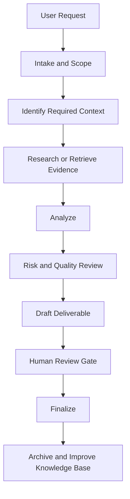

# Enterprise AI Operator Documentation Suite v3 — Foundation Standard

## 1. Purpose

EAODS v3 converts Python agent source files into enterprise-grade operating handbooks. Each handbook must function as technical documentation, operational guidance, training material, audit evidence support, RAG-ready knowledge material, and commercialization-grade intellectual property.

## 2. Required Documentation Behavior

Each handbook shall:

1. Begin with YAML metadata.
2. State the agent mission and role.
3. distinguish legal requirements, regulatory expectations, contractual obligations, standards, internal policies, and advisory best practices.
4. Include at least five enterprise case studies.
5. Include risk, governance, quality assurance, and human oversight sections.
6. Include the original Python source code as an appendix.
7. Use repeatable sections so handbooks can be indexed, searched, versioned, and maintained.

## 3. YAML Metadata Specification

Required fields:

```yaml
title:
version:
source_file:
role:
owner:
status:
generated:
classification:
description:
tags:
```

Recommended optional fields:

```yaml
frameworks:
controls:
dependencies:
inputs:
outputs:
review_cycle:
approval_authority:
```

## 4. Documentation Quality Rules

- Do not present advisory frameworks as binding law.
- Do not assume jurisdiction.
- Do not assume an organization is subject to a regulation without validating business model, geography, customers, data categories, contracts, and sector.
- Identify assumptions.
- Preserve evidence lineage.
- Use human review for legal, compliance, safety, financial, or high-impact decisions.
- Prefer repeatable controls over one-time fixes.

## 5. Enterprise Risk Rating

| Rating | Definition | Required Action |
|---|---|---|
| Low | Limited operational impact | Track and review during normal cycles |
| Moderate | Meaningful business or compliance exposure | Assign owner and remediation date |
| High | Material operational, legal, security, or financial exposure | Escalate to leadership and remediate with priority |
| Critical | Severe exposure, active exploitation, safety concern, or regulatory deadline | Immediate executive attention and documented response |

## 6. Standard Agent Workflow



## 7. Human Approval Gates

Human review is mandatory when the agent output may affect:

- legal interpretation,
- regulatory compliance,
- financial commitments,
- security actions in production,
- employment decisions,
- privacy rights,
- client-facing contractual statements,
- irreversible system changes.

## 8. Publishing Targets

EAODS v3 supports:

- GitHub documentation,
- MkDocs,
- Docusaurus,
- PDF manuals,
- RAG ingestion,
- internal knowledge base,
- client deliverables,
- consulting packages,
- training materials.

## 9. Versioning

Use semantic documentation versioning:

- `MAJOR`: structural redesign or governance change.
- `MINOR`: new sections, case studies, or role capabilities.
- `PATCH`: typo, formatting, citation, or minor clarification.

## 10. Acceptance Criteria

A handbook is complete when it includes:

- YAML front matter,
- mission,
- objectives,
- principles,
- workflows,
- governance,
- risk model,
- deliverables,
- QA checklist,
- at least five case studies,
- automation opportunities,
- source code appendix,
- future roadmap.
