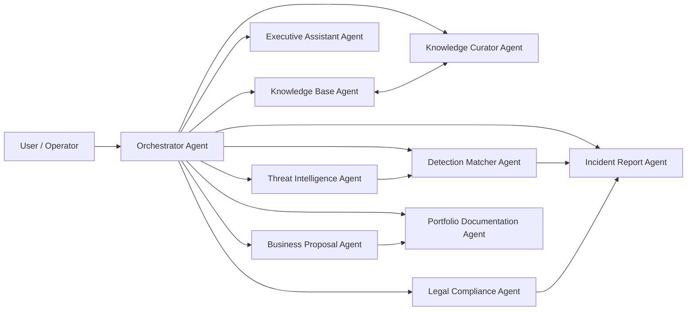
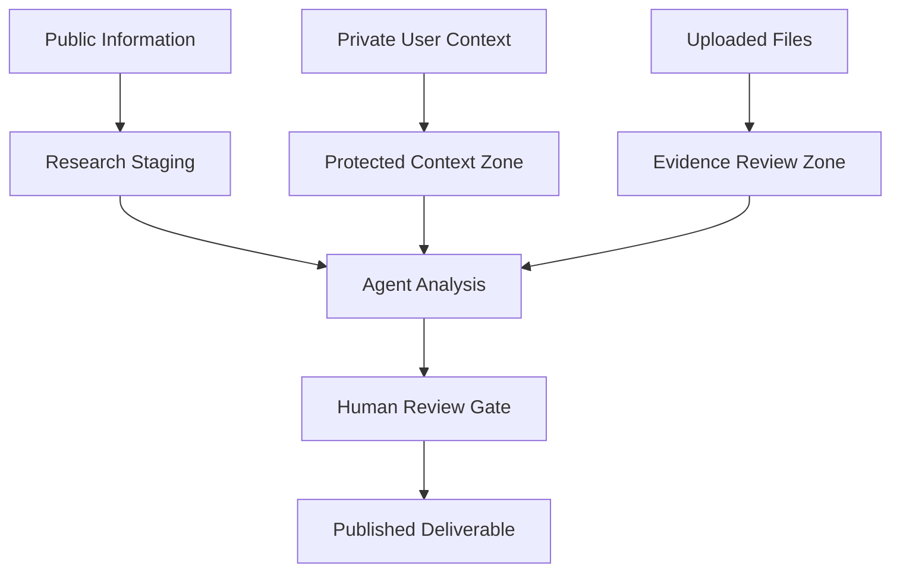

# EAODS v3 System Architecture Overview

## Architecture Intent

The EAODS platform treats each agent as a governed capability inside a larger operating system. The Orchestrator coordinates task routing. Knowledge agents manage source integrity. Security agents assess and report threats. Business agents convert operational work into client-ready outputs. Compliance agents enforce evidence, policy, audit, and risk discipline.

## Logical Architecture

## Trust Boundaries

## Operating Model

1. Intake receives the request.
2. Orchestrator identifies required agents.
3. Knowledge Base retrieves existing evidence.
4. Knowledge Curator validates source quality.
5. Specialist agents perform analysis.
6. Compliance or security agents review risk where applicable.
7. Executive Assistant converts outputs into actions and follow-ups.
8. Portfolio Documentation Agent preserves the result as reusable evidence.
