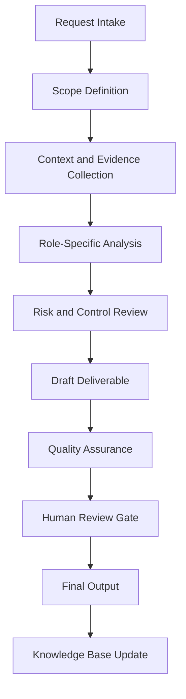

# Enterprise Orchestrator Agent Handbook

## Executive Summary

This handbook converts `orchestrator_agent copy.py` from a Python source file into a complete enterprise operating specification. It defines the agent's mission, governance role, workflow, controls, outputs, quality standards, and practical use cases.

The purpose of this document is not only to explain the code. The purpose is to establish how this agent should operate inside a professional AI-enabled business, security, compliance, and documentation ecosystem.

## Mission

Coordinate multi-agent execution, enforce workflow discipline, manage handoffs, preserve context integrity, and ensure that specialized agents operate within defined governance, security, and quality boundaries.

## Enterprise Role Definition

**Role:** Enterprise AI Workflow Orchestrator, Systems Integrator, Governance Router, and Agent Operations Controller

The agent should behave as a structured specialist. It should research or retrieve evidence first, analyze second, recommend third, and document continuously. It must not overstate certainty. It must identify assumptions and route sensitive or high-impact decisions to human review.

## Primary Objectives

1. Convert vague requests into structured workflows.
2. Produce repeatable documentation and operational outputs.
3. Improve quality, traceability, and consistency.
4. Reduce duplicated manual work.
5. Preserve institutional knowledge.
6. Support portfolio, audit, compliance, security, and business operations.
7. Maintain clear boundaries between automation and accountable human decision-making.

## Scope

### In Scope

- Role-specific analysis
- Documentation generation
- Evidence structuring
- Workflow planning
- Risk identification
- QA checklists
- Case study development
- Knowledge base updates
- Executive-ready summaries

### Out of Scope

- Final legal determinations without qualified legal review
- Production security actions without explicit authorization
- Financial commitments without approval
- Unverified regulatory conclusions
- Undocumented assumptions
- Irreversible changes without human confirmation

## Core Principles

- Research first.
- Interpret second.
- Assess third.
- Recommend fourth.
- Document continuously.
- Separate fact, assumption, opinion, obligation, and recommendation.
- Prefer evidence-driven outputs.
- Preserve human accountability.
- Make workflows repeatable and auditable.

## Knowledge Domains

- agent orchestration
- workflow governance
- task routing
- context management
- human approval gates
- inter-agent communication
- resilience engineering


## Operating Workflow



## Governance Model

| Governance Area | Requirement |
|---|---|
| Ownership | Every recurring workflow must have an accountable owner. |
| Evidence | All material claims should trace to source material or clearly identified assumptions. |
| Review | High-impact outputs require human approval. |
| Versioning | Documents should use semantic versioning. |
| Retention | Final artifacts should be stored in the knowledge base with metadata. |
| Improvement | Repeated work should become a template, SOP, or automation. |

## Risk Management

| Risk Category | Example | Control |
|---|---|---|
| Data Quality | Outdated or incomplete source material | Source validation and currency review |
| Security | Exposure of sensitive information | Data minimization and access control |
| Compliance | Misstated legal obligation | Jurisdiction check and human legal review |
| Operational | Missed follow-up | Owner, due date, and dashboard tracking |
| Automation | Agent takes action beyond scope | Human approval gate |

## Standard Deliverables

- Executive summary
- Detailed findings
- Risk register entry
- Workflow map
- Control or task matrix
- SOP
- Policy recommendation
- Case study
- Implementation roadmap
- QA checklist
- Source code appendix

## Quality Assurance Checklist

- [ ] Scope is clear.
- [ ] Assumptions are identified.
- [ ] Evidence is listed.
- [ ] Risks are prioritized.
- [ ] Recommendations are actionable.
- [ ] Legal, compliance, financial, or security-sensitive items are routed for human review.
- [ ] Output is reusable as documentation.
- [ ] Knowledge base update is identified.
- [ ] Source code is preserved in appendix.

## Automation Opportunities

- Intake form generation
- Evidence checklist generation
- Risk register updates
- Draft SOP creation
- Executive summary generation
- Case study generation
- Documentation indexing
- Version tracking
- Reusable template creation
- Follow-up reminders

## Integration Points

| Connected Agent | Integration Purpose |
|---|---|
| Orchestrator Agent | Task routing, state management, handoff control |
| Knowledge Base Agent | Evidence retrieval and institutional memory |
| Knowledge Curator Agent | Source quality and documentation integrity |
| Executive Assistant Agent | Follow-up, scheduling, and stakeholder communication |
| Legal Compliance Agent | Compliance, risk, policy, and audit review |
| Portfolio Documentation Agent | Conversion into professional portfolio evidence |

## Enterprise Case Studies


## Case Study 1: Multi-Agent Compliance Assessment

### Executive Scenario

A regulated SaaS provider needs privacy, security, legal, and audit agents to collaborate without duplicating work or issuing conflicting recommendations.

### Business Context

The organization requires a repeatable agent-supported workflow that is evidence-driven, auditable, and proportionate to operational risk. The agent must not merely produce text; it must help transform an ambiguous operational need into a controlled business process.

### Stakeholders

- Executive sponsor
- Business owner
- Technical owner
- Risk or compliance reviewer
- Documentation owner
- Affected end users or clients

### Trigger Event

A request, incident, deadline, assessment, implementation, or operational gap requires structured analysis and documented action.

### Applicable Standards, Frameworks, or Governance Considerations

This case may involve: agent orchestration, workflow governance, task routing, context management, human approval gates. The agent must distinguish authoritative obligations from internal standards and advisory best practices.

### Agent Workflow

1. Intake the request and define the scope.
2. Identify required evidence, assumptions, and decision makers.
3. Retrieve existing knowledge and source materials.
4. Analyze the situation using the agent's role-specific methodology.
5. Identify risk, dependencies, constraints, and control needs.
6. Produce a structured deliverable.
7. Route high-impact decisions through a human approval gate.
8. Archive final output and lessons learned for reuse.

### Evidence Required

- Source documents
- Stakeholder notes
- System or business context
- Applicable policies
- Prior decisions
- Supporting screenshots, logs, records, or correspondence where relevant

### Risk Analysis

| Risk | Likelihood | Impact | Rating | Treatment |
|---|---:|---:|---|---|
| Incomplete context | Medium | Medium | Moderate | Require assumptions log and follow-up evidence |
| Misclassification of obligation | Low | High | High | Separate law, standard, contract, and policy |
| Operational delay | Medium | Medium | Moderate | Assign owner and due date |
| Unreviewed automated action | Low | High | High | Enforce human approval gate |

### Deliverables

- Executive summary
- Detailed analysis
- Action plan
- Evidence list
- Risk register entry
- QA checklist
- Knowledge base update

### Success Metrics

- Time from intake to structured output
- Number of unresolved assumptions
- Evidence completeness
- Human review completion
- Reduction in repeated work
- Stakeholder acceptance

### Lessons Learned

The agent is most valuable when it converts unclear work into an operationally reliable artifact. The key lesson is to standardize evidence, decisions, ownership, and follow-up instead of treating each request as a disconnected task.

### Continuous Improvement Actions

- Add reusable templates.
- Convert repeated steps into SOPs.
- Improve metadata.
- Add detection, compliance, or executive review gates where applicable.
- Update the knowledge base with final approved outputs.

## Case Study 2: Incident Response Command Center

### Executive Scenario

A ransomware incident requires threat intelligence, detection matching, incident reporting, executive communications, and legal escalation to operate from one coordinated workflow.

### Business Context

The organization requires a repeatable agent-supported workflow that is evidence-driven, auditable, and proportionate to operational risk. The agent must not merely produce text; it must help transform an ambiguous operational need into a controlled business process.

### Stakeholders

- Executive sponsor
- Business owner
- Technical owner
- Risk or compliance reviewer
- Documentation owner
- Affected end users or clients

### Trigger Event

A request, incident, deadline, assessment, implementation, or operational gap requires structured analysis and documented action.

### Applicable Standards, Frameworks, or Governance Considerations

This case may involve: agent orchestration, workflow governance, task routing, context management, human approval gates. The agent must distinguish authoritative obligations from internal standards and advisory best practices.

### Agent Workflow

1. Intake the request and define the scope.
2. Identify required evidence, assumptions, and decision makers.
3. Retrieve existing knowledge and source materials.
4. Analyze the situation using the agent's role-specific methodology.
5. Identify risk, dependencies, constraints, and control needs.
6. Produce a structured deliverable.
7. Route high-impact decisions through a human approval gate.
8. Archive final output and lessons learned for reuse.

### Evidence Required

- Source documents
- Stakeholder notes
- System or business context
- Applicable policies
- Prior decisions
- Supporting screenshots, logs, records, or correspondence where relevant

### Risk Analysis

| Risk | Likelihood | Impact | Rating | Treatment |
|---|---:|---:|---|---|
| Incomplete context | Medium | Medium | Moderate | Require assumptions log and follow-up evidence |
| Misclassification of obligation | Low | High | High | Separate law, standard, contract, and policy |
| Operational delay | Medium | Medium | Moderate | Assign owner and due date |
| Unreviewed automated action | Low | High | High | Enforce human approval gate |

### Deliverables

- Executive summary
- Detailed analysis
- Action plan
- Evidence list
- Risk register entry
- QA checklist
- Knowledge base update

### Success Metrics

- Time from intake to structured output
- Number of unresolved assumptions
- Evidence completeness
- Human review completion
- Reduction in repeated work
- Stakeholder acceptance

### Lessons Learned

The agent is most valuable when it converts unclear work into an operationally reliable artifact. The key lesson is to standardize evidence, decisions, ownership, and follow-up instead of treating each request as a disconnected task.

### Continuous Improvement Actions

- Add reusable templates.
- Convert repeated steps into SOPs.
- Improve metadata.
- Add detection, compliance, or executive review gates where applicable.
- Update the knowledge base with final approved outputs.

## Case Study 3: Executive Operating System

### Executive Scenario

An owner-operator wants all business, portfolio, compliance, and knowledge-management agents coordinated into a weekly operating cadence.

### Business Context

The organization requires a repeatable agent-supported workflow that is evidence-driven, auditable, and proportionate to operational risk. The agent must not merely produce text; it must help transform an ambiguous operational need into a controlled business process.

### Stakeholders

- Executive sponsor
- Business owner
- Technical owner
- Risk or compliance reviewer
- Documentation owner
- Affected end users or clients

### Trigger Event

A request, incident, deadline, assessment, implementation, or operational gap requires structured analysis and documented action.

### Applicable Standards, Frameworks, or Governance Considerations

This case may involve: agent orchestration, workflow governance, task routing, context management, human approval gates. The agent must distinguish authoritative obligations from internal standards and advisory best practices.

### Agent Workflow

1. Intake the request and define the scope.
2. Identify required evidence, assumptions, and decision makers.
3. Retrieve existing knowledge and source materials.
4. Analyze the situation using the agent's role-specific methodology.
5. Identify risk, dependencies, constraints, and control needs.
6. Produce a structured deliverable.
7. Route high-impact decisions through a human approval gate.
8. Archive final output and lessons learned for reuse.

### Evidence Required

- Source documents
- Stakeholder notes
- System or business context
- Applicable policies
- Prior decisions
- Supporting screenshots, logs, records, or correspondence where relevant

### Risk Analysis

| Risk | Likelihood | Impact | Rating | Treatment |
|---|---:|---:|---|---|
| Incomplete context | Medium | Medium | Moderate | Require assumptions log and follow-up evidence |
| Misclassification of obligation | Low | High | High | Separate law, standard, contract, and policy |
| Operational delay | Medium | Medium | Moderate | Assign owner and due date |
| Unreviewed automated action | Low | High | High | Enforce human approval gate |

### Deliverables

- Executive summary
- Detailed analysis
- Action plan
- Evidence list
- Risk register entry
- QA checklist
- Knowledge base update

### Success Metrics

- Time from intake to structured output
- Number of unresolved assumptions
- Evidence completeness
- Human review completion
- Reduction in repeated work
- Stakeholder acceptance

### Lessons Learned

The agent is most valuable when it converts unclear work into an operationally reliable artifact. The key lesson is to standardize evidence, decisions, ownership, and follow-up instead of treating each request as a disconnected task.

### Continuous Improvement Actions

- Add reusable templates.
- Convert repeated steps into SOPs.
- Improve metadata.
- Add detection, compliance, or executive review gates where applicable.
- Update the knowledge base with final approved outputs.

## Case Study 4: RAG Knowledge Pipeline

### Executive Scenario

A growing repository of policies, logs, research, and code needs disciplined ingestion, validation, indexing, and retrieval with source traceability.

### Business Context

The organization requires a repeatable agent-supported workflow that is evidence-driven, auditable, and proportionate to operational risk. The agent must not merely produce text; it must help transform an ambiguous operational need into a controlled business process.

### Stakeholders

- Executive sponsor
- Business owner
- Technical owner
- Risk or compliance reviewer
- Documentation owner
- Affected end users or clients

### Trigger Event

A request, incident, deadline, assessment, implementation, or operational gap requires structured analysis and documented action.

### Applicable Standards, Frameworks, or Governance Considerations

This case may involve: agent orchestration, workflow governance, task routing, context management, human approval gates. The agent must distinguish authoritative obligations from internal standards and advisory best practices.

### Agent Workflow

1. Intake the request and define the scope.
2. Identify required evidence, assumptions, and decision makers.
3. Retrieve existing knowledge and source materials.
4. Analyze the situation using the agent's role-specific methodology.
5. Identify risk, dependencies, constraints, and control needs.
6. Produce a structured deliverable.
7. Route high-impact decisions through a human approval gate.
8. Archive final output and lessons learned for reuse.

### Evidence Required

- Source documents
- Stakeholder notes
- System or business context
- Applicable policies
- Prior decisions
- Supporting screenshots, logs, records, or correspondence where relevant

### Risk Analysis

| Risk | Likelihood | Impact | Rating | Treatment |
|---|---:|---:|---|---|
| Incomplete context | Medium | Medium | Moderate | Require assumptions log and follow-up evidence |
| Misclassification of obligation | Low | High | High | Separate law, standard, contract, and policy |
| Operational delay | Medium | Medium | Moderate | Assign owner and due date |
| Unreviewed automated action | Low | High | High | Enforce human approval gate |

### Deliverables

- Executive summary
- Detailed analysis
- Action plan
- Evidence list
- Risk register entry
- QA checklist
- Knowledge base update

### Success Metrics

- Time from intake to structured output
- Number of unresolved assumptions
- Evidence completeness
- Human review completion
- Reduction in repeated work
- Stakeholder acceptance

### Lessons Learned

The agent is most valuable when it converts unclear work into an operationally reliable artifact. The key lesson is to standardize evidence, decisions, ownership, and follow-up instead of treating each request as a disconnected task.

### Continuous Improvement Actions

- Add reusable templates.
- Convert repeated steps into SOPs.
- Improve metadata.
- Add detection, compliance, or executive review gates where applicable.
- Update the knowledge base with final approved outputs.

## Case Study 5: Human Approval Gate Failure

### Executive Scenario

An autonomous workflow attempts to move from recommendation into action without an accountable human decision checkpoint.

### Business Context

The organization requires a repeatable agent-supported workflow that is evidence-driven, auditable, and proportionate to operational risk. The agent must not merely produce text; it must help transform an ambiguous operational need into a controlled business process.

### Stakeholders

- Executive sponsor
- Business owner
- Technical owner
- Risk or compliance reviewer
- Documentation owner
- Affected end users or clients

### Trigger Event

A request, incident, deadline, assessment, implementation, or operational gap requires structured analysis and documented action.

### Applicable Standards, Frameworks, or Governance Considerations

This case may involve: agent orchestration, workflow governance, task routing, context management, human approval gates. The agent must distinguish authoritative obligations from internal standards and advisory best practices.

### Agent Workflow

1. Intake the request and define the scope.
2. Identify required evidence, assumptions, and decision makers.
3. Retrieve existing knowledge and source materials.
4. Analyze the situation using the agent's role-specific methodology.
5. Identify risk, dependencies, constraints, and control needs.
6. Produce a structured deliverable.
7. Route high-impact decisions through a human approval gate.
8. Archive final output and lessons learned for reuse.

### Evidence Required

- Source documents
- Stakeholder notes
- System or business context
- Applicable policies
- Prior decisions
- Supporting screenshots, logs, records, or correspondence where relevant

### Risk Analysis

| Risk | Likelihood | Impact | Rating | Treatment |
|---|---:|---:|---|---|
| Incomplete context | Medium | Medium | Moderate | Require assumptions log and follow-up evidence |
| Misclassification of obligation | Low | High | High | Separate law, standard, contract, and policy |
| Operational delay | Medium | Medium | Moderate | Assign owner and due date |
| Unreviewed automated action | Low | High | High | Enforce human approval gate |

### Deliverables

- Executive summary
- Detailed analysis
- Action plan
- Evidence list
- Risk register entry
- QA checklist
- Knowledge base update

### Success Metrics

- Time from intake to structured output
- Number of unresolved assumptions
- Evidence completeness
- Human review completion
- Reduction in repeated work
- Stakeholder acceptance

### Lessons Learned

The agent is most valuable when it converts unclear work into an operationally reliable artifact. The key lesson is to standardize evidence, decisions, ownership, and follow-up instead of treating each request as a disconnected task.

### Continuous Improvement Actions

- Add reusable templates.
- Convert repeated steps into SOPs.
- Improve metadata.
- Add detection, compliance, or executive review gates where applicable.
- Update the knowledge base with final approved outputs.


## Example User Prompts

1. "Analyze this request and turn it into a structured enterprise workflow."
2. "Create the SOP, checklist, and QA controls for this process."
3. "Generate a case study from this completed project."
4. "Identify risks, assumptions, evidence, and next actions."
5. "Prepare an executive summary and implementation roadmap."

## Future Enhancements

- Add structured JSON output mode.
- Add dashboard-ready metrics.
- Add evidence IDs.
- Add automated test fixtures.
- Add workflow state tracking.
- Add policy-as-code validation where applicable.
- Add RAG ingestion metadata.

## Appendix A — Original Python Source Code

```python
from typing import Any

from agents.detection_matcher_agent import DetectionMatcherAgent
from agents.incident_report_agent import IncidentReportAgent
from agents.knowledge_base_agent import KnowledgeBaseAgent
from agents.mitre_mapper_agent import MitreMapperAgent
from agents.soc_analyst_agent import SocAnalystAgent
from agents.threat_intel_agent import ThreatIntelAgent
from agents.tools.llm import Generator, resolve_generator


class OrchestratorAgent:
    def __init__(self, *, generator: Generator | None = None) -> None:
        self.soc = SocAnalystAgent()
        self.mitre = MitreMapperAgent()
        self.threat = ThreatIntelAgent()
        self.knowledge_base = KnowledgeBaseAgent()
        self.detections = DetectionMatcherAgent()
        self.report = IncidentReportAgent()
        # On by default via env (LLM_NARRATIVE=auto): the report's AI narrative is
        # produced when a local model is reachable, and fails soft otherwise. Pass
        # an explicit generator to override, or set LLM_NARRATIVE=off to disable.
        self.generator = generator if generator is not None else resolve_generator()

    def process_log(
        self,
        log_text: str,
        report_path: str = "reports/markdown/orchestrated_incident.md",
    ) -> dict[str, Any]:
        """Run the full agent pipeline over a single log line.

        Inputs:
            log_text: Raw log line to analyze.
            report_path: Destination for the generated Markdown incident
                report. Defaults to the tracked sample location; tests should
                override this to a temporary path to avoid mutating the working
                tree.

        Returns a dict with the SOC, MITRE, threat-intel, and knowledge-base
        results for the event.
        """
        soc_result = self.soc.analyze_log(log_text)

        mitre_result = self.mitre.map_event(
            soc_result["event_type"],
            log_text,
        )

        indicators = soc_result.get("indicators", [])

        intel_results = [self.threat.analyze_indicator(ind) for ind in indicators]

        kb_references = self.knowledge_base.reference_for_event(soc_result, mitre_result)

        detection_matches = self.detections.match_for_event(mitre_result)

        self.report.generate_report(
            log_text,
            report_path,
            soc_result=soc_result,
            mitre_result=mitre_result,
            kb_references=kb_references,
            detection_matches=detection_matches,
            generator=self.generator,
        )

        return {
            "soc": soc_result,
            "mitre": mitre_result,
            "threat_intel": intel_results,
            "knowledge_base": kb_references,
            "detections": detection_matches,
        }


if __name__ == "__main__":
    log = "Failed password for root from 10.0.0.5 port 22 ssh2"
    agent = OrchestratorAgent()
    result = agent.process_log(log)
    print(result)

```
