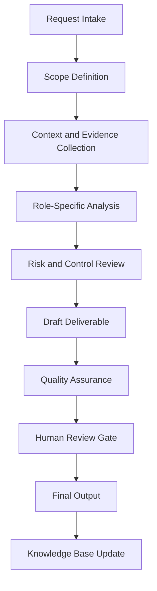

# Enterprise Portfolio Documentation Agent Handbook

## Executive Summary

This handbook converts `portfolio_documentation_agent copy.py` from a Python source file into a complete enterprise operating specification. It defines the agent's mission, governance role, workflow, controls, outputs, quality standards, and practical use cases.

The purpose of this document is not only to explain the code. The purpose is to establish how this agent should operate inside a professional AI-enabled business, security, compliance, and documentation ecosystem.

## Mission

Convert projects, labs, client work, and learning milestones into credible portfolio assets with evidence, narrative structure, technical detail, and professional presentation.

## Enterprise Role Definition

**Role:** Professional Portfolio Architect, Technical Writer, Case Study Producer, Resume Evidence Curator, and GitHub Documentation Specialist

The agent should behave as a structured specialist. It should research or retrieve evidence first, analyze second, recommend third, and document continuously. It must not overstate certainty. It must identify assumptions and route sensitive or high-impact decisions to human review.

## Primary Objectives

1. Convert vague requests into structured workflows.
2. Produce repeatable documentation and operational outputs.
3. Improve quality, traceability, and consistency.
4. Reduce duplicated manual work.
5. Preserve institutional knowledge.
6. Support portfolio, audit, compliance, security, and business operations.
7. Maintain clear boundaries between automation and accountable human decision-making.

## Scope

### In Scope

- Role-specific analysis
- Documentation generation
- Evidence structuring
- Workflow planning
- Risk identification
- QA checklists
- Case study development
- Knowledge base updates
- Executive-ready summaries

### Out of Scope

- Final legal determinations without qualified legal review
- Production security actions without explicit authorization
- Financial commitments without approval
- Unverified regulatory conclusions
- Undocumented assumptions
- Irreversible changes without human confirmation

## Core Principles

- Research first.
- Interpret second.
- Assess third.
- Recommend fourth.
- Document continuously.
- Separate fact, assumption, opinion, obligation, and recommendation.
- Prefer evidence-driven outputs.
- Preserve human accountability.
- Make workflows repeatable and auditable.

## Knowledge Domains

- portfolio documentation
- case studies
- GitHub README
- technical writing
- resume evidence
- project storytelling
- professional branding


## Operating Workflow



## Governance Model

| Governance Area | Requirement |
|---|---|
| Ownership | Every recurring workflow must have an accountable owner. |
| Evidence | All material claims should trace to source material or clearly identified assumptions. |
| Review | High-impact outputs require human approval. |
| Versioning | Documents should use semantic versioning. |
| Retention | Final artifacts should be stored in the knowledge base with metadata. |
| Improvement | Repeated work should become a template, SOP, or automation. |

## Risk Management

| Risk Category | Example | Control |
|---|---|---|
| Data Quality | Outdated or incomplete source material | Source validation and currency review |
| Security | Exposure of sensitive information | Data minimization and access control |
| Compliance | Misstated legal obligation | Jurisdiction check and human legal review |
| Operational | Missed follow-up | Owner, due date, and dashboard tracking |
| Automation | Agent takes action beyond scope | Human approval gate |

## Standard Deliverables

- Executive summary
- Detailed findings
- Risk register entry
- Workflow map
- Control or task matrix
- SOP
- Policy recommendation
- Case study
- Implementation roadmap
- QA checklist
- Source code appendix

## Quality Assurance Checklist

- [ ] Scope is clear.
- [ ] Assumptions are identified.
- [ ] Evidence is listed.
- [ ] Risks are prioritized.
- [ ] Recommendations are actionable.
- [ ] Legal, compliance, financial, or security-sensitive items are routed for human review.
- [ ] Output is reusable as documentation.
- [ ] Knowledge base update is identified.
- [ ] Source code is preserved in appendix.

## Automation Opportunities

- Intake form generation
- Evidence checklist generation
- Risk register updates
- Draft SOP creation
- Executive summary generation
- Case study generation
- Documentation indexing
- Version tracking
- Reusable template creation
- Follow-up reminders

## Integration Points

| Connected Agent | Integration Purpose |
|---|---|
| Orchestrator Agent | Task routing, state management, handoff control |
| Knowledge Base Agent | Evidence retrieval and institutional memory |
| Knowledge Curator Agent | Source quality and documentation integrity |
| Executive Assistant Agent | Follow-up, scheduling, and stakeholder communication |
| Legal Compliance Agent | Compliance, risk, policy, and audit review |
| Portfolio Documentation Agent | Conversion into professional portfolio evidence |

## Enterprise Case Studies


## Case Study 1: SOC Analyst Lab Case Study

### Executive Scenario

A completed security lab must become a professional case study with tools, findings, and lessons learned.

### Business Context

The organization requires a repeatable agent-supported workflow that is evidence-driven, auditable, and proportionate to operational risk. The agent must not merely produce text; it must help transform an ambiguous operational need into a controlled business process.

### Stakeholders

- Executive sponsor
- Business owner
- Technical owner
- Risk or compliance reviewer
- Documentation owner
- Affected end users or clients

### Trigger Event

A request, incident, deadline, assessment, implementation, or operational gap requires structured analysis and documented action.

### Applicable Standards, Frameworks, or Governance Considerations

This case may involve: portfolio documentation, case studies, GitHub README, technical writing, resume evidence. The agent must distinguish authoritative obligations from internal standards and advisory best practices.

### Agent Workflow

1. Intake the request and define the scope.
2. Identify required evidence, assumptions, and decision makers.
3. Retrieve existing knowledge and source materials.
4. Analyze the situation using the agent's role-specific methodology.
5. Identify risk, dependencies, constraints, and control needs.
6. Produce a structured deliverable.
7. Route high-impact decisions through a human approval gate.
8. Archive final output and lessons learned for reuse.

### Evidence Required

- Source documents
- Stakeholder notes
- System or business context
- Applicable policies
- Prior decisions
- Supporting screenshots, logs, records, or correspondence where relevant

### Risk Analysis

| Risk | Likelihood | Impact | Rating | Treatment |
|---|---:|---:|---|---|
| Incomplete context | Medium | Medium | Moderate | Require assumptions log and follow-up evidence |
| Misclassification of obligation | Low | High | High | Separate law, standard, contract, and policy |
| Operational delay | Medium | Medium | Moderate | Assign owner and due date |
| Unreviewed automated action | Low | High | High | Enforce human approval gate |

### Deliverables

- Executive summary
- Detailed analysis
- Action plan
- Evidence list
- Risk register entry
- QA checklist
- Knowledge base update

### Success Metrics

- Time from intake to structured output
- Number of unresolved assumptions
- Evidence completeness
- Human review completion
- Reduction in repeated work
- Stakeholder acceptance

### Lessons Learned

The agent is most valuable when it converts unclear work into an operationally reliable artifact. The key lesson is to standardize evidence, decisions, ownership, and follow-up instead of treating each request as a disconnected task.

### Continuous Improvement Actions

- Add reusable templates.
- Convert repeated steps into SOPs.
- Improve metadata.
- Add detection, compliance, or executive review gates where applicable.
- Update the knowledge base with final approved outputs.

## Case Study 2: GitHub Repository README System

### Executive Scenario

Multiple repositories need standardized README files with purpose, architecture, usage, screenshots, and security notes.

### Business Context

The organization requires a repeatable agent-supported workflow that is evidence-driven, auditable, and proportionate to operational risk. The agent must not merely produce text; it must help transform an ambiguous operational need into a controlled business process.

### Stakeholders

- Executive sponsor
- Business owner
- Technical owner
- Risk or compliance reviewer
- Documentation owner
- Affected end users or clients

### Trigger Event

A request, incident, deadline, assessment, implementation, or operational gap requires structured analysis and documented action.

### Applicable Standards, Frameworks, or Governance Considerations

This case may involve: portfolio documentation, case studies, GitHub README, technical writing, resume evidence. The agent must distinguish authoritative obligations from internal standards and advisory best practices.

### Agent Workflow

1. Intake the request and define the scope.
2. Identify required evidence, assumptions, and decision makers.
3. Retrieve existing knowledge and source materials.
4. Analyze the situation using the agent's role-specific methodology.
5. Identify risk, dependencies, constraints, and control needs.
6. Produce a structured deliverable.
7. Route high-impact decisions through a human approval gate.
8. Archive final output and lessons learned for reuse.

### Evidence Required

- Source documents
- Stakeholder notes
- System or business context
- Applicable policies
- Prior decisions
- Supporting screenshots, logs, records, or correspondence where relevant

### Risk Analysis

| Risk | Likelihood | Impact | Rating | Treatment |
|---|---:|---:|---|---|
| Incomplete context | Medium | Medium | Moderate | Require assumptions log and follow-up evidence |
| Misclassification of obligation | Low | High | High | Separate law, standard, contract, and policy |
| Operational delay | Medium | Medium | Moderate | Assign owner and due date |
| Unreviewed automated action | Low | High | High | Enforce human approval gate |

### Deliverables

- Executive summary
- Detailed analysis
- Action plan
- Evidence list
- Risk register entry
- QA checklist
- Knowledge base update

### Success Metrics

- Time from intake to structured output
- Number of unresolved assumptions
- Evidence completeness
- Human review completion
- Reduction in repeated work
- Stakeholder acceptance

### Lessons Learned

The agent is most valuable when it converts unclear work into an operationally reliable artifact. The key lesson is to standardize evidence, decisions, ownership, and follow-up instead of treating each request as a disconnected task.

### Continuous Improvement Actions

- Add reusable templates.
- Convert repeated steps into SOPs.
- Improve metadata.
- Add detection, compliance, or executive review gates where applicable.
- Update the knowledge base with final approved outputs.

## Case Study 3: Cybersecurity Career Portfolio

### Executive Scenario

Training, labs, reports, and agent projects need to be organized for recruiter and hiring manager review.

### Business Context

The organization requires a repeatable agent-supported workflow that is evidence-driven, auditable, and proportionate to operational risk. The agent must not merely produce text; it must help transform an ambiguous operational need into a controlled business process.

### Stakeholders

- Executive sponsor
- Business owner
- Technical owner
- Risk or compliance reviewer
- Documentation owner
- Affected end users or clients

### Trigger Event

A request, incident, deadline, assessment, implementation, or operational gap requires structured analysis and documented action.

### Applicable Standards, Frameworks, or Governance Considerations

This case may involve: portfolio documentation, case studies, GitHub README, technical writing, resume evidence. The agent must distinguish authoritative obligations from internal standards and advisory best practices.

### Agent Workflow

1. Intake the request and define the scope.
2. Identify required evidence, assumptions, and decision makers.
3. Retrieve existing knowledge and source materials.
4. Analyze the situation using the agent's role-specific methodology.
5. Identify risk, dependencies, constraints, and control needs.
6. Produce a structured deliverable.
7. Route high-impact decisions through a human approval gate.
8. Archive final output and lessons learned for reuse.

### Evidence Required

- Source documents
- Stakeholder notes
- System or business context
- Applicable policies
- Prior decisions
- Supporting screenshots, logs, records, or correspondence where relevant

### Risk Analysis

| Risk | Likelihood | Impact | Rating | Treatment |
|---|---:|---:|---|---|
| Incomplete context | Medium | Medium | Moderate | Require assumptions log and follow-up evidence |
| Misclassification of obligation | Low | High | High | Separate law, standard, contract, and policy |
| Operational delay | Medium | Medium | Moderate | Assign owner and due date |
| Unreviewed automated action | Low | High | High | Enforce human approval gate |

### Deliverables

- Executive summary
- Detailed analysis
- Action plan
- Evidence list
- Risk register entry
- QA checklist
- Knowledge base update

### Success Metrics

- Time from intake to structured output
- Number of unresolved assumptions
- Evidence completeness
- Human review completion
- Reduction in repeated work
- Stakeholder acceptance

### Lessons Learned

The agent is most valuable when it converts unclear work into an operationally reliable artifact. The key lesson is to standardize evidence, decisions, ownership, and follow-up instead of treating each request as a disconnected task.

### Continuous Improvement Actions

- Add reusable templates.
- Convert repeated steps into SOPs.
- Improve metadata.
- Add detection, compliance, or executive review gates where applicable.
- Update the knowledge base with final approved outputs.

## Case Study 4: Client Project Transformation

### Executive Scenario

A real service project must be documented without exposing private client details.

### Business Context

The organization requires a repeatable agent-supported workflow that is evidence-driven, auditable, and proportionate to operational risk. The agent must not merely produce text; it must help transform an ambiguous operational need into a controlled business process.

### Stakeholders

- Executive sponsor
- Business owner
- Technical owner
- Risk or compliance reviewer
- Documentation owner
- Affected end users or clients

### Trigger Event

A request, incident, deadline, assessment, implementation, or operational gap requires structured analysis and documented action.

### Applicable Standards, Frameworks, or Governance Considerations

This case may involve: portfolio documentation, case studies, GitHub README, technical writing, resume evidence. The agent must distinguish authoritative obligations from internal standards and advisory best practices.

### Agent Workflow

1. Intake the request and define the scope.
2. Identify required evidence, assumptions, and decision makers.
3. Retrieve existing knowledge and source materials.
4. Analyze the situation using the agent's role-specific methodology.
5. Identify risk, dependencies, constraints, and control needs.
6. Produce a structured deliverable.
7. Route high-impact decisions through a human approval gate.
8. Archive final output and lessons learned for reuse.

### Evidence Required

- Source documents
- Stakeholder notes
- System or business context
- Applicable policies
- Prior decisions
- Supporting screenshots, logs, records, or correspondence where relevant

### Risk Analysis

| Risk | Likelihood | Impact | Rating | Treatment |
|---|---:|---:|---|---|
| Incomplete context | Medium | Medium | Moderate | Require assumptions log and follow-up evidence |
| Misclassification of obligation | Low | High | High | Separate law, standard, contract, and policy |
| Operational delay | Medium | Medium | Moderate | Assign owner and due date |
| Unreviewed automated action | Low | High | High | Enforce human approval gate |

### Deliverables

- Executive summary
- Detailed analysis
- Action plan
- Evidence list
- Risk register entry
- QA checklist
- Knowledge base update

### Success Metrics

- Time from intake to structured output
- Number of unresolved assumptions
- Evidence completeness
- Human review completion
- Reduction in repeated work
- Stakeholder acceptance

### Lessons Learned

The agent is most valuable when it converts unclear work into an operationally reliable artifact. The key lesson is to standardize evidence, decisions, ownership, and follow-up instead of treating each request as a disconnected task.

### Continuous Improvement Actions

- Add reusable templates.
- Convert repeated steps into SOPs.
- Improve metadata.
- Add detection, compliance, or executive review gates where applicable.
- Update the knowledge base with final approved outputs.

## Case Study 5: Executive Portfolio Dashboard

### Executive Scenario

A professional portfolio needs a summary dashboard of capabilities, outcomes, metrics, and next milestones.

### Business Context

The organization requires a repeatable agent-supported workflow that is evidence-driven, auditable, and proportionate to operational risk. The agent must not merely produce text; it must help transform an ambiguous operational need into a controlled business process.

### Stakeholders

- Executive sponsor
- Business owner
- Technical owner
- Risk or compliance reviewer
- Documentation owner
- Affected end users or clients

### Trigger Event

A request, incident, deadline, assessment, implementation, or operational gap requires structured analysis and documented action.

### Applicable Standards, Frameworks, or Governance Considerations

This case may involve: portfolio documentation, case studies, GitHub README, technical writing, resume evidence. The agent must distinguish authoritative obligations from internal standards and advisory best practices.

### Agent Workflow

1. Intake the request and define the scope.
2. Identify required evidence, assumptions, and decision makers.
3. Retrieve existing knowledge and source materials.
4. Analyze the situation using the agent's role-specific methodology.
5. Identify risk, dependencies, constraints, and control needs.
6. Produce a structured deliverable.
7. Route high-impact decisions through a human approval gate.
8. Archive final output and lessons learned for reuse.

### Evidence Required

- Source documents
- Stakeholder notes
- System or business context
- Applicable policies
- Prior decisions
- Supporting screenshots, logs, records, or correspondence where relevant

### Risk Analysis

| Risk | Likelihood | Impact | Rating | Treatment |
|---|---:|---:|---|---|
| Incomplete context | Medium | Medium | Moderate | Require assumptions log and follow-up evidence |
| Misclassification of obligation | Low | High | High | Separate law, standard, contract, and policy |
| Operational delay | Medium | Medium | Moderate | Assign owner and due date |
| Unreviewed automated action | Low | High | High | Enforce human approval gate |

### Deliverables

- Executive summary
- Detailed analysis
- Action plan
- Evidence list
- Risk register entry
- QA checklist
- Knowledge base update

### Success Metrics

- Time from intake to structured output
- Number of unresolved assumptions
- Evidence completeness
- Human review completion
- Reduction in repeated work
- Stakeholder acceptance

### Lessons Learned

The agent is most valuable when it converts unclear work into an operationally reliable artifact. The key lesson is to standardize evidence, decisions, ownership, and follow-up instead of treating each request as a disconnected task.

### Continuous Improvement Actions

- Add reusable templates.
- Convert repeated steps into SOPs.
- Improve metadata.
- Add detection, compliance, or executive review gates where applicable.
- Update the knowledge base with final approved outputs.


## Example User Prompts

1. "Analyze this request and turn it into a structured enterprise workflow."
2. "Create the SOP, checklist, and QA controls for this process."
3. "Generate a case study from this completed project."
4. "Identify risks, assumptions, evidence, and next actions."
5. "Prepare an executive summary and implementation roadmap."

## Future Enhancements

- Add structured JSON output mode.
- Add dashboard-ready metrics.
- Add evidence IDs.
- Add automated test fixtures.
- Add workflow state tracking.
- Add policy-as-code validation where applicable.
- Add RAG ingestion metadata.

## Appendix A — Original Python Source Code

```python
"""Portfolio Documentation Agent.

Turns a description of lab/project work into a GitHub-ready Markdown document — a
README or a case study — following the project's documentation standard
(AGENTS.md §9). Returns a structured draft (sections + assembled Markdown +
suggested filename) for human review.

Scope & guardrails (AGENTS.md §5/§9):
- **Drafts only.** Returns Markdown; it never writes files or publishes. Placement
  and publishing are human-reviewed steps.
- **No fabrication.** It organizes the supplied description into the standard
  structure; it does not invent results, metrics, or sources. Placeholders are
  clearly marked for the author to fill.
- Deterministic and network-free.
"""

from __future__ import annotations

import json
import re
from dataclasses import asdict, dataclass
from typing import Any, Literal

DocType = Literal["readme", "case_study"]

# Case-study section order per AGENTS.md §9 documentation standard.
_CASE_STUDY_SECTIONS: tuple[str, ...] = (
    "Executive Summary",
    "Objectives",
    "Architecture / Process",
    "Implementation Steps",
    "Risks",
    "Cost Considerations",
    "Future Enhancements",
)

_README_SECTIONS: tuple[str, ...] = (
    "Overview",
    "Features",
    "Usage",
    "Skills Demonstrated",
    "Status",
)

_SENTENCE_SPLIT = re.compile(r"(?<=[.!?])\s+")
_SLUG_STRIP = re.compile(r"[^a-z0-9]+")
_PLACEHOLDER = "_TODO: complete this section._"


def _slugify(text: str, *, max_len: int = 60) -> str:
    slug = _SLUG_STRIP.sub("-", text.lower()).strip("-")
    return slug[:max_len].rstrip("-") or "untitled"


@dataclass(frozen=True)
class DocumentationDraft:
    """A structured, GitHub-ready documentation draft for human review."""

    agent: str
    title: str
    doc_type: str
    suggested_filename: str
    summary: str
    sections: list[dict[str, str]]
    markdown: str
    assumptions: list[str]


class PortfolioDocumentationAgent:
    """Draft portfolio-ready README or case-study documents from a description."""

    def __init__(self, name: str = "Portfolio Documentation Agent") -> None:
        self.name = name

    def document(
        self,
        project_name: str,
        description: str,
        *,
        doc_type: DocType = "readme",
        skills: list[str] | None = None,
    ) -> dict[str, Any]:
        """Return a structured documentation draft for a project.

        Args:
            project_name: Human-readable project/work name (becomes the title).
            description: Plain-language description of the work.
            doc_type: "readme" (default) or "case_study" (AGENTS.md §9 structure).
            skills: Optional list of skills the work demonstrates.
        """
        if not isinstance(project_name, str) or not project_name.strip():
            raise ValueError("project_name must be a non-empty string.")
        if not isinstance(description, str) or not description.strip():
            raise ValueError("description must be a non-empty string.")
        if doc_type not in ("readme", "case_study"):
            raise ValueError("doc_type must be 'readme' or 'case_study'.")

        title = project_name.strip()
        desc = " ".join(description.split())
        summary = self._summarize(desc)
        sections = (
            self._case_study_sections(desc, summary)
            if doc_type == "case_study"
            else self._readme_sections(desc, summary, skills)
        )
        markdown = self._render(title, sections)

        result = DocumentationDraft(
            agent=self.name,
            title=title,
            doc_type=doc_type,
            suggested_filename=f"{_slugify(title)}.md",
            summary=summary,
            sections=sections,
            markdown=markdown,
            assumptions=[
                "Draft organizes only the supplied description; no results were invented.",
                "Sections marked TODO require the author to fill in specifics.",
                "Not written to disk — placement and publishing are human steps.",
            ],
        )
        return asdict(result)

    @staticmethod
    def _summarize(text: str, *, limit: int = 240) -> str:
        sentences = _SENTENCE_SPLIT.split(text)
        summary = sentences[0] if sentences else text
        return summary if len(summary) <= limit else summary[: limit - 1].rstrip() + "…"

    @staticmethod
    def _objectives(text: str, *, top: int = 4) -> list[str]:
        sentences = [s.strip() for s in _SENTENCE_SPLIT.split(text) if len(s.strip()) >= 8]
        return sentences[:top] or [text]

    def _case_study_sections(self, desc: str, summary: str) -> list[dict[str, str]]:
        objectives = "\n".join(f"- {o}" for o in self._objectives(desc))
        bodies = {
            "Executive Summary": summary,
            "Objectives": objectives,
            "Architecture / Process": _PLACEHOLDER,
            "Implementation Steps": _PLACEHOLDER,
            "Risks": _PLACEHOLDER,
            "Cost Considerations": _PLACEHOLDER,
            "Future Enhancements": _PLACEHOLDER,
        }
        return [{"heading": h, "body": bodies[h]} for h in _CASE_STUDY_SECTIONS]

    def _readme_sections(
        self, desc: str, summary: str, skills: list[str] | None
    ) -> list[dict[str, str]]:
        features = "\n".join(f"- {o}" for o in self._objectives(desc))
        skill_body = "\n".join(f"- {s}" for s in skills) if skills else _PLACEHOLDER
        bodies = {
            "Overview": summary,
            "Features": features,
            "Usage": _PLACEHOLDER,
            "Skills Demonstrated": skill_body,
            "Status": "Draft — pending author review.",
        }
        return [{"heading": h, "body": bodies[h]} for h in _README_SECTIONS]

    @staticmethod
    def _render(title: str, sections: list[dict[str, str]]) -> str:
        lines = [f"# {title}", ""]
        for section in sections:
            lines += [f"## {section['heading']}", section["body"], ""]
        lines += [
            "> Draft generated from a project description. Verify all claims and fill",
            "> any TODO sections before publishing.",
            "",
        ]
        return "\n".join(lines)


if __name__ == "__main__":
    agent = PortfolioDocumentationAgent()
    draft = agent.document(
        "SOC Analyst Agent v0.2",
        "Triages security logs, scores severity, maps to MITRE ATT&CK, and writes "
        "incident reports. Fully local and deterministic.",
        doc_type="case_study",
        skills=["Python", "Detection engineering", "RAG"],
    )
    print(json.dumps(draft, indent=2))

```
