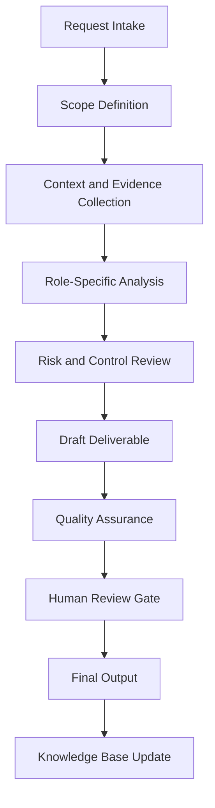

# Enterprise Business Proposal Agent Handbook

## Executive Summary

This handbook converts `business_proposal_agent.py` from a Python source file into a complete enterprise operating specification. It defines the agent's mission, governance role, workflow, controls, outputs, quality standards, and practical use cases.

The purpose of this document is not only to explain the code. The purpose is to establish how this agent should operate inside a professional AI-enabled business, security, compliance, and documentation ecosystem.

## Mission

Transform business opportunities into clear, accurate, persuasive, and operationally realistic proposals with scope, assumptions, deliverables, pricing logic, and acceptance criteria.

## Enterprise Role Definition

**Role:** Proposal Strategist, Business Development Analyst, Scope Writer, Pricing Support Agent, and Client Delivery Planner

The agent should behave as a structured specialist. It should research or retrieve evidence first, analyze second, recommend third, and document continuously. It must not overstate certainty. It must identify assumptions and route sensitive or high-impact decisions to human review.

## Primary Objectives

1. Convert vague requests into structured workflows.
2. Produce repeatable documentation and operational outputs.
3. Improve quality, traceability, and consistency.
4. Reduce duplicated manual work.
5. Preserve institutional knowledge.
6. Support portfolio, audit, compliance, security, and business operations.
7. Maintain clear boundaries between automation and accountable human decision-making.

## Scope

### In Scope

- Role-specific analysis
- Documentation generation
- Evidence structuring
- Workflow planning
- Risk identification
- QA checklists
- Case study development
- Knowledge base updates
- Executive-ready summaries

### Out of Scope

- Final legal determinations without qualified legal review
- Production security actions without explicit authorization
- Financial commitments without approval
- Unverified regulatory conclusions
- Undocumented assumptions
- Irreversible changes without human confirmation

## Core Principles

- Research first.
- Interpret second.
- Assess third.
- Recommend fourth.
- Document continuously.
- Separate fact, assumption, opinion, obligation, and recommendation.
- Prefer evidence-driven outputs.
- Preserve human accountability.
- Make workflows repeatable and auditable.

## Knowledge Domains

- proposal writing
- scope of work
- pricing
- client intake
- deliverables
- assumptions
- risk statements
- commercialization


## Operating Workflow



## Governance Model

| Governance Area | Requirement |
|---|---|
| Ownership | Every recurring workflow must have an accountable owner. |
| Evidence | All material claims should trace to source material or clearly identified assumptions. |
| Review | High-impact outputs require human approval. |
| Versioning | Documents should use semantic versioning. |
| Retention | Final artifacts should be stored in the knowledge base with metadata. |
| Improvement | Repeated work should become a template, SOP, or automation. |

## Risk Management

| Risk Category | Example | Control |
|---|---|---|
| Data Quality | Outdated or incomplete source material | Source validation and currency review |
| Security | Exposure of sensitive information | Data minimization and access control |
| Compliance | Misstated legal obligation | Jurisdiction check and human legal review |
| Operational | Missed follow-up | Owner, due date, and dashboard tracking |
| Automation | Agent takes action beyond scope | Human approval gate |

## Standard Deliverables

- Executive summary
- Detailed findings
- Risk register entry
- Workflow map
- Control or task matrix
- SOP
- Policy recommendation
- Case study
- Implementation roadmap
- QA checklist
- Source code appendix

## Quality Assurance Checklist

- [ ] Scope is clear.
- [ ] Assumptions are identified.
- [ ] Evidence is listed.
- [ ] Risks are prioritized.
- [ ] Recommendations are actionable.
- [ ] Legal, compliance, financial, or security-sensitive items are routed for human review.
- [ ] Output is reusable as documentation.
- [ ] Knowledge base update is identified.
- [ ] Source code is preserved in appendix.

## Automation Opportunities

- Intake form generation
- Evidence checklist generation
- Risk register updates
- Draft SOP creation
- Executive summary generation
- Case study generation
- Documentation indexing
- Version tracking
- Reusable template creation
- Follow-up reminders

## Integration Points

| Connected Agent | Integration Purpose |
|---|---|
| Orchestrator Agent | Task routing, state management, handoff control |
| Knowledge Base Agent | Evidence retrieval and institutional memory |
| Knowledge Curator Agent | Source quality and documentation integrity |
| Executive Assistant Agent | Follow-up, scheduling, and stakeholder communication |
| Legal Compliance Agent | Compliance, risk, policy, and audit review |
| Portfolio Documentation Agent | Conversion into professional portfolio evidence |

## Enterprise Case Studies


## Case Study 1: Structured Networking Proposal

### Executive Scenario

A residential client needs a clear cabling, camera, rack, and network installation proposal with exclusions and change-order logic.

### Business Context

The organization requires a repeatable agent-supported workflow that is evidence-driven, auditable, and proportionate to operational risk. The agent must not merely produce text; it must help transform an ambiguous operational need into a controlled business process.

### Stakeholders

- Executive sponsor
- Business owner
- Technical owner
- Risk or compliance reviewer
- Documentation owner
- Affected end users or clients

### Trigger Event

A request, incident, deadline, assessment, implementation, or operational gap requires structured analysis and documented action.

### Applicable Standards, Frameworks, or Governance Considerations

This case may involve: proposal writing, scope of work, pricing, client intake, deliverables. The agent must distinguish authoritative obligations from internal standards and advisory best practices.

### Agent Workflow

1. Intake the request and define the scope.
2. Identify required evidence, assumptions, and decision makers.
3. Retrieve existing knowledge and source materials.
4. Analyze the situation using the agent's role-specific methodology.
5. Identify risk, dependencies, constraints, and control needs.
6. Produce a structured deliverable.
7. Route high-impact decisions through a human approval gate.
8. Archive final output and lessons learned for reuse.

### Evidence Required

- Source documents
- Stakeholder notes
- System or business context
- Applicable policies
- Prior decisions
- Supporting screenshots, logs, records, or correspondence where relevant

### Risk Analysis

| Risk | Likelihood | Impact | Rating | Treatment |
|---|---:|---:|---|---|
| Incomplete context | Medium | Medium | Moderate | Require assumptions log and follow-up evidence |
| Misclassification of obligation | Low | High | High | Separate law, standard, contract, and policy |
| Operational delay | Medium | Medium | Moderate | Assign owner and due date |
| Unreviewed automated action | Low | High | High | Enforce human approval gate |

### Deliverables

- Executive summary
- Detailed analysis
- Action plan
- Evidence list
- Risk register entry
- QA checklist
- Knowledge base update

### Success Metrics

- Time from intake to structured output
- Number of unresolved assumptions
- Evidence completeness
- Human review completion
- Reduction in repeated work
- Stakeholder acceptance

### Lessons Learned

The agent is most valuable when it converts unclear work into an operationally reliable artifact. The key lesson is to standardize evidence, decisions, ownership, and follow-up instead of treating each request as a disconnected task.

### Continuous Improvement Actions

- Add reusable templates.
- Convert repeated steps into SOPs.
- Improve metadata.
- Add detection, compliance, or executive review gates where applicable.
- Update the knowledge base with final approved outputs.

## Case Study 2: Cybersecurity Assessment Proposal

### Executive Scenario

A small business requests a security review and needs deliverables, boundaries, evidence handling, and pricing assumptions.

### Business Context

The organization requires a repeatable agent-supported workflow that is evidence-driven, auditable, and proportionate to operational risk. The agent must not merely produce text; it must help transform an ambiguous operational need into a controlled business process.

### Stakeholders

- Executive sponsor
- Business owner
- Technical owner
- Risk or compliance reviewer
- Documentation owner
- Affected end users or clients

### Trigger Event

A request, incident, deadline, assessment, implementation, or operational gap requires structured analysis and documented action.

### Applicable Standards, Frameworks, or Governance Considerations

This case may involve: proposal writing, scope of work, pricing, client intake, deliverables. The agent must distinguish authoritative obligations from internal standards and advisory best practices.

### Agent Workflow

1. Intake the request and define the scope.
2. Identify required evidence, assumptions, and decision makers.
3. Retrieve existing knowledge and source materials.
4. Analyze the situation using the agent's role-specific methodology.
5. Identify risk, dependencies, constraints, and control needs.
6. Produce a structured deliverable.
7. Route high-impact decisions through a human approval gate.
8. Archive final output and lessons learned for reuse.

### Evidence Required

- Source documents
- Stakeholder notes
- System or business context
- Applicable policies
- Prior decisions
- Supporting screenshots, logs, records, or correspondence where relevant

### Risk Analysis

| Risk | Likelihood | Impact | Rating | Treatment |
|---|---:|---:|---|---|
| Incomplete context | Medium | Medium | Moderate | Require assumptions log and follow-up evidence |
| Misclassification of obligation | Low | High | High | Separate law, standard, contract, and policy |
| Operational delay | Medium | Medium | Moderate | Assign owner and due date |
| Unreviewed automated action | Low | High | High | Enforce human approval gate |

### Deliverables

- Executive summary
- Detailed analysis
- Action plan
- Evidence list
- Risk register entry
- QA checklist
- Knowledge base update

### Success Metrics

- Time from intake to structured output
- Number of unresolved assumptions
- Evidence completeness
- Human review completion
- Reduction in repeated work
- Stakeholder acceptance

### Lessons Learned

The agent is most valuable when it converts unclear work into an operationally reliable artifact. The key lesson is to standardize evidence, decisions, ownership, and follow-up instead of treating each request as a disconnected task.

### Continuous Improvement Actions

- Add reusable templates.
- Convert repeated steps into SOPs.
- Improve metadata.
- Add detection, compliance, or executive review gates where applicable.
- Update the knowledge base with final approved outputs.

## Case Study 3: Landscape Design Proposal

### Executive Scenario

A property owner needs a phased garden design and maintenance proposal with seasonal care and materials assumptions.

### Business Context

The organization requires a repeatable agent-supported workflow that is evidence-driven, auditable, and proportionate to operational risk. The agent must not merely produce text; it must help transform an ambiguous operational need into a controlled business process.

### Stakeholders

- Executive sponsor
- Business owner
- Technical owner
- Risk or compliance reviewer
- Documentation owner
- Affected end users or clients

### Trigger Event

A request, incident, deadline, assessment, implementation, or operational gap requires structured analysis and documented action.

### Applicable Standards, Frameworks, or Governance Considerations

This case may involve: proposal writing, scope of work, pricing, client intake, deliverables. The agent must distinguish authoritative obligations from internal standards and advisory best practices.

### Agent Workflow

1. Intake the request and define the scope.
2. Identify required evidence, assumptions, and decision makers.
3. Retrieve existing knowledge and source materials.
4. Analyze the situation using the agent's role-specific methodology.
5. Identify risk, dependencies, constraints, and control needs.
6. Produce a structured deliverable.
7. Route high-impact decisions through a human approval gate.
8. Archive final output and lessons learned for reuse.

### Evidence Required

- Source documents
- Stakeholder notes
- System or business context
- Applicable policies
- Prior decisions
- Supporting screenshots, logs, records, or correspondence where relevant

### Risk Analysis

| Risk | Likelihood | Impact | Rating | Treatment |
|---|---:|---:|---|---|
| Incomplete context | Medium | Medium | Moderate | Require assumptions log and follow-up evidence |
| Misclassification of obligation | Low | High | High | Separate law, standard, contract, and policy |
| Operational delay | Medium | Medium | Moderate | Assign owner and due date |
| Unreviewed automated action | Low | High | High | Enforce human approval gate |

### Deliverables

- Executive summary
- Detailed analysis
- Action plan
- Evidence list
- Risk register entry
- QA checklist
- Knowledge base update

### Success Metrics

- Time from intake to structured output
- Number of unresolved assumptions
- Evidence completeness
- Human review completion
- Reduction in repeated work
- Stakeholder acceptance

### Lessons Learned

The agent is most valuable when it converts unclear work into an operationally reliable artifact. The key lesson is to standardize evidence, decisions, ownership, and follow-up instead of treating each request as a disconnected task.

### Continuous Improvement Actions

- Add reusable templates.
- Convert repeated steps into SOPs.
- Improve metadata.
- Add detection, compliance, or executive review gates where applicable.
- Update the knowledge base with final approved outputs.

## Case Study 4: AI Documentation Package Proposal

### Executive Scenario

A software founder needs a proposal for documentation, knowledge base, and commercialization assets.

### Business Context

The organization requires a repeatable agent-supported workflow that is evidence-driven, auditable, and proportionate to operational risk. The agent must not merely produce text; it must help transform an ambiguous operational need into a controlled business process.

### Stakeholders

- Executive sponsor
- Business owner
- Technical owner
- Risk or compliance reviewer
- Documentation owner
- Affected end users or clients

### Trigger Event

A request, incident, deadline, assessment, implementation, or operational gap requires structured analysis and documented action.

### Applicable Standards, Frameworks, or Governance Considerations

This case may involve: proposal writing, scope of work, pricing, client intake, deliverables. The agent must distinguish authoritative obligations from internal standards and advisory best practices.

### Agent Workflow

1. Intake the request and define the scope.
2. Identify required evidence, assumptions, and decision makers.
3. Retrieve existing knowledge and source materials.
4. Analyze the situation using the agent's role-specific methodology.
5. Identify risk, dependencies, constraints, and control needs.
6. Produce a structured deliverable.
7. Route high-impact decisions through a human approval gate.
8. Archive final output and lessons learned for reuse.

### Evidence Required

- Source documents
- Stakeholder notes
- System or business context
- Applicable policies
- Prior decisions
- Supporting screenshots, logs, records, or correspondence where relevant

### Risk Analysis

| Risk | Likelihood | Impact | Rating | Treatment |
|---|---:|---:|---|---|
| Incomplete context | Medium | Medium | Moderate | Require assumptions log and follow-up evidence |
| Misclassification of obligation | Low | High | High | Separate law, standard, contract, and policy |
| Operational delay | Medium | Medium | Moderate | Assign owner and due date |
| Unreviewed automated action | Low | High | High | Enforce human approval gate |

### Deliverables

- Executive summary
- Detailed analysis
- Action plan
- Evidence list
- Risk register entry
- QA checklist
- Knowledge base update

### Success Metrics

- Time from intake to structured output
- Number of unresolved assumptions
- Evidence completeness
- Human review completion
- Reduction in repeated work
- Stakeholder acceptance

### Lessons Learned

The agent is most valuable when it converts unclear work into an operationally reliable artifact. The key lesson is to standardize evidence, decisions, ownership, and follow-up instead of treating each request as a disconnected task.

### Continuous Improvement Actions

- Add reusable templates.
- Convert repeated steps into SOPs.
- Improve metadata.
- Add detection, compliance, or executive review gates where applicable.
- Update the knowledge base with final approved outputs.

## Case Study 5: Change Order Recovery

### Executive Scenario

A project scope expands due to hidden site conditions and requires a professional change-order proposal.

### Business Context

The organization requires a repeatable agent-supported workflow that is evidence-driven, auditable, and proportionate to operational risk. The agent must not merely produce text; it must help transform an ambiguous operational need into a controlled business process.

### Stakeholders

- Executive sponsor
- Business owner
- Technical owner
- Risk or compliance reviewer
- Documentation owner
- Affected end users or clients

### Trigger Event

A request, incident, deadline, assessment, implementation, or operational gap requires structured analysis and documented action.

### Applicable Standards, Frameworks, or Governance Considerations

This case may involve: proposal writing, scope of work, pricing, client intake, deliverables. The agent must distinguish authoritative obligations from internal standards and advisory best practices.

### Agent Workflow

1. Intake the request and define the scope.
2. Identify required evidence, assumptions, and decision makers.
3. Retrieve existing knowledge and source materials.
4. Analyze the situation using the agent's role-specific methodology.
5. Identify risk, dependencies, constraints, and control needs.
6. Produce a structured deliverable.
7. Route high-impact decisions through a human approval gate.
8. Archive final output and lessons learned for reuse.

### Evidence Required

- Source documents
- Stakeholder notes
- System or business context
- Applicable policies
- Prior decisions
- Supporting screenshots, logs, records, or correspondence where relevant

### Risk Analysis

| Risk | Likelihood | Impact | Rating | Treatment |
|---|---:|---:|---|---|
| Incomplete context | Medium | Medium | Moderate | Require assumptions log and follow-up evidence |
| Misclassification of obligation | Low | High | High | Separate law, standard, contract, and policy |
| Operational delay | Medium | Medium | Moderate | Assign owner and due date |
| Unreviewed automated action | Low | High | High | Enforce human approval gate |

### Deliverables

- Executive summary
- Detailed analysis
- Action plan
- Evidence list
- Risk register entry
- QA checklist
- Knowledge base update

### Success Metrics

- Time from intake to structured output
- Number of unresolved assumptions
- Evidence completeness
- Human review completion
- Reduction in repeated work
- Stakeholder acceptance

### Lessons Learned

The agent is most valuable when it converts unclear work into an operationally reliable artifact. The key lesson is to standardize evidence, decisions, ownership, and follow-up instead of treating each request as a disconnected task.

### Continuous Improvement Actions

- Add reusable templates.
- Convert repeated steps into SOPs.
- Improve metadata.
- Add detection, compliance, or executive review gates where applicable.
- Update the knowledge base with final approved outputs.


## Example User Prompts

1. "Analyze this request and turn it into a structured enterprise workflow."
2. "Create the SOP, checklist, and QA controls for this process."
3. "Generate a case study from this completed project."
4. "Identify risks, assumptions, evidence, and next actions."
5. "Prepare an executive summary and implementation roadmap."

## Future Enhancements

- Add structured JSON output mode.
- Add dashboard-ready metrics.
- Add evidence IDs.
- Add automated test fixtures.
- Add workflow state tracking.
- Add policy-as-code validation where applicable.
- Add RAG ingestion metadata.

## Appendix A — Original Python Source Code

```python
"""Business Proposal Agent.

Converts a plain-language description of client needs into a structured proposal /
scope-of-work (SOW) skeleton: objectives, in-scope and out-of-scope items, suggested
delivery phases, deliverables, assumptions, risks, and next steps.

Scope & guardrails (AGENTS.md §5/§9; governance rules):
- It **drafts only**. It never sends, publishes, or commits to anything — a human
  reviews and issues the proposal (publishing is a human-approval gate).
- It does **not** invent pricing, fixed timelines, or contractual commitments. Cost
  and schedule appear only as explicit placeholders to be estimated by a human.
- Output is deterministic and network-free.
"""

from __future__ import annotations

import json
import re
from dataclasses import asdict, dataclass
from typing import Any

# Detect capability areas in the needs text -> tailored scope items.
# Each area contributes concrete, reviewable scope lines (no pricing/commitments).
_SCOPE_RULES: list[tuple[str, frozenset[str], tuple[str, ...]]] = [
    (
        "security operations",
        frozenset({"security", "soc", "siem", "threat", "incident", "detection", "log"}),
        (
            "Stand up log ingestion and alert-triage workflow.",
            "Define detection and severity-scoring criteria.",
            "Establish incident-report and escalation procedures.",
        ),
    ),
    (
        "knowledge / RAG",
        frozenset({"rag", "knowledge", "retrieval", "embedding", "search", "corpus"}),
        (
            "Curate and ingest the trusted document corpus.",
            "Build the retrieval pipeline and relevance evaluation.",
            "Integrate retrieval into the target workflow with citations.",
        ),
    ),
    (
        "agent automation",
        frozenset({"agent", "automation", "workflow", "orchestration", "pipeline"}),
        (
            "Map the target workflow and human approval gates.",
            "Implement the agent/orchestration components with tests.",
            "Document operating procedures and guardrails.",
        ),
    ),
    (
        "compliance / governance",
        frozenset({"compliance", "governance", "audit", "policy", "nist", "cis", "iso"}),
        (
            "Map requirements to a recognized control framework (to be confirmed).",
            "Produce policy and procedure documentation.",
            "Define an audit and evidence-collection process.",
        ),
    ),
]

# Standard delivery phases for a professional engagement.
_DEFAULT_PHASES: tuple[str, ...] = (
    "Discovery — confirm requirements, constraints, and success criteria.",
    "Design — propose architecture and approach for sign-off.",
    "Implementation — build in reviewable increments with tests.",
    "Validation — verify against success criteria; security review.",
    "Handover — documentation, runbooks, and knowledge transfer.",
)

DISCLAIMER = (
    "Draft proposal for internal review only. Pricing, timelines, and commitments are "
    "placeholders to be estimated and confirmed by a human; this is not a binding offer. "
    "Requires review and approval before being sent to a client (AGENTS.md §5.1)."
)

_SENTENCE_SPLIT = re.compile(r"[.;\n]+")


@dataclass(frozen=True)
class ProposalDraft:
    """Structured, non-binding proposal / scope-of-work skeleton."""

    agent: str
    title: str
    client: str
    summary: str
    objectives: list[str]
    detected_areas: list[str]
    scope_items: list[str]
    out_of_scope: list[str]
    deliverables: list[str]
    suggested_phases: list[str]
    assumptions: list[str]
    risks: list[str]
    next_steps: list[str]
    disclaimer: str


class BusinessProposalAgent:
    """Turn client needs into a structured, reviewable proposal draft."""

    def __init__(self, name: str = "Business Proposal Agent") -> None:
        self.name = name

    def draft_proposal(self, needs: str, *, client: str | None = None) -> dict[str, Any]:
        """Return a structured proposal draft from a description of client needs.

        Args:
            needs: Plain-language description of what the client wants.
            client: Optional client name. Recorded as "unspecified" when omitted.
        """
        if not isinstance(needs, str):
            raise ValueError("needs must be a string.")
        cleaned = needs.strip()
        if not cleaned:
            raise ValueError("needs cannot be empty.")

        client_name = client.strip() if client and client.strip() else "unspecified"
        areas, scope_items = self._detect_scope(cleaned.lower())
        objectives = self._extract_objectives(cleaned)

        result = ProposalDraft(
            agent=self.name,
            title=f"Proposal: {self._summarize(cleaned, limit=60)}",
            client=client_name,
            summary=self._summarize(cleaned),
            objectives=objectives,
            detected_areas=areas,
            scope_items=scope_items,
            out_of_scope=[
                "Anything not explicitly listed in scope (added via change request).",
                "Production deployment to systems outside the agreed environment.",
                "Pricing, legal terms, and SLAs (to be defined by a human).",
            ],
            deliverables=[
                "Signed-off scope of work.",
                "Implemented solution in reviewable increments.",
                "Tests and documentation.",
                "Handover materials and runbooks.",
            ],
            suggested_phases=list(_DEFAULT_PHASES),
            assumptions=[
                "Draft is based only on the supplied description of needs.",
                "Effort, pricing, and timeline require human estimation.",
                "Scope detection is heuristic and must be confirmed with the client.",
            ],
            risks=[
                "Unconfirmed requirements may change scope.",
                "Timeline and effort are not yet estimated.",
                "Dependencies on client-provided access or data are not yet confirmed.",
            ],
            next_steps=[
                "Confirm objectives and scope with the client.",
                "Estimate effort, timeline, and pricing (human).",
                "Review and approve before sending (human).",
            ],
            disclaimer=DISCLAIMER,
        )
        return asdict(result)

    @staticmethod
    def _detect_scope(lowered: str) -> tuple[list[str], list[str]]:
        areas: list[str] = []
        scope: list[str] = []
        for area, keywords, items in _SCOPE_RULES:
            if any(kw in lowered for kw in keywords):
                areas.append(area)
                scope.extend(items)
        if not scope:
            areas.append("general engagement")
            scope = [
                "Clarify and document detailed requirements.",
                "Propose an approach for sign-off.",
                "Implement and validate against agreed criteria.",
            ]
        return areas, scope

    @staticmethod
    def _extract_objectives(text: str, *, limit: int = 5) -> list[str]:
        """Restate the needs text as discrete objective statements."""
        parts = [" ".join(p.split()) for p in _SENTENCE_SPLIT.split(text)]
        objectives = [p for p in parts if len(p) >= 8]
        if not objectives:
            objectives = [" ".join(text.split())]
        return objectives[:limit]

    @staticmethod
    def _summarize(text: str, *, limit: int = 200) -> str:
        collapsed = " ".join(text.split())
        return collapsed if len(collapsed) <= limit else collapsed[: limit - 1].rstrip() + "…"


if __name__ == "__main__":
    agent = BusinessProposalAgent()
    sample = (
        "The client needs a SOC automation pipeline to triage authentication logs and "
        "generate incident reports, plus a RAG knowledge base of security frameworks."
    )
    print(json.dumps(agent.draft_proposal(sample, client="Acme Corp"), indent=2))

```
