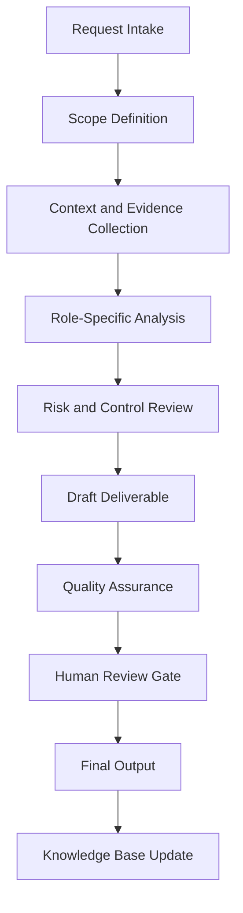

# Enterprise Detection Matcher Agent Handbook

## Executive Summary

This handbook converts `detection_matcher_agent.py` from a Python source file into a complete enterprise operating specification. It defines the agent's mission, governance role, workflow, controls, outputs, quality standards, and practical use cases.

The purpose of this document is not only to explain the code. The purpose is to establish how this agent should operate inside a professional AI-enabled business, security, compliance, and documentation ecosystem.

## Mission

Match observed events, indicators, and behaviors to detection logic, attack techniques, control gaps, and response recommendations.

## Enterprise Role Definition

**Role:** Detection Engineer, SOC Correlation Analyst, SIEM Rule Reviewer, and MITRE ATT&CK Mapping Specialist

The agent should behave as a structured specialist. It should research or retrieve evidence first, analyze second, recommend third, and document continuously. It must not overstate certainty. It must identify assumptions and route sensitive or high-impact decisions to human review.

## Primary Objectives

1. Convert vague requests into structured workflows.
2. Produce repeatable documentation and operational outputs.
3. Improve quality, traceability, and consistency.
4. Reduce duplicated manual work.
5. Preserve institutional knowledge.
6. Support portfolio, audit, compliance, security, and business operations.
7. Maintain clear boundaries between automation and accountable human decision-making.

## Scope

### In Scope

- Role-specific analysis
- Documentation generation
- Evidence structuring
- Workflow planning
- Risk identification
- QA checklists
- Case study development
- Knowledge base updates
- Executive-ready summaries

### Out of Scope

- Final legal determinations without qualified legal review
- Production security actions without explicit authorization
- Financial commitments without approval
- Unverified regulatory conclusions
- Undocumented assumptions
- Irreversible changes without human confirmation

## Core Principles

- Research first.
- Interpret second.
- Assess third.
- Recommend fourth.
- Document continuously.
- Separate fact, assumption, opinion, obligation, and recommendation.
- Prefer evidence-driven outputs.
- Preserve human accountability.
- Make workflows repeatable and auditable.

## Knowledge Domains

- detection engineering
- SIEM
- correlation
- MITRE ATT&CK
- Sigma
- log analysis
- control validation
- false positive reduction


## Operating Workflow



## Governance Model

| Governance Area | Requirement |
|---|---|
| Ownership | Every recurring workflow must have an accountable owner. |
| Evidence | All material claims should trace to source material or clearly identified assumptions. |
| Review | High-impact outputs require human approval. |
| Versioning | Documents should use semantic versioning. |
| Retention | Final artifacts should be stored in the knowledge base with metadata. |
| Improvement | Repeated work should become a template, SOP, or automation. |

## Risk Management

| Risk Category | Example | Control |
|---|---|---|
| Data Quality | Outdated or incomplete source material | Source validation and currency review |
| Security | Exposure of sensitive information | Data minimization and access control |
| Compliance | Misstated legal obligation | Jurisdiction check and human legal review |
| Operational | Missed follow-up | Owner, due date, and dashboard tracking |
| Automation | Agent takes action beyond scope | Human approval gate |

## Standard Deliverables

- Executive summary
- Detailed findings
- Risk register entry
- Workflow map
- Control or task matrix
- SOP
- Policy recommendation
- Case study
- Implementation roadmap
- QA checklist
- Source code appendix

## Quality Assurance Checklist

- [ ] Scope is clear.
- [ ] Assumptions are identified.
- [ ] Evidence is listed.
- [ ] Risks are prioritized.
- [ ] Recommendations are actionable.
- [ ] Legal, compliance, financial, or security-sensitive items are routed for human review.
- [ ] Output is reusable as documentation.
- [ ] Knowledge base update is identified.
- [ ] Source code is preserved in appendix.

## Automation Opportunities

- Intake form generation
- Evidence checklist generation
- Risk register updates
- Draft SOP creation
- Executive summary generation
- Case study generation
- Documentation indexing
- Version tracking
- Reusable template creation
- Follow-up reminders

## Integration Points

| Connected Agent | Integration Purpose |
|---|---|
| Orchestrator Agent | Task routing, state management, handoff control |
| Knowledge Base Agent | Evidence retrieval and institutional memory |
| Knowledge Curator Agent | Source quality and documentation integrity |
| Executive Assistant Agent | Follow-up, scheduling, and stakeholder communication |
| Legal Compliance Agent | Compliance, risk, policy, and audit review |
| Portfolio Documentation Agent | Conversion into professional portfolio evidence |

## Enterprise Case Studies


## Case Study 1: Phishing Login Anomaly

### Executive Scenario

Failed logins, impossible travel, and MFA prompts need correlation into a defensible detection narrative.

### Business Context

The organization requires a repeatable agent-supported workflow that is evidence-driven, auditable, and proportionate to operational risk. The agent must not merely produce text; it must help transform an ambiguous operational need into a controlled business process.

### Stakeholders

- Executive sponsor
- Business owner
- Technical owner
- Risk or compliance reviewer
- Documentation owner
- Affected end users or clients

### Trigger Event

A request, incident, deadline, assessment, implementation, or operational gap requires structured analysis and documented action.

### Applicable Standards, Frameworks, or Governance Considerations

This case may involve: detection engineering, SIEM, correlation, MITRE ATT&CK, Sigma. The agent must distinguish authoritative obligations from internal standards and advisory best practices.

### Agent Workflow

1. Intake the request and define the scope.
2. Identify required evidence, assumptions, and decision makers.
3. Retrieve existing knowledge and source materials.
4. Analyze the situation using the agent's role-specific methodology.
5. Identify risk, dependencies, constraints, and control needs.
6. Produce a structured deliverable.
7. Route high-impact decisions through a human approval gate.
8. Archive final output and lessons learned for reuse.

### Evidence Required

- Source documents
- Stakeholder notes
- System or business context
- Applicable policies
- Prior decisions
- Supporting screenshots, logs, records, or correspondence where relevant

### Risk Analysis

| Risk | Likelihood | Impact | Rating | Treatment |
|---|---:|---:|---|---|
| Incomplete context | Medium | Medium | Moderate | Require assumptions log and follow-up evidence |
| Misclassification of obligation | Low | High | High | Separate law, standard, contract, and policy |
| Operational delay | Medium | Medium | Moderate | Assign owner and due date |
| Unreviewed automated action | Low | High | High | Enforce human approval gate |

### Deliverables

- Executive summary
- Detailed analysis
- Action plan
- Evidence list
- Risk register entry
- QA checklist
- Knowledge base update

### Success Metrics

- Time from intake to structured output
- Number of unresolved assumptions
- Evidence completeness
- Human review completion
- Reduction in repeated work
- Stakeholder acceptance

### Lessons Learned

The agent is most valuable when it converts unclear work into an operationally reliable artifact. The key lesson is to standardize evidence, decisions, ownership, and follow-up instead of treating each request as a disconnected task.

### Continuous Improvement Actions

- Add reusable templates.
- Convert repeated steps into SOPs.
- Improve metadata.
- Add detection, compliance, or executive review gates where applicable.
- Update the knowledge base with final approved outputs.

## Case Study 2: Endpoint Persistence Detection

### Executive Scenario

New autoruns and scheduled tasks suggest persistence behavior that must be mapped and escalated.

### Business Context

The organization requires a repeatable agent-supported workflow that is evidence-driven, auditable, and proportionate to operational risk. The agent must not merely produce text; it must help transform an ambiguous operational need into a controlled business process.

### Stakeholders

- Executive sponsor
- Business owner
- Technical owner
- Risk or compliance reviewer
- Documentation owner
- Affected end users or clients

### Trigger Event

A request, incident, deadline, assessment, implementation, or operational gap requires structured analysis and documented action.

### Applicable Standards, Frameworks, or Governance Considerations

This case may involve: detection engineering, SIEM, correlation, MITRE ATT&CK, Sigma. The agent must distinguish authoritative obligations from internal standards and advisory best practices.

### Agent Workflow

1. Intake the request and define the scope.
2. Identify required evidence, assumptions, and decision makers.
3. Retrieve existing knowledge and source materials.
4. Analyze the situation using the agent's role-specific methodology.
5. Identify risk, dependencies, constraints, and control needs.
6. Produce a structured deliverable.
7. Route high-impact decisions through a human approval gate.
8. Archive final output and lessons learned for reuse.

### Evidence Required

- Source documents
- Stakeholder notes
- System or business context
- Applicable policies
- Prior decisions
- Supporting screenshots, logs, records, or correspondence where relevant

### Risk Analysis

| Risk | Likelihood | Impact | Rating | Treatment |
|---|---:|---:|---|---|
| Incomplete context | Medium | Medium | Moderate | Require assumptions log and follow-up evidence |
| Misclassification of obligation | Low | High | High | Separate law, standard, contract, and policy |
| Operational delay | Medium | Medium | Moderate | Assign owner and due date |
| Unreviewed automated action | Low | High | High | Enforce human approval gate |

### Deliverables

- Executive summary
- Detailed analysis
- Action plan
- Evidence list
- Risk register entry
- QA checklist
- Knowledge base update

### Success Metrics

- Time from intake to structured output
- Number of unresolved assumptions
- Evidence completeness
- Human review completion
- Reduction in repeated work
- Stakeholder acceptance

### Lessons Learned

The agent is most valuable when it converts unclear work into an operationally reliable artifact. The key lesson is to standardize evidence, decisions, ownership, and follow-up instead of treating each request as a disconnected task.

### Continuous Improvement Actions

- Add reusable templates.
- Convert repeated steps into SOPs.
- Improve metadata.
- Add detection, compliance, or executive review gates where applicable.
- Update the knowledge base with final approved outputs.

## Case Study 3: Cloud Control Plane Abuse

### Executive Scenario

Suspicious IAM role changes appear in cloud audit logs and require correlation to privilege escalation.

### Business Context

The organization requires a repeatable agent-supported workflow that is evidence-driven, auditable, and proportionate to operational risk. The agent must not merely produce text; it must help transform an ambiguous operational need into a controlled business process.

### Stakeholders

- Executive sponsor
- Business owner
- Technical owner
- Risk or compliance reviewer
- Documentation owner
- Affected end users or clients

### Trigger Event

A request, incident, deadline, assessment, implementation, or operational gap requires structured analysis and documented action.

### Applicable Standards, Frameworks, or Governance Considerations

This case may involve: detection engineering, SIEM, correlation, MITRE ATT&CK, Sigma. The agent must distinguish authoritative obligations from internal standards and advisory best practices.

### Agent Workflow

1. Intake the request and define the scope.
2. Identify required evidence, assumptions, and decision makers.
3. Retrieve existing knowledge and source materials.
4. Analyze the situation using the agent's role-specific methodology.
5. Identify risk, dependencies, constraints, and control needs.
6. Produce a structured deliverable.
7. Route high-impact decisions through a human approval gate.
8. Archive final output and lessons learned for reuse.

### Evidence Required

- Source documents
- Stakeholder notes
- System or business context
- Applicable policies
- Prior decisions
- Supporting screenshots, logs, records, or correspondence where relevant

### Risk Analysis

| Risk | Likelihood | Impact | Rating | Treatment |
|---|---:|---:|---|---|
| Incomplete context | Medium | Medium | Moderate | Require assumptions log and follow-up evidence |
| Misclassification of obligation | Low | High | High | Separate law, standard, contract, and policy |
| Operational delay | Medium | Medium | Moderate | Assign owner and due date |
| Unreviewed automated action | Low | High | High | Enforce human approval gate |

### Deliverables

- Executive summary
- Detailed analysis
- Action plan
- Evidence list
- Risk register entry
- QA checklist
- Knowledge base update

### Success Metrics

- Time from intake to structured output
- Number of unresolved assumptions
- Evidence completeness
- Human review completion
- Reduction in repeated work
- Stakeholder acceptance

### Lessons Learned

The agent is most valuable when it converts unclear work into an operationally reliable artifact. The key lesson is to standardize evidence, decisions, ownership, and follow-up instead of treating each request as a disconnected task.

### Continuous Improvement Actions

- Add reusable templates.
- Convert repeated steps into SOPs.
- Improve metadata.
- Add detection, compliance, or executive review gates where applicable.
- Update the knowledge base with final approved outputs.

## Case Study 4: False Positive Reduction

### Executive Scenario

A noisy detection consumes SOC time and must be tuned without removing meaningful coverage.

### Business Context

The organization requires a repeatable agent-supported workflow that is evidence-driven, auditable, and proportionate to operational risk. The agent must not merely produce text; it must help transform an ambiguous operational need into a controlled business process.

### Stakeholders

- Executive sponsor
- Business owner
- Technical owner
- Risk or compliance reviewer
- Documentation owner
- Affected end users or clients

### Trigger Event

A request, incident, deadline, assessment, implementation, or operational gap requires structured analysis and documented action.

### Applicable Standards, Frameworks, or Governance Considerations

This case may involve: detection engineering, SIEM, correlation, MITRE ATT&CK, Sigma. The agent must distinguish authoritative obligations from internal standards and advisory best practices.

### Agent Workflow

1. Intake the request and define the scope.
2. Identify required evidence, assumptions, and decision makers.
3. Retrieve existing knowledge and source materials.
4. Analyze the situation using the agent's role-specific methodology.
5. Identify risk, dependencies, constraints, and control needs.
6. Produce a structured deliverable.
7. Route high-impact decisions through a human approval gate.
8. Archive final output and lessons learned for reuse.

### Evidence Required

- Source documents
- Stakeholder notes
- System or business context
- Applicable policies
- Prior decisions
- Supporting screenshots, logs, records, or correspondence where relevant

### Risk Analysis

| Risk | Likelihood | Impact | Rating | Treatment |
|---|---:|---:|---|---|
| Incomplete context | Medium | Medium | Moderate | Require assumptions log and follow-up evidence |
| Misclassification of obligation | Low | High | High | Separate law, standard, contract, and policy |
| Operational delay | Medium | Medium | Moderate | Assign owner and due date |
| Unreviewed automated action | Low | High | High | Enforce human approval gate |

### Deliverables

- Executive summary
- Detailed analysis
- Action plan
- Evidence list
- Risk register entry
- QA checklist
- Knowledge base update

### Success Metrics

- Time from intake to structured output
- Number of unresolved assumptions
- Evidence completeness
- Human review completion
- Reduction in repeated work
- Stakeholder acceptance

### Lessons Learned

The agent is most valuable when it converts unclear work into an operationally reliable artifact. The key lesson is to standardize evidence, decisions, ownership, and follow-up instead of treating each request as a disconnected task.

### Continuous Improvement Actions

- Add reusable templates.
- Convert repeated steps into SOPs.
- Improve metadata.
- Add detection, compliance, or executive review gates where applicable.
- Update the knowledge base with final approved outputs.

## Case Study 5: Coverage Gap Assessment

### Executive Scenario

Existing detections are compared against likely adversary techniques for a prioritized engineering backlog.

### Business Context

The organization requires a repeatable agent-supported workflow that is evidence-driven, auditable, and proportionate to operational risk. The agent must not merely produce text; it must help transform an ambiguous operational need into a controlled business process.

### Stakeholders

- Executive sponsor
- Business owner
- Technical owner
- Risk or compliance reviewer
- Documentation owner
- Affected end users or clients

### Trigger Event

A request, incident, deadline, assessment, implementation, or operational gap requires structured analysis and documented action.

### Applicable Standards, Frameworks, or Governance Considerations

This case may involve: detection engineering, SIEM, correlation, MITRE ATT&CK, Sigma. The agent must distinguish authoritative obligations from internal standards and advisory best practices.

### Agent Workflow

1. Intake the request and define the scope.
2. Identify required evidence, assumptions, and decision makers.
3. Retrieve existing knowledge and source materials.
4. Analyze the situation using the agent's role-specific methodology.
5. Identify risk, dependencies, constraints, and control needs.
6. Produce a structured deliverable.
7. Route high-impact decisions through a human approval gate.
8. Archive final output and lessons learned for reuse.

### Evidence Required

- Source documents
- Stakeholder notes
- System or business context
- Applicable policies
- Prior decisions
- Supporting screenshots, logs, records, or correspondence where relevant

### Risk Analysis

| Risk | Likelihood | Impact | Rating | Treatment |
|---|---:|---:|---|---|
| Incomplete context | Medium | Medium | Moderate | Require assumptions log and follow-up evidence |
| Misclassification of obligation | Low | High | High | Separate law, standard, contract, and policy |
| Operational delay | Medium | Medium | Moderate | Assign owner and due date |
| Unreviewed automated action | Low | High | High | Enforce human approval gate |

### Deliverables

- Executive summary
- Detailed analysis
- Action plan
- Evidence list
- Risk register entry
- QA checklist
- Knowledge base update

### Success Metrics

- Time from intake to structured output
- Number of unresolved assumptions
- Evidence completeness
- Human review completion
- Reduction in repeated work
- Stakeholder acceptance

### Lessons Learned

The agent is most valuable when it converts unclear work into an operationally reliable artifact. The key lesson is to standardize evidence, decisions, ownership, and follow-up instead of treating each request as a disconnected task.

### Continuous Improvement Actions

- Add reusable templates.
- Convert repeated steps into SOPs.
- Improve metadata.
- Add detection, compliance, or executive review gates where applicable.
- Update the knowledge base with final approved outputs.


## Example User Prompts

1. "Analyze this request and turn it into a structured enterprise workflow."
2. "Create the SOP, checklist, and QA controls for this process."
3. "Generate a case study from this completed project."
4. "Identify risks, assumptions, evidence, and next actions."
5. "Prepare an executive summary and implementation roadmap."

## Future Enhancements

- Add structured JSON output mode.
- Add dashboard-ready metrics.
- Add evidence IDs.
- Add automated test fixtures.
- Add workflow state tracking.
- Add policy-as-code validation where applicable.
- Add RAG ingestion metadata.

## Appendix A — Original Python Source Code

```python
"""Detection Matcher Agent — links triage to detection content.

Given a MITRE ATT&CK technique (the one the SOC Analyst / MITRE Mapper agents
emit), it returns the Sigma rules in ``detections/sigma/`` that cover that
technique. This closes the loop between *triage* (what happened) and *detection
engineering* (what alerts on it), using the shared ATT&CK vocabulary.

Design (DESIGN.md §5):
- **Read-only, network-free, deterministic.** It only reads the local Sigma
  corpus and matches on technique tags.
- **Fails soft.** A missing corpus — or PyYAML not being installed — yields no
  matches rather than an error, so the agent pipeline degrades gracefully and the
  package keeps a dependency-free core.
"""

from __future__ import annotations

from dataclasses import asdict, dataclass
from pathlib import Path
from typing import Any

try:  # PyYAML ships with the dev/dashboard extras; core stays import-safe without it.
    import yaml
except ModuleNotFoundError:  # pragma: no cover - yaml is present in dev/CI
    yaml = None

DEFAULT_SIGMA_DIR = Path("detections/sigma")

# Sigma severity order for ranking matches (most severe first).
_LEVEL_RANK: dict[str, int] = {
    "critical": 0,
    "high": 1,
    "medium": 2,
    "low": 3,
    "informational": 4,
}


@dataclass(frozen=True)
class DetectionMatch:
    """A Sigma rule that covers a given technique."""

    rule_id: str
    title: str
    level: str
    technique: str
    file: str


class DetectionMatcherAgent:
    """Map a MITRE technique to the Sigma rules that detect it."""

    def __init__(self, sigma_dir: Path | str = DEFAULT_SIGMA_DIR) -> None:
        self.sigma_dir = Path(sigma_dir)

    @staticmethod
    def _normalize(technique_id: str) -> str:
        """``"T1136.001"`` -> ``"t1136.001"`` to compare against Sigma tags."""
        return technique_id.strip().lower()

    def _load_rules(self) -> list[dict[str, Any]]:
        if yaml is None or not self.sigma_dir.is_dir():
            return []
        rules: list[dict[str, Any]] = []
        for path in sorted(self.sigma_dir.glob("*.yml")):
            try:
                parsed = yaml.safe_load(path.read_text(encoding="utf-8"))
            except yaml.YAMLError:
                continue
            if isinstance(parsed, dict):
                parsed["__file__"] = path.name
                rules.append(parsed)
        return rules

    def match_for_technique(self, technique_id: str) -> list[dict[str, Any]]:
        """Return Sigma rules whose ATT&CK tags include ``technique_id``.

        Matching is exact on the technique (e.g. ``T1110``). A rule tagged with a
        sub-technique (``t1136.001``) matches its parent query only if the parent
        id is supplied; callers pass whatever the MITRE Mapper emitted.
        """
        target = self._normalize(technique_id)
        if not target or target in {"unknown", "t"}:
            return []
        wanted = f"attack.{target}"

        matches: list[DetectionMatch] = []
        for rule in self._load_rules():
            tags = [str(t).lower() for t in rule.get("tags", [])]
            if wanted in tags:
                matches.append(
                    DetectionMatch(
                        rule_id=str(rule.get("id", "")),
                        title=str(rule.get("title", "")),
                        level=str(rule.get("level", "unknown")),
                        technique=technique_id.strip().upper(),
                        file=str(rule.get("__file__", "")),
                    )
                )
        # Most severe first; ties broken by title for a stable order.
        matches.sort(key=lambda m: (_LEVEL_RANK.get(m.level, 99), m.title))
        return [asdict(m) for m in matches]

    def match_for_event(self, mitre_result: dict[str, Any]) -> list[dict[str, Any]]:
        """Convenience: match using the ``technique_id`` from a MITRE result."""
        technique_id = mitre_result.get("technique_id")
        if not isinstance(technique_id, str):
            return []
        return self.match_for_technique(technique_id)


if __name__ == "__main__":
    import json

    agent = DetectionMatcherAgent()
    print(json.dumps(agent.match_for_technique("T1110"), indent=2))

```
