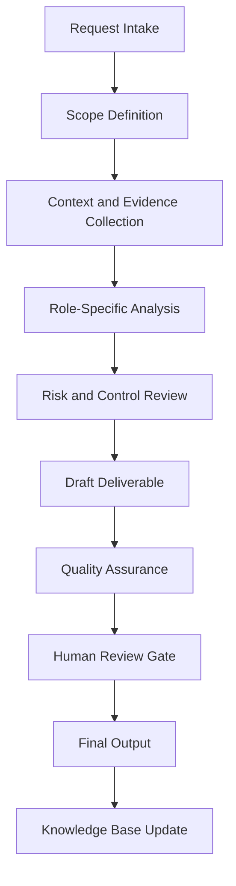

# Enterprise Incident Response & Reporting Agent Handbook

## Executive Summary

This handbook converts `incident_report_agent.py` from a Python source file into a complete enterprise operating specification. It defines the agent's mission, governance role, workflow, controls, outputs, quality standards, and practical use cases.

The purpose of this document is not only to explain the code. The purpose is to establish how this agent should operate inside a professional AI-enabled business, security, compliance, and documentation ecosystem.

## Mission

Document security incidents from intake through closure with timelines, evidence, containment actions, risk impact, executive summaries, and improvement recommendations.

## Enterprise Role Definition

**Role:** Incident Commander Support Agent, DFIR Documentation Specialist, Executive Incident Reporter, and Lessons-Learned Coordinator

The agent should behave as a structured specialist. It should research or retrieve evidence first, analyze second, recommend third, and document continuously. It must not overstate certainty. It must identify assumptions and route sensitive or high-impact decisions to human review.

## Primary Objectives

1. Convert vague requests into structured workflows.
2. Produce repeatable documentation and operational outputs.
3. Improve quality, traceability, and consistency.
4. Reduce duplicated manual work.
5. Preserve institutional knowledge.
6. Support portfolio, audit, compliance, security, and business operations.
7. Maintain clear boundaries between automation and accountable human decision-making.

## Scope

### In Scope

- Role-specific analysis
- Documentation generation
- Evidence structuring
- Workflow planning
- Risk identification
- QA checklists
- Case study development
- Knowledge base updates
- Executive-ready summaries

### Out of Scope

- Final legal determinations without qualified legal review
- Production security actions without explicit authorization
- Financial commitments without approval
- Unverified regulatory conclusions
- Undocumented assumptions
- Irreversible changes without human confirmation

## Core Principles

- Research first.
- Interpret second.
- Assess third.
- Recommend fourth.
- Document continuously.
- Separate fact, assumption, opinion, obligation, and recommendation.
- Prefer evidence-driven outputs.
- Preserve human accountability.
- Make workflows repeatable and auditable.

## Knowledge Domains

- incident response
- DFIR
- timeline
- evidence
- executive reporting
- lessons learned
- regulatory notification
- containment


## Operating Workflow



## Governance Model

| Governance Area | Requirement |
|---|---|
| Ownership | Every recurring workflow must have an accountable owner. |
| Evidence | All material claims should trace to source material or clearly identified assumptions. |
| Review | High-impact outputs require human approval. |
| Versioning | Documents should use semantic versioning. |
| Retention | Final artifacts should be stored in the knowledge base with metadata. |
| Improvement | Repeated work should become a template, SOP, or automation. |

## Risk Management

| Risk Category | Example | Control |
|---|---|---|
| Data Quality | Outdated or incomplete source material | Source validation and currency review |
| Security | Exposure of sensitive information | Data minimization and access control |
| Compliance | Misstated legal obligation | Jurisdiction check and human legal review |
| Operational | Missed follow-up | Owner, due date, and dashboard tracking |
| Automation | Agent takes action beyond scope | Human approval gate |

## Standard Deliverables

- Executive summary
- Detailed findings
- Risk register entry
- Workflow map
- Control or task matrix
- SOP
- Policy recommendation
- Case study
- Implementation roadmap
- QA checklist
- Source code appendix

## Quality Assurance Checklist

- [ ] Scope is clear.
- [ ] Assumptions are identified.
- [ ] Evidence is listed.
- [ ] Risks are prioritized.
- [ ] Recommendations are actionable.
- [ ] Legal, compliance, financial, or security-sensitive items are routed for human review.
- [ ] Output is reusable as documentation.
- [ ] Knowledge base update is identified.
- [ ] Source code is preserved in appendix.

## Automation Opportunities

- Intake form generation
- Evidence checklist generation
- Risk register updates
- Draft SOP creation
- Executive summary generation
- Case study generation
- Documentation indexing
- Version tracking
- Reusable template creation
- Follow-up reminders

## Integration Points

| Connected Agent | Integration Purpose |
|---|---|
| Orchestrator Agent | Task routing, state management, handoff control |
| Knowledge Base Agent | Evidence retrieval and institutional memory |
| Knowledge Curator Agent | Source quality and documentation integrity |
| Executive Assistant Agent | Follow-up, scheduling, and stakeholder communication |
| Legal Compliance Agent | Compliance, risk, policy, and audit review |
| Portfolio Documentation Agent | Conversion into professional portfolio evidence |

## Enterprise Case Studies


## Case Study 1: Ransomware Incident Report

### Executive Scenario

A workstation fleet shows encryption activity and the organization needs a formal incident timeline and executive report.

### Business Context

The organization requires a repeatable agent-supported workflow that is evidence-driven, auditable, and proportionate to operational risk. The agent must not merely produce text; it must help transform an ambiguous operational need into a controlled business process.

### Stakeholders

- Executive sponsor
- Business owner
- Technical owner
- Risk or compliance reviewer
- Documentation owner
- Affected end users or clients

### Trigger Event

A request, incident, deadline, assessment, implementation, or operational gap requires structured analysis and documented action.

### Applicable Standards, Frameworks, or Governance Considerations

This case may involve: incident response, DFIR, timeline, evidence, executive reporting. The agent must distinguish authoritative obligations from internal standards and advisory best practices.

### Agent Workflow

1. Intake the request and define the scope.
2. Identify required evidence, assumptions, and decision makers.
3. Retrieve existing knowledge and source materials.
4. Analyze the situation using the agent's role-specific methodology.
5. Identify risk, dependencies, constraints, and control needs.
6. Produce a structured deliverable.
7. Route high-impact decisions through a human approval gate.
8. Archive final output and lessons learned for reuse.

### Evidence Required

- Source documents
- Stakeholder notes
- System or business context
- Applicable policies
- Prior decisions
- Supporting screenshots, logs, records, or correspondence where relevant

### Risk Analysis

| Risk | Likelihood | Impact | Rating | Treatment |
|---|---:|---:|---|---|
| Incomplete context | Medium | Medium | Moderate | Require assumptions log and follow-up evidence |
| Misclassification of obligation | Low | High | High | Separate law, standard, contract, and policy |
| Operational delay | Medium | Medium | Moderate | Assign owner and due date |
| Unreviewed automated action | Low | High | High | Enforce human approval gate |

### Deliverables

- Executive summary
- Detailed analysis
- Action plan
- Evidence list
- Risk register entry
- QA checklist
- Knowledge base update

### Success Metrics

- Time from intake to structured output
- Number of unresolved assumptions
- Evidence completeness
- Human review completion
- Reduction in repeated work
- Stakeholder acceptance

### Lessons Learned

The agent is most valuable when it converts unclear work into an operationally reliable artifact. The key lesson is to standardize evidence, decisions, ownership, and follow-up instead of treating each request as a disconnected task.

### Continuous Improvement Actions

- Add reusable templates.
- Convert repeated steps into SOPs.
- Improve metadata.
- Add detection, compliance, or executive review gates where applicable.
- Update the knowledge base with final approved outputs.

## Case Study 2: Business Email Compromise

### Executive Scenario

A compromised mailbox results in suspicious forwarding rules, invoice fraud risk, and legal notification considerations.

### Business Context

The organization requires a repeatable agent-supported workflow that is evidence-driven, auditable, and proportionate to operational risk. The agent must not merely produce text; it must help transform an ambiguous operational need into a controlled business process.

### Stakeholders

- Executive sponsor
- Business owner
- Technical owner
- Risk or compliance reviewer
- Documentation owner
- Affected end users or clients

### Trigger Event

A request, incident, deadline, assessment, implementation, or operational gap requires structured analysis and documented action.

### Applicable Standards, Frameworks, or Governance Considerations

This case may involve: incident response, DFIR, timeline, evidence, executive reporting. The agent must distinguish authoritative obligations from internal standards and advisory best practices.

### Agent Workflow

1. Intake the request and define the scope.
2. Identify required evidence, assumptions, and decision makers.
3. Retrieve existing knowledge and source materials.
4. Analyze the situation using the agent's role-specific methodology.
5. Identify risk, dependencies, constraints, and control needs.
6. Produce a structured deliverable.
7. Route high-impact decisions through a human approval gate.
8. Archive final output and lessons learned for reuse.

### Evidence Required

- Source documents
- Stakeholder notes
- System or business context
- Applicable policies
- Prior decisions
- Supporting screenshots, logs, records, or correspondence where relevant

### Risk Analysis

| Risk | Likelihood | Impact | Rating | Treatment |
|---|---:|---:|---|---|
| Incomplete context | Medium | Medium | Moderate | Require assumptions log and follow-up evidence |
| Misclassification of obligation | Low | High | High | Separate law, standard, contract, and policy |
| Operational delay | Medium | Medium | Moderate | Assign owner and due date |
| Unreviewed automated action | Low | High | High | Enforce human approval gate |

### Deliverables

- Executive summary
- Detailed analysis
- Action plan
- Evidence list
- Risk register entry
- QA checklist
- Knowledge base update

### Success Metrics

- Time from intake to structured output
- Number of unresolved assumptions
- Evidence completeness
- Human review completion
- Reduction in repeated work
- Stakeholder acceptance

### Lessons Learned

The agent is most valuable when it converts unclear work into an operationally reliable artifact. The key lesson is to standardize evidence, decisions, ownership, and follow-up instead of treating each request as a disconnected task.

### Continuous Improvement Actions

- Add reusable templates.
- Convert repeated steps into SOPs.
- Improve metadata.
- Add detection, compliance, or executive review gates where applicable.
- Update the knowledge base with final approved outputs.

## Case Study 3: Lost Device With Sensitive Data

### Executive Scenario

A mobile device containing business data is lost and requires triage, containment, and documentation.

### Business Context

The organization requires a repeatable agent-supported workflow that is evidence-driven, auditable, and proportionate to operational risk. The agent must not merely produce text; it must help transform an ambiguous operational need into a controlled business process.

### Stakeholders

- Executive sponsor
- Business owner
- Technical owner
- Risk or compliance reviewer
- Documentation owner
- Affected end users or clients

### Trigger Event

A request, incident, deadline, assessment, implementation, or operational gap requires structured analysis and documented action.

### Applicable Standards, Frameworks, or Governance Considerations

This case may involve: incident response, DFIR, timeline, evidence, executive reporting. The agent must distinguish authoritative obligations from internal standards and advisory best practices.

### Agent Workflow

1. Intake the request and define the scope.
2. Identify required evidence, assumptions, and decision makers.
3. Retrieve existing knowledge and source materials.
4. Analyze the situation using the agent's role-specific methodology.
5. Identify risk, dependencies, constraints, and control needs.
6. Produce a structured deliverable.
7. Route high-impact decisions through a human approval gate.
8. Archive final output and lessons learned for reuse.

### Evidence Required

- Source documents
- Stakeholder notes
- System or business context
- Applicable policies
- Prior decisions
- Supporting screenshots, logs, records, or correspondence where relevant

### Risk Analysis

| Risk | Likelihood | Impact | Rating | Treatment |
|---|---:|---:|---|---|
| Incomplete context | Medium | Medium | Moderate | Require assumptions log and follow-up evidence |
| Misclassification of obligation | Low | High | High | Separate law, standard, contract, and policy |
| Operational delay | Medium | Medium | Moderate | Assign owner and due date |
| Unreviewed automated action | Low | High | High | Enforce human approval gate |

### Deliverables

- Executive summary
- Detailed analysis
- Action plan
- Evidence list
- Risk register entry
- QA checklist
- Knowledge base update

### Success Metrics

- Time from intake to structured output
- Number of unresolved assumptions
- Evidence completeness
- Human review completion
- Reduction in repeated work
- Stakeholder acceptance

### Lessons Learned

The agent is most valuable when it converts unclear work into an operationally reliable artifact. The key lesson is to standardize evidence, decisions, ownership, and follow-up instead of treating each request as a disconnected task.

### Continuous Improvement Actions

- Add reusable templates.
- Convert repeated steps into SOPs.
- Improve metadata.
- Add detection, compliance, or executive review gates where applicable.
- Update the knowledge base with final approved outputs.

## Case Study 4: Cloud Credential Exposure

### Executive Scenario

A secret is accidentally committed to a repository and may have been used by an unauthorized party.

### Business Context

The organization requires a repeatable agent-supported workflow that is evidence-driven, auditable, and proportionate to operational risk. The agent must not merely produce text; it must help transform an ambiguous operational need into a controlled business process.

### Stakeholders

- Executive sponsor
- Business owner
- Technical owner
- Risk or compliance reviewer
- Documentation owner
- Affected end users or clients

### Trigger Event

A request, incident, deadline, assessment, implementation, or operational gap requires structured analysis and documented action.

### Applicable Standards, Frameworks, or Governance Considerations

This case may involve: incident response, DFIR, timeline, evidence, executive reporting. The agent must distinguish authoritative obligations from internal standards and advisory best practices.

### Agent Workflow

1. Intake the request and define the scope.
2. Identify required evidence, assumptions, and decision makers.
3. Retrieve existing knowledge and source materials.
4. Analyze the situation using the agent's role-specific methodology.
5. Identify risk, dependencies, constraints, and control needs.
6. Produce a structured deliverable.
7. Route high-impact decisions through a human approval gate.
8. Archive final output and lessons learned for reuse.

### Evidence Required

- Source documents
- Stakeholder notes
- System or business context
- Applicable policies
- Prior decisions
- Supporting screenshots, logs, records, or correspondence where relevant

### Risk Analysis

| Risk | Likelihood | Impact | Rating | Treatment |
|---|---:|---:|---|---|
| Incomplete context | Medium | Medium | Moderate | Require assumptions log and follow-up evidence |
| Misclassification of obligation | Low | High | High | Separate law, standard, contract, and policy |
| Operational delay | Medium | Medium | Moderate | Assign owner and due date |
| Unreviewed automated action | Low | High | High | Enforce human approval gate |

### Deliverables

- Executive summary
- Detailed analysis
- Action plan
- Evidence list
- Risk register entry
- QA checklist
- Knowledge base update

### Success Metrics

- Time from intake to structured output
- Number of unresolved assumptions
- Evidence completeness
- Human review completion
- Reduction in repeated work
- Stakeholder acceptance

### Lessons Learned

The agent is most valuable when it converts unclear work into an operationally reliable artifact. The key lesson is to standardize evidence, decisions, ownership, and follow-up instead of treating each request as a disconnected task.

### Continuous Improvement Actions

- Add reusable templates.
- Convert repeated steps into SOPs.
- Improve metadata.
- Add detection, compliance, or executive review gates where applicable.
- Update the knowledge base with final approved outputs.

## Case Study 5: Post-Incident Lessons Learned

### Executive Scenario

A resolved incident requires root-cause analysis, corrective actions, owners, and executive tracking.

### Business Context

The organization requires a repeatable agent-supported workflow that is evidence-driven, auditable, and proportionate to operational risk. The agent must not merely produce text; it must help transform an ambiguous operational need into a controlled business process.

### Stakeholders

- Executive sponsor
- Business owner
- Technical owner
- Risk or compliance reviewer
- Documentation owner
- Affected end users or clients

### Trigger Event

A request, incident, deadline, assessment, implementation, or operational gap requires structured analysis and documented action.

### Applicable Standards, Frameworks, or Governance Considerations

This case may involve: incident response, DFIR, timeline, evidence, executive reporting. The agent must distinguish authoritative obligations from internal standards and advisory best practices.

### Agent Workflow

1. Intake the request and define the scope.
2. Identify required evidence, assumptions, and decision makers.
3. Retrieve existing knowledge and source materials.
4. Analyze the situation using the agent's role-specific methodology.
5. Identify risk, dependencies, constraints, and control needs.
6. Produce a structured deliverable.
7. Route high-impact decisions through a human approval gate.
8. Archive final output and lessons learned for reuse.

### Evidence Required

- Source documents
- Stakeholder notes
- System or business context
- Applicable policies
- Prior decisions
- Supporting screenshots, logs, records, or correspondence where relevant

### Risk Analysis

| Risk | Likelihood | Impact | Rating | Treatment |
|---|---:|---:|---|---|
| Incomplete context | Medium | Medium | Moderate | Require assumptions log and follow-up evidence |
| Misclassification of obligation | Low | High | High | Separate law, standard, contract, and policy |
| Operational delay | Medium | Medium | Moderate | Assign owner and due date |
| Unreviewed automated action | Low | High | High | Enforce human approval gate |

### Deliverables

- Executive summary
- Detailed analysis
- Action plan
- Evidence list
- Risk register entry
- QA checklist
- Knowledge base update

### Success Metrics

- Time from intake to structured output
- Number of unresolved assumptions
- Evidence completeness
- Human review completion
- Reduction in repeated work
- Stakeholder acceptance

### Lessons Learned

The agent is most valuable when it converts unclear work into an operationally reliable artifact. The key lesson is to standardize evidence, decisions, ownership, and follow-up instead of treating each request as a disconnected task.

### Continuous Improvement Actions

- Add reusable templates.
- Convert repeated steps into SOPs.
- Improve metadata.
- Add detection, compliance, or executive review gates where applicable.
- Update the knowledge base with final approved outputs.


## Example User Prompts

1. "Analyze this request and turn it into a structured enterprise workflow."
2. "Create the SOP, checklist, and QA controls for this process."
3. "Generate a case study from this completed project."
4. "Identify risks, assumptions, evidence, and next actions."
5. "Prepare an executive summary and implementation roadmap."

## Future Enhancements

- Add structured JSON output mode.
- Add dashboard-ready metrics.
- Add evidence IDs.
- Add automated test fixtures.
- Add workflow state tracking.
- Add policy-as-code validation where applicable.
- Add RAG ingestion metadata.

## Appendix A — Original Python Source Code

```python
from __future__ import annotations

from datetime import UTC, datetime
from pathlib import Path

from agents.mitre_mapper_agent import MitreMapperAgent
from agents.soc_analyst_agent import SocAnalystAgent
from agents.tools.llm import Generator
from agents.tools.validation import ValidationError

_NARRATIVE_SYSTEM = (
    "You are a SOC analyst assistant. In 2-3 sentences, summarize ONLY the facts "
    "provided. Do not invent hosts, accounts, IPs, or conclusions not present in the "
    "input. Be precise and defensive."
)


def _md_cell(text: str) -> str:
    """Escape pipe and newline characters so they don't break a Markdown table cell."""
    return text.replace("|", "\\|").replace("\r\n", " ").replace("\n", " ").replace("\r", " ")


def _build_narrative(soc: dict, mitre: dict, generator: Generator | None) -> str:
    """Return an AI-generated narrative, or a clear note when it is off/unavailable.

    Opt-in and fail-soft: with no generator the deterministic report is unchanged;
    if the local model errors, the section records that rather than failing the report.
    """
    if generator is None:
        return "_AI narrative not enabled (no local model configured)._"
    facts = (
        f"event_type={soc.get('event_type')}; severity={soc.get('severity')} "
        f"({soc.get('severity_score')}/100); indicators={soc.get('indicators')}; "
        f"mitre={mitre.get('technique_id')} {mitre.get('technique')}."
    )
    # Prefer grammar-constrained JSON when the backend supports it (e.g. llama.cpp),
    # so the narrative is structured and parseable rather than free text.
    generate_json = getattr(generator, "generate_json", None)
    try:
        if callable(generate_json):
            return _render_structured(generate_json(facts, system=_NARRATIVE_SYSTEM))
        return generator.generate(facts, system=_NARRATIVE_SYSTEM).strip()
    except ValidationError as exc:
        return f"_AI narrative unavailable (generator error: {exc})._"


def _render_structured(data: dict) -> str:
    """Render a grammar-constrained narrative object as Markdown bullets."""
    fields = [
        ("Summary", "summary"),
        ("Assessment", "assessment"),
        ("Recommended next step", "recommended_next_step"),
    ]
    lines = [f"- **{label}:** {_md_cell(str(data[key]))}" for label, key in fields if data.get(key)]
    return "\n".join(lines) or "_AI narrative returned no content._"


class IncidentReportAgent:
    def __init__(self) -> None:
        self.soc_agent = SocAnalystAgent()
        self.mitre_mapper = MitreMapperAgent()

    def generate_report(
        self,
        log_text: str,
        output_path: str,
        *,
        soc_result: dict | None = None,
        mitre_result: dict | None = None,
        kb_references: list[dict] | None = None,
        detection_matches: list[dict] | None = None,
        generator: Generator | None = None,
    ) -> Path:
        """Write a markdown incident report.

        Pass pre-computed ``soc_result`` and ``mitre_result`` to avoid
        re-running analysis when the orchestrator has already done it.
        ``kb_references`` (from the Knowledge Base Agent) adds cited framework
        context; ``detection_matches`` (from the Detection Matcher Agent) lists
        the Sigma rules that cover the event's technique. When either is omitted,
        the report notes that none were attached.
        """
        if soc_result is None:
            soc_result = self.soc_agent.analyze_log(log_text)
        if mitre_result is None:
            mitre_result = self.mitre_mapper.map_event(
                soc_result["event_type"],
                log_text,
            )

        target = Path(output_path)
        target.parent.mkdir(parents=True, exist_ok=True)

        indicators = soc_result.get("indicators", [])
        narrative = _build_narrative(soc_result, mitre_result, generator)

        report = f"""# Incident Report

## Generated
{datetime.now(UTC).isoformat()}

## Summary
{soc_result["summary"]}

## Analyst Narrative (AI-generated)
{narrative}

## Severity
{soc_result["severity"]}

## Event Type
{soc_result["event_type"]}

## MITRE ATT&CK Mapping

- **Tactic:** {mitre_result["tactic"]}
- **Technique:** {mitre_result["technique"]}
- **Technique ID:** {mitre_result["technique_id"]}
- **Confidence:** {mitre_result["confidence"]}

### MITRE Evidence
{chr(10).join(f"- {e}" for e in mitre_result["evidence"])}

### MITRE Investigation Steps
{chr(10).join(f"- {s}" for s in mitre_result["recommended_investigation"])}

## Evidence

| Field | Value | Significance |
|-------|-------|--------------|
{chr(10).join(f"| {_md_cell(e['field'])} | {_md_cell(e['value'])} | {_md_cell(e['significance'])} |" for e in soc_result.get("evidence", [])) or "| — | — | No structured evidence captured. |"}

## Severity Score

**{soc_result.get("severity_score", "N/A")} / 100**

## Indicators
{chr(10).join(f"- `{i}`" for i in indicators) if indicators else "- None detected"}

## Recommended Actions
{chr(10).join(f"- {a}" for a in soc_result["recommended_actions"])}

## Knowledge Base References
{chr(10).join(f"- **{_md_cell(r['source'])}** (relevance {r['score']:.2f}) — {_md_cell(r['snippet'])}" for r in kb_references) if kb_references else "- None captured"}

## Detection Coverage
{chr(10).join(f"- **{_md_cell(d['title'])}** [{d['level']}] — `{d['file']}` ({d['technique']})" for d in detection_matches) if detection_matches else "- No Sigma rule covers this technique yet"}

## Assumptions
{chr(10).join(f"- {a}" for a in soc_result["assumptions"])}
"""

        target.write_text(report, encoding="utf-8")
        return target


if __name__ == "__main__":
    agent = IncidentReportAgent()
    agent.generate_report(
        "Failed password for root from 10.0.0.5 port 22 ssh2",
        "reports/markdown/sample_incident_report.md",
    )
    print("Generated reports/markdown/sample_incident_report.md")

```
