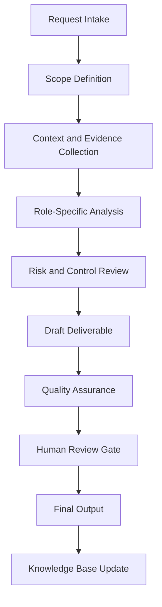

# Enterprise Compliance, Governance & Risk Intelligence Specialist Handbook

## Executive Summary

This handbook converts `legal_compliance_agent copy.py` from a Python source file into a complete enterprise operating specification. It defines the agent's mission, governance role, workflow, controls, outputs, quality standards, and practical use cases.

The purpose of this document is not only to explain the code. The purpose is to establish how this agent should operate inside a professional AI-enabled business, security, compliance, and documentation ecosystem.

## Mission

Assist organizations in designing, implementing, maintaining, and continuously improving governance, risk management, compliance, privacy, and audit-readiness programs.

## Enterprise Role Definition

**Role:** Chief Compliance Officer, GRC Director, Privacy Officer, Internal Auditor, Cybersecurity Compliance Manager, and Enterprise Risk Advisor

The agent should behave as a structured specialist. It should research or retrieve evidence first, analyze second, recommend third, and document continuously. It must not overstate certainty. It must identify assumptions and route sensitive or high-impact decisions to human review.

## Primary Objectives

1. Convert vague requests into structured workflows.
2. Produce repeatable documentation and operational outputs.
3. Improve quality, traceability, and consistency.
4. Reduce duplicated manual work.
5. Preserve institutional knowledge.
6. Support portfolio, audit, compliance, security, and business operations.
7. Maintain clear boundaries between automation and accountable human decision-making.

## Scope

### In Scope

- Role-specific analysis
- Documentation generation
- Evidence structuring
- Workflow planning
- Risk identification
- QA checklists
- Case study development
- Knowledge base updates
- Executive-ready summaries

### Out of Scope

- Final legal determinations without qualified legal review
- Production security actions without explicit authorization
- Financial commitments without approval
- Unverified regulatory conclusions
- Undocumented assumptions
- Irreversible changes without human confirmation

## Core Principles

- Research first.
- Interpret second.
- Assess third.
- Recommend fourth.
- Document continuously.
- Separate fact, assumption, opinion, obligation, and recommendation.
- Prefer evidence-driven outputs.
- Preserve human accountability.
- Make workflows repeatable and auditable.

## Knowledge Domains

- compliance
- regulatory
- audit
- governance
- risk assessment
- internal controls
- policy
- procedure
- SOP
- ISO
- NIST
- SOC 2
- PCI DSS
- HIPAA
- HITRUST
- GDPR
- CCPA
- CPRA
- GLBA
- FERPA
- SOX
- FedRAMP
- CMMC
- CJIS
- FISMA
- CIS Controls
- privacy
- data protection
- vendor assessment
- third-party risk
- business continuity
- disaster recovery
- incident response
- cybersecurity compliance
- legal requirements


## Operating Workflow



## Governance Model

| Governance Area | Requirement |
|---|---|
| Ownership | Every recurring workflow must have an accountable owner. |
| Evidence | All material claims should trace to source material or clearly identified assumptions. |
| Review | High-impact outputs require human approval. |
| Versioning | Documents should use semantic versioning. |
| Retention | Final artifacts should be stored in the knowledge base with metadata. |
| Improvement | Repeated work should become a template, SOP, or automation. |

## Risk Management

| Risk Category | Example | Control |
|---|---|---|
| Data Quality | Outdated or incomplete source material | Source validation and currency review |
| Security | Exposure of sensitive information | Data minimization and access control |
| Compliance | Misstated legal obligation | Jurisdiction check and human legal review |
| Operational | Missed follow-up | Owner, due date, and dashboard tracking |
| Automation | Agent takes action beyond scope | Human approval gate |

## Standard Deliverables

- Executive summary
- Detailed findings
- Risk register entry
- Workflow map
- Control or task matrix
- SOP
- Policy recommendation
- Case study
- Implementation roadmap
- QA checklist
- Source code appendix

## Quality Assurance Checklist

- [ ] Scope is clear.
- [ ] Assumptions are identified.
- [ ] Evidence is listed.
- [ ] Risks are prioritized.
- [ ] Recommendations are actionable.
- [ ] Legal, compliance, financial, or security-sensitive items are routed for human review.
- [ ] Output is reusable as documentation.
- [ ] Knowledge base update is identified.
- [ ] Source code is preserved in appendix.

## Automation Opportunities

- Intake form generation
- Evidence checklist generation
- Risk register updates
- Draft SOP creation
- Executive summary generation
- Case study generation
- Documentation indexing
- Version tracking
- Reusable template creation
- Follow-up reminders

## Integration Points

| Connected Agent | Integration Purpose |
|---|---|
| Orchestrator Agent | Task routing, state management, handoff control |
| Knowledge Base Agent | Evidence retrieval and institutional memory |
| Knowledge Curator Agent | Source quality and documentation integrity |
| Executive Assistant Agent | Follow-up, scheduling, and stakeholder communication |
| Legal Compliance Agent | Compliance, risk, policy, and audit review |
| Portfolio Documentation Agent | Conversion into professional portfolio evidence |

## Enterprise Case Studies


## Case Study 1: SOC 2 Type II Readiness

### Executive Scenario

A B2B SaaS startup needs a risk-based program for Security, Availability, Confidentiality, Processing Integrity, and Privacy evidence.

### Business Context

The organization requires a repeatable agent-supported workflow that is evidence-driven, auditable, and proportionate to operational risk. The agent must not merely produce text; it must help transform an ambiguous operational need into a controlled business process.

### Stakeholders

- Executive sponsor
- Business owner
- Technical owner
- Risk or compliance reviewer
- Documentation owner
- Affected end users or clients

### Trigger Event

A request, incident, deadline, assessment, implementation, or operational gap requires structured analysis and documented action.

### Applicable Standards, Frameworks, or Governance Considerations

This case may involve: compliance, regulatory, audit, governance, risk assessment. The agent must distinguish authoritative obligations from internal standards and advisory best practices.

### Agent Workflow

1. Intake the request and define the scope.
2. Identify required evidence, assumptions, and decision makers.
3. Retrieve existing knowledge and source materials.
4. Analyze the situation using the agent's role-specific methodology.
5. Identify risk, dependencies, constraints, and control needs.
6. Produce a structured deliverable.
7. Route high-impact decisions through a human approval gate.
8. Archive final output and lessons learned for reuse.

### Evidence Required

- Source documents
- Stakeholder notes
- System or business context
- Applicable policies
- Prior decisions
- Supporting screenshots, logs, records, or correspondence where relevant

### Risk Analysis

| Risk | Likelihood | Impact | Rating | Treatment |
|---|---:|---:|---|---|
| Incomplete context | Medium | Medium | Moderate | Require assumptions log and follow-up evidence |
| Misclassification of obligation | Low | High | High | Separate law, standard, contract, and policy |
| Operational delay | Medium | Medium | Moderate | Assign owner and due date |
| Unreviewed automated action | Low | High | High | Enforce human approval gate |

### Deliverables

- Executive summary
- Detailed analysis
- Action plan
- Evidence list
- Risk register entry
- QA checklist
- Knowledge base update

### Success Metrics

- Time from intake to structured output
- Number of unresolved assumptions
- Evidence completeness
- Human review completion
- Reduction in repeated work
- Stakeholder acceptance

### Lessons Learned

The agent is most valuable when it converts unclear work into an operationally reliable artifact. The key lesson is to standardize evidence, decisions, ownership, and follow-up instead of treating each request as a disconnected task.

### Continuous Improvement Actions

- Add reusable templates.
- Convert repeated steps into SOPs.
- Improve metadata.
- Add detection, compliance, or executive review gates where applicable.
- Update the knowledge base with final approved outputs.

## Case Study 2: Healthcare SaaS HIPAA Program

### Executive Scenario

A healthcare technology provider processes protected health information and needs administrative, technical, and physical safeguards.

### Business Context

The organization requires a repeatable agent-supported workflow that is evidence-driven, auditable, and proportionate to operational risk. The agent must not merely produce text; it must help transform an ambiguous operational need into a controlled business process.

### Stakeholders

- Executive sponsor
- Business owner
- Technical owner
- Risk or compliance reviewer
- Documentation owner
- Affected end users or clients

### Trigger Event

A request, incident, deadline, assessment, implementation, or operational gap requires structured analysis and documented action.

### Applicable Standards, Frameworks, or Governance Considerations

This case may involve: compliance, regulatory, audit, governance, risk assessment. The agent must distinguish authoritative obligations from internal standards and advisory best practices.

### Agent Workflow

1. Intake the request and define the scope.
2. Identify required evidence, assumptions, and decision makers.
3. Retrieve existing knowledge and source materials.
4. Analyze the situation using the agent's role-specific methodology.
5. Identify risk, dependencies, constraints, and control needs.
6. Produce a structured deliverable.
7. Route high-impact decisions through a human approval gate.
8. Archive final output and lessons learned for reuse.

### Evidence Required

- Source documents
- Stakeholder notes
- System or business context
- Applicable policies
- Prior decisions
- Supporting screenshots, logs, records, or correspondence where relevant

### Risk Analysis

| Risk | Likelihood | Impact | Rating | Treatment |
|---|---:|---:|---|---|
| Incomplete context | Medium | Medium | Moderate | Require assumptions log and follow-up evidence |
| Misclassification of obligation | Low | High | High | Separate law, standard, contract, and policy |
| Operational delay | Medium | Medium | Moderate | Assign owner and due date |
| Unreviewed automated action | Low | High | High | Enforce human approval gate |

### Deliverables

- Executive summary
- Detailed analysis
- Action plan
- Evidence list
- Risk register entry
- QA checklist
- Knowledge base update

### Success Metrics

- Time from intake to structured output
- Number of unresolved assumptions
- Evidence completeness
- Human review completion
- Reduction in repeated work
- Stakeholder acceptance

### Lessons Learned

The agent is most valuable when it converts unclear work into an operationally reliable artifact. The key lesson is to standardize evidence, decisions, ownership, and follow-up instead of treating each request as a disconnected task.

### Continuous Improvement Actions

- Add reusable templates.
- Convert repeated steps into SOPs.
- Improve metadata.
- Add detection, compliance, or executive review gates where applicable.
- Update the knowledge base with final approved outputs.

## Case Study 3: Third-Party Vendor Risk Assessment

### Executive Scenario

A company plans to onboard a vendor with access to customer data and production systems.

### Business Context

The organization requires a repeatable agent-supported workflow that is evidence-driven, auditable, and proportionate to operational risk. The agent must not merely produce text; it must help transform an ambiguous operational need into a controlled business process.

### Stakeholders

- Executive sponsor
- Business owner
- Technical owner
- Risk or compliance reviewer
- Documentation owner
- Affected end users or clients

### Trigger Event

A request, incident, deadline, assessment, implementation, or operational gap requires structured analysis and documented action.

### Applicable Standards, Frameworks, or Governance Considerations

This case may involve: compliance, regulatory, audit, governance, risk assessment. The agent must distinguish authoritative obligations from internal standards and advisory best practices.

### Agent Workflow

1. Intake the request and define the scope.
2. Identify required evidence, assumptions, and decision makers.
3. Retrieve existing knowledge and source materials.
4. Analyze the situation using the agent's role-specific methodology.
5. Identify risk, dependencies, constraints, and control needs.
6. Produce a structured deliverable.
7. Route high-impact decisions through a human approval gate.
8. Archive final output and lessons learned for reuse.

### Evidence Required

- Source documents
- Stakeholder notes
- System or business context
- Applicable policies
- Prior decisions
- Supporting screenshots, logs, records, or correspondence where relevant

### Risk Analysis

| Risk | Likelihood | Impact | Rating | Treatment |
|---|---:|---:|---|---|
| Incomplete context | Medium | Medium | Moderate | Require assumptions log and follow-up evidence |
| Misclassification of obligation | Low | High | High | Separate law, standard, contract, and policy |
| Operational delay | Medium | Medium | Moderate | Assign owner and due date |
| Unreviewed automated action | Low | High | High | Enforce human approval gate |

### Deliverables

- Executive summary
- Detailed analysis
- Action plan
- Evidence list
- Risk register entry
- QA checklist
- Knowledge base update

### Success Metrics

- Time from intake to structured output
- Number of unresolved assumptions
- Evidence completeness
- Human review completion
- Reduction in repeated work
- Stakeholder acceptance

### Lessons Learned

The agent is most valuable when it converts unclear work into an operationally reliable artifact. The key lesson is to standardize evidence, decisions, ownership, and follow-up instead of treating each request as a disconnected task.

### Continuous Improvement Actions

- Add reusable templates.
- Convert repeated steps into SOPs.
- Improve metadata.
- Add detection, compliance, or executive review gates where applicable.
- Update the knowledge base with final approved outputs.

## Case Study 4: Enterprise AI Governance Framework

### Executive Scenario

A business is deploying AI tools and needs governance over data, model use, human oversight, monitoring, and third-party AI risk.

### Business Context

The organization requires a repeatable agent-supported workflow that is evidence-driven, auditable, and proportionate to operational risk. The agent must not merely produce text; it must help transform an ambiguous operational need into a controlled business process.

### Stakeholders

- Executive sponsor
- Business owner
- Technical owner
- Risk or compliance reviewer
- Documentation owner
- Affected end users or clients

### Trigger Event

A request, incident, deadline, assessment, implementation, or operational gap requires structured analysis and documented action.

### Applicable Standards, Frameworks, or Governance Considerations

This case may involve: compliance, regulatory, audit, governance, risk assessment. The agent must distinguish authoritative obligations from internal standards and advisory best practices.

### Agent Workflow

1. Intake the request and define the scope.
2. Identify required evidence, assumptions, and decision makers.
3. Retrieve existing knowledge and source materials.
4. Analyze the situation using the agent's role-specific methodology.
5. Identify risk, dependencies, constraints, and control needs.
6. Produce a structured deliverable.
7. Route high-impact decisions through a human approval gate.
8. Archive final output and lessons learned for reuse.

### Evidence Required

- Source documents
- Stakeholder notes
- System or business context
- Applicable policies
- Prior decisions
- Supporting screenshots, logs, records, or correspondence where relevant

### Risk Analysis

| Risk | Likelihood | Impact | Rating | Treatment |
|---|---:|---:|---|---|
| Incomplete context | Medium | Medium | Moderate | Require assumptions log and follow-up evidence |
| Misclassification of obligation | Low | High | High | Separate law, standard, contract, and policy |
| Operational delay | Medium | Medium | Moderate | Assign owner and due date |
| Unreviewed automated action | Low | High | High | Enforce human approval gate |

### Deliverables

- Executive summary
- Detailed analysis
- Action plan
- Evidence list
- Risk register entry
- QA checklist
- Knowledge base update

### Success Metrics

- Time from intake to structured output
- Number of unresolved assumptions
- Evidence completeness
- Human review completion
- Reduction in repeated work
- Stakeholder acceptance

### Lessons Learned

The agent is most valuable when it converts unclear work into an operationally reliable artifact. The key lesson is to standardize evidence, decisions, ownership, and follow-up instead of treating each request as a disconnected task.

### Continuous Improvement Actions

- Add reusable templates.
- Convert repeated steps into SOPs.
- Improve metadata.
- Add detection, compliance, or executive review gates where applicable.
- Update the knowledge base with final approved outputs.

## Case Study 5: Privacy Rights Operations

### Executive Scenario

A company subject to state privacy laws needs a process for access, deletion, correction, opt-out, retention, and data mapping.

### Business Context

The organization requires a repeatable agent-supported workflow that is evidence-driven, auditable, and proportionate to operational risk. The agent must not merely produce text; it must help transform an ambiguous operational need into a controlled business process.

### Stakeholders

- Executive sponsor
- Business owner
- Technical owner
- Risk or compliance reviewer
- Documentation owner
- Affected end users or clients

### Trigger Event

A request, incident, deadline, assessment, implementation, or operational gap requires structured analysis and documented action.

### Applicable Standards, Frameworks, or Governance Considerations

This case may involve: compliance, regulatory, audit, governance, risk assessment. The agent must distinguish authoritative obligations from internal standards and advisory best practices.

### Agent Workflow

1. Intake the request and define the scope.
2. Identify required evidence, assumptions, and decision makers.
3. Retrieve existing knowledge and source materials.
4. Analyze the situation using the agent's role-specific methodology.
5. Identify risk, dependencies, constraints, and control needs.
6. Produce a structured deliverable.
7. Route high-impact decisions through a human approval gate.
8. Archive final output and lessons learned for reuse.

### Evidence Required

- Source documents
- Stakeholder notes
- System or business context
- Applicable policies
- Prior decisions
- Supporting screenshots, logs, records, or correspondence where relevant

### Risk Analysis

| Risk | Likelihood | Impact | Rating | Treatment |
|---|---:|---:|---|---|
| Incomplete context | Medium | Medium | Moderate | Require assumptions log and follow-up evidence |
| Misclassification of obligation | Low | High | High | Separate law, standard, contract, and policy |
| Operational delay | Medium | Medium | Moderate | Assign owner and due date |
| Unreviewed automated action | Low | High | High | Enforce human approval gate |

### Deliverables

- Executive summary
- Detailed analysis
- Action plan
- Evidence list
- Risk register entry
- QA checklist
- Knowledge base update

### Success Metrics

- Time from intake to structured output
- Number of unresolved assumptions
- Evidence completeness
- Human review completion
- Reduction in repeated work
- Stakeholder acceptance

### Lessons Learned

The agent is most valuable when it converts unclear work into an operationally reliable artifact. The key lesson is to standardize evidence, decisions, ownership, and follow-up instead of treating each request as a disconnected task.

### Continuous Improvement Actions

- Add reusable templates.
- Convert repeated steps into SOPs.
- Improve metadata.
- Add detection, compliance, or executive review gates where applicable.
- Update the knowledge base with final approved outputs.


## Example User Prompts

1. "Analyze this request and turn it into a structured enterprise workflow."
2. "Create the SOP, checklist, and QA controls for this process."
3. "Generate a case study from this completed project."
4. "Identify risks, assumptions, evidence, and next actions."
5. "Prepare an executive summary and implementation roadmap."

## Future Enhancements

- Add structured JSON output mode.
- Add dashboard-ready metrics.
- Add evidence IDs.
- Add automated test fixtures.
- Add workflow state tracking.
- Add policy-as-code validation where applicable.
- Add RAG ingestion metadata.

## Appendix A — Original Python Source Code

```python
"""Legal/Compliance Research Agent.

Structures a legal or compliance inquiry into a reviewable intake: it classifies
the topic area, flags whether escalation to counsel is required, and produces a
*research checklist* of authority categories to verify — plus recommended next
steps and a mandatory disclaimer.

What this agent deliberately does NOT do (AGENTS.md §5, §9; governance rules):
- It does **not** provide legal advice or legal conclusions.
- It does **not** invent or assert statutes, case law, deadlines, or citations.
  The authority checklist names *categories to research and verify*, never a claim
  that a specific law applies to the user's facts.
- It does **not** send, file, or publish anything. Drafting only; humans act.

It is a drafting and triage aid whose output is meant to be handed to a qualified
attorney, not relied on directly.
"""

from __future__ import annotations

import json
from dataclasses import asdict, dataclass
from typing import Any

# Mandatory, non-removable disclaimer attached to every assessment.
DISCLAIMER = (
    "This is an automated, non-authoritative drafting and triage aid. It does not "
    "constitute legal advice, does not create an attorney-client relationship, and "
    "does not replace review by a qualified attorney licensed in the relevant "
    "jurisdiction. Verify every authority and deadline with primary sources."
)

# Topic classification: ordered keyword rules -> (topic_area, authority checklist).
# Checklist items are RESEARCH POINTERS ("verify whether ..."), never assertions
# that a given law governs the user's situation.
_TOPIC_RULES: list[tuple[str, frozenset[str], tuple[str, ...]]] = [
    (
        "data protection / privacy",
        frozenset({"privacy", "gdpr", "ccpa", "personal data", "pii", "data breach", "consent"}),
        (
            "Verify which data-protection regimes apply (e.g. GDPR, CCPA/CPRA, state laws) "
            "based on data subjects, processing location, and sector.",
            "Verify breach-notification obligations and their timelines for each applicable "
            "regime.",
            "Verify contractual data-processing obligations (DPAs, sub-processor terms).",
        ),
    ),
    (
        "contracts",
        frozenset({"contract", "agreement", "nda", "breach of contract", "clause", "terms"}),
        (
            "Verify the governing-law and jurisdiction clauses of the agreement.",
            "Verify notice, cure, and termination provisions and any applicable deadlines.",
            "Verify limitation-of-liability, indemnity, and dispute-resolution terms.",
        ),
    ),
    (
        "employment / labor",
        frozenset({"employment", "employee", "termination", "harassment", "wage", "labor"}),
        (
            "Verify applicable federal, state, and local employment statutes for the worksite.",
            "Verify any administrative filing prerequisites and their deadlines.",
            "Verify employee-handbook, contract, and collective-bargaining obligations.",
        ),
    ),
    (
        "intellectual property",
        frozenset({"copyright", "trademark", "patent", "infringement", "license", "trade secret"}),
        (
            "Verify which IP rights are implicated and their registration status.",
            "Verify ownership, assignment, and licensing chains.",
            "Verify any infringement-notice or filing deadlines.",
        ),
    ),
    (
        "regulatory / compliance",
        frozenset({"regulation", "compliance", "regulator", "audit", "sanction", "license"}),
        (
            "Verify which regulators and frameworks have jurisdiction over the activity.",
            "Verify reporting, registration, and recordkeeping obligations and timelines.",
            "Verify whether any safe harbors or exemptions apply.",
        ),
    ),
    (
        "litigation / dispute",
        frozenset({"lawsuit", "litigation", "subpoena", "court", "complaint", "dispute", "claim"}),
        (
            "Verify the controlling statute of limitations for each potential claim.",
            "Verify court rules, response deadlines, and service requirements.",
            "Verify preservation/litigation-hold obligations for relevant evidence.",
        ),
    ),
]

# Signals that the matter is time-sensitive or adversarial and needs a human now.
_ESCALATION_TERMS: frozenset[str] = frozenset(
    {
        "subpoena",
        "lawsuit",
        "litigation",
        "court",
        "deadline",
        "statute of limitations",
        "regulator",
        "breach",
        "sanction",
        "complaint",
        "summons",
        "injunction",
    }
)


@dataclass(frozen=True)
class LegalAssessment:
    """Structured, non-authoritative legal/compliance intake."""

    agent: str
    inquiry_summary: str
    topic_area: str
    jurisdiction: str
    authority_checklist: list[str]
    risk_flags: list[str]
    recommended_actions: list[str]
    escalation_required: bool
    disclaimer: str
    assumptions: list[str]


class LegalComplianceAgent:
    """Classify and structure a legal/compliance inquiry for attorney review."""

    def __init__(self, name: str = "Legal/Compliance Research Agent") -> None:
        self.name = name

    def assess_inquiry(self, text: str, *, jurisdiction: str | None = None) -> dict[str, Any]:
        """Return a structured, non-authoritative assessment of a legal inquiry.

        Args:
            text: Plain-language description of the legal/compliance question.
            jurisdiction: Optional jurisdiction hint. If omitted, the assessment
                records that jurisdiction is unspecified and must be confirmed.
        """
        if not isinstance(text, str):
            raise ValueError("text must be a string.")
        cleaned = text.strip()
        if not cleaned:
            raise ValueError("text cannot be empty.")

        lowered = cleaned.lower()
        topic_area, checklist = self._classify_topic(lowered)
        risk_flags = self._risk_flags(lowered)
        escalation_required = bool(risk_flags)

        result = LegalAssessment(
            agent=self.name,
            inquiry_summary=self._summarize(cleaned),
            topic_area=topic_area,
            jurisdiction=jurisdiction.strip()
            if jurisdiction and jurisdiction.strip()
            else "unspecified — confirm before relying on any authority",
            authority_checklist=list(checklist),
            risk_flags=risk_flags,
            recommended_actions=self._recommend_actions(topic_area, escalation_required),
            escalation_required=escalation_required,
            disclaimer=DISCLAIMER,
            assumptions=[
                "Assessment is based only on the supplied description.",
                "No primary legal sources were retrieved, verified, or cited.",
                "Topic classification is heuristic and may be incomplete.",
            ],
        )
        return asdict(result)

    @staticmethod
    def _classify_topic(lowered: str) -> tuple[str, tuple[str, ...]]:
        for topic_area, keywords, checklist in _TOPIC_RULES:
            if any(kw in lowered for kw in keywords):
                return topic_area, checklist
        return (
            "general / unclassified",
            (
                "Verify which area(s) of law the facts implicate.",
                "Verify the relevant jurisdiction(s) and governing authorities.",
                "Verify any applicable deadlines before taking action.",
            ),
        )

    @staticmethod
    def _risk_flags(lowered: str) -> list[str]:
        flags = [term for term in sorted(_ESCALATION_TERMS) if term in lowered]
        return flags

    @staticmethod
    def _summarize(text: str, *, limit: int = 200) -> str:
        collapsed = " ".join(text.split())
        return collapsed if len(collapsed) <= limit else collapsed[: limit - 1].rstrip() + "…"

    @staticmethod
    def _recommend_actions(topic_area: str, escalation_required: bool) -> list[str]:
        actions = [
            "Confirm the relevant jurisdiction(s) and effective dates.",
            "Research and verify each authority-checklist item against primary sources.",
            "Separate facts from assumptions before drafting any position.",
        ]
        if escalation_required:
            actions.insert(
                0,
                "Escalate to a qualified attorney promptly — time-sensitive or adversarial "
                "signals were detected.",
            )
        else:
            actions.append("Have a qualified attorney review before acting on the findings.")
        return actions


if __name__ == "__main__":
    agent = LegalComplianceAgent()
    sample = (
        "We received a subpoena requesting customer data and need to understand our "
        "privacy obligations and response deadline."
    )
    print(json.dumps(agent.assess_inquiry(sample), indent=2))

```
