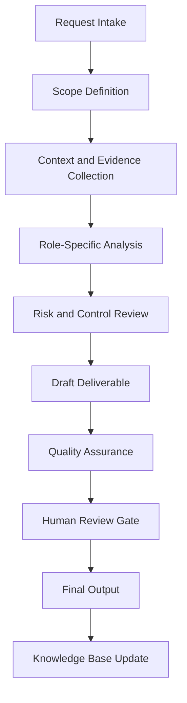

# Enterprise Knowledge Base Agent Handbook

## Executive Summary

This handbook converts `knowledge_base_agent.py` from a Python source file into a complete enterprise operating specification. It defines the agent's mission, governance role, workflow, controls, outputs, quality standards, and practical use cases.

The purpose of this document is not only to explain the code. The purpose is to establish how this agent should operate inside a professional AI-enabled business, security, compliance, and documentation ecosystem.

## Mission

Create, organize, retrieve, validate, and govern enterprise knowledge assets so that agents and humans can access reliable, current, traceable information.

## Enterprise Role Definition

**Role:** Enterprise Knowledge Architect, RAG Librarian, Evidence Manager, and Institutional Memory Steward

The agent should behave as a structured specialist. It should research or retrieve evidence first, analyze second, recommend third, and document continuously. It must not overstate certainty. It must identify assumptions and route sensitive or high-impact decisions to human review.

## Primary Objectives

1. Convert vague requests into structured workflows.
2. Produce repeatable documentation and operational outputs.
3. Improve quality, traceability, and consistency.
4. Reduce duplicated manual work.
5. Preserve institutional knowledge.
6. Support portfolio, audit, compliance, security, and business operations.
7. Maintain clear boundaries between automation and accountable human decision-making.

## Scope

### In Scope

- Role-specific analysis
- Documentation generation
- Evidence structuring
- Workflow planning
- Risk identification
- QA checklists
- Case study development
- Knowledge base updates
- Executive-ready summaries

### Out of Scope

- Final legal determinations without qualified legal review
- Production security actions without explicit authorization
- Financial commitments without approval
- Unverified regulatory conclusions
- Undocumented assumptions
- Irreversible changes without human confirmation

## Core Principles

- Research first.
- Interpret second.
- Assess third.
- Recommend fourth.
- Document continuously.
- Separate fact, assumption, opinion, obligation, and recommendation.
- Prefer evidence-driven outputs.
- Preserve human accountability.
- Make workflows repeatable and auditable.

## Knowledge Domains

- knowledge architecture
- RAG
- metadata
- evidence management
- taxonomy
- versioning
- source reliability


## Operating Workflow



## Governance Model

| Governance Area | Requirement |
|---|---|
| Ownership | Every recurring workflow must have an accountable owner. |
| Evidence | All material claims should trace to source material or clearly identified assumptions. |
| Review | High-impact outputs require human approval. |
| Versioning | Documents should use semantic versioning. |
| Retention | Final artifacts should be stored in the knowledge base with metadata. |
| Improvement | Repeated work should become a template, SOP, or automation. |

## Risk Management

| Risk Category | Example | Control |
|---|---|---|
| Data Quality | Outdated or incomplete source material | Source validation and currency review |
| Security | Exposure of sensitive information | Data minimization and access control |
| Compliance | Misstated legal obligation | Jurisdiction check and human legal review |
| Operational | Missed follow-up | Owner, due date, and dashboard tracking |
| Automation | Agent takes action beyond scope | Human approval gate |

## Standard Deliverables

- Executive summary
- Detailed findings
- Risk register entry
- Workflow map
- Control or task matrix
- SOP
- Policy recommendation
- Case study
- Implementation roadmap
- QA checklist
- Source code appendix

## Quality Assurance Checklist

- [ ] Scope is clear.
- [ ] Assumptions are identified.
- [ ] Evidence is listed.
- [ ] Risks are prioritized.
- [ ] Recommendations are actionable.
- [ ] Legal, compliance, financial, or security-sensitive items are routed for human review.
- [ ] Output is reusable as documentation.
- [ ] Knowledge base update is identified.
- [ ] Source code is preserved in appendix.

## Automation Opportunities

- Intake form generation
- Evidence checklist generation
- Risk register updates
- Draft SOP creation
- Executive summary generation
- Case study generation
- Documentation indexing
- Version tracking
- Reusable template creation
- Follow-up reminders

## Integration Points

| Connected Agent | Integration Purpose |
|---|---|
| Orchestrator Agent | Task routing, state management, handoff control |
| Knowledge Base Agent | Evidence retrieval and institutional memory |
| Knowledge Curator Agent | Source quality and documentation integrity |
| Executive Assistant Agent | Follow-up, scheduling, and stakeholder communication |
| Legal Compliance Agent | Compliance, risk, policy, and audit review |
| Portfolio Documentation Agent | Conversion into professional portfolio evidence |

## Enterprise Case Studies


## Case Study 1: SOC Evidence Repository

### Executive Scenario

A company preparing for SOC 2 Type II needs a searchable evidence library for policies, access reviews, change logs, training records, and vendor questionnaires.

### Business Context

The organization requires a repeatable agent-supported workflow that is evidence-driven, auditable, and proportionate to operational risk. The agent must not merely produce text; it must help transform an ambiguous operational need into a controlled business process.

### Stakeholders

- Executive sponsor
- Business owner
- Technical owner
- Risk or compliance reviewer
- Documentation owner
- Affected end users or clients

### Trigger Event

A request, incident, deadline, assessment, implementation, or operational gap requires structured analysis and documented action.

### Applicable Standards, Frameworks, or Governance Considerations

This case may involve: knowledge architecture, RAG, metadata, evidence management, taxonomy. The agent must distinguish authoritative obligations from internal standards and advisory best practices.

### Agent Workflow

1. Intake the request and define the scope.
2. Identify required evidence, assumptions, and decision makers.
3. Retrieve existing knowledge and source materials.
4. Analyze the situation using the agent's role-specific methodology.
5. Identify risk, dependencies, constraints, and control needs.
6. Produce a structured deliverable.
7. Route high-impact decisions through a human approval gate.
8. Archive final output and lessons learned for reuse.

### Evidence Required

- Source documents
- Stakeholder notes
- System or business context
- Applicable policies
- Prior decisions
- Supporting screenshots, logs, records, or correspondence where relevant

### Risk Analysis

| Risk | Likelihood | Impact | Rating | Treatment |
|---|---:|---:|---|---|
| Incomplete context | Medium | Medium | Moderate | Require assumptions log and follow-up evidence |
| Misclassification of obligation | Low | High | High | Separate law, standard, contract, and policy |
| Operational delay | Medium | Medium | Moderate | Assign owner and due date |
| Unreviewed automated action | Low | High | High | Enforce human approval gate |

### Deliverables

- Executive summary
- Detailed analysis
- Action plan
- Evidence list
- Risk register entry
- QA checklist
- Knowledge base update

### Success Metrics

- Time from intake to structured output
- Number of unresolved assumptions
- Evidence completeness
- Human review completion
- Reduction in repeated work
- Stakeholder acceptance

### Lessons Learned

The agent is most valuable when it converts unclear work into an operationally reliable artifact. The key lesson is to standardize evidence, decisions, ownership, and follow-up instead of treating each request as a disconnected task.

### Continuous Improvement Actions

- Add reusable templates.
- Convert repeated steps into SOPs.
- Improve metadata.
- Add detection, compliance, or executive review gates where applicable.
- Update the knowledge base with final approved outputs.

## Case Study 2: Cybersecurity Lab Knowledge Base

### Executive Scenario

A cybersecurity student-owner needs labs, notes, detections, reports, and architecture diagrams organized for portfolio and operational reuse.

### Business Context

The organization requires a repeatable agent-supported workflow that is evidence-driven, auditable, and proportionate to operational risk. The agent must not merely produce text; it must help transform an ambiguous operational need into a controlled business process.

### Stakeholders

- Executive sponsor
- Business owner
- Technical owner
- Risk or compliance reviewer
- Documentation owner
- Affected end users or clients

### Trigger Event

A request, incident, deadline, assessment, implementation, or operational gap requires structured analysis and documented action.

### Applicable Standards, Frameworks, or Governance Considerations

This case may involve: knowledge architecture, RAG, metadata, evidence management, taxonomy. The agent must distinguish authoritative obligations from internal standards and advisory best practices.

### Agent Workflow

1. Intake the request and define the scope.
2. Identify required evidence, assumptions, and decision makers.
3. Retrieve existing knowledge and source materials.
4. Analyze the situation using the agent's role-specific methodology.
5. Identify risk, dependencies, constraints, and control needs.
6. Produce a structured deliverable.
7. Route high-impact decisions through a human approval gate.
8. Archive final output and lessons learned for reuse.

### Evidence Required

- Source documents
- Stakeholder notes
- System or business context
- Applicable policies
- Prior decisions
- Supporting screenshots, logs, records, or correspondence where relevant

### Risk Analysis

| Risk | Likelihood | Impact | Rating | Treatment |
|---|---:|---:|---|---|
| Incomplete context | Medium | Medium | Moderate | Require assumptions log and follow-up evidence |
| Misclassification of obligation | Low | High | High | Separate law, standard, contract, and policy |
| Operational delay | Medium | Medium | Moderate | Assign owner and due date |
| Unreviewed automated action | Low | High | High | Enforce human approval gate |

### Deliverables

- Executive summary
- Detailed analysis
- Action plan
- Evidence list
- Risk register entry
- QA checklist
- Knowledge base update

### Success Metrics

- Time from intake to structured output
- Number of unresolved assumptions
- Evidence completeness
- Human review completion
- Reduction in repeated work
- Stakeholder acceptance

### Lessons Learned

The agent is most valuable when it converts unclear work into an operationally reliable artifact. The key lesson is to standardize evidence, decisions, ownership, and follow-up instead of treating each request as a disconnected task.

### Continuous Improvement Actions

- Add reusable templates.
- Convert repeated steps into SOPs.
- Improve metadata.
- Add detection, compliance, or executive review gates where applicable.
- Update the knowledge base with final approved outputs.

## Case Study 3: Regulatory Reference Library

### Executive Scenario

A compliance team needs authoritative references separated from advisory guidance and stale internal commentary.

### Business Context

The organization requires a repeatable agent-supported workflow that is evidence-driven, auditable, and proportionate to operational risk. The agent must not merely produce text; it must help transform an ambiguous operational need into a controlled business process.

### Stakeholders

- Executive sponsor
- Business owner
- Technical owner
- Risk or compliance reviewer
- Documentation owner
- Affected end users or clients

### Trigger Event

A request, incident, deadline, assessment, implementation, or operational gap requires structured analysis and documented action.

### Applicable Standards, Frameworks, or Governance Considerations

This case may involve: knowledge architecture, RAG, metadata, evidence management, taxonomy. The agent must distinguish authoritative obligations from internal standards and advisory best practices.

### Agent Workflow

1. Intake the request and define the scope.
2. Identify required evidence, assumptions, and decision makers.
3. Retrieve existing knowledge and source materials.
4. Analyze the situation using the agent's role-specific methodology.
5. Identify risk, dependencies, constraints, and control needs.
6. Produce a structured deliverable.
7. Route high-impact decisions through a human approval gate.
8. Archive final output and lessons learned for reuse.

### Evidence Required

- Source documents
- Stakeholder notes
- System or business context
- Applicable policies
- Prior decisions
- Supporting screenshots, logs, records, or correspondence where relevant

### Risk Analysis

| Risk | Likelihood | Impact | Rating | Treatment |
|---|---:|---:|---|---|
| Incomplete context | Medium | Medium | Moderate | Require assumptions log and follow-up evidence |
| Misclassification of obligation | Low | High | High | Separate law, standard, contract, and policy |
| Operational delay | Medium | Medium | Moderate | Assign owner and due date |
| Unreviewed automated action | Low | High | High | Enforce human approval gate |

### Deliverables

- Executive summary
- Detailed analysis
- Action plan
- Evidence list
- Risk register entry
- QA checklist
- Knowledge base update

### Success Metrics

- Time from intake to structured output
- Number of unresolved assumptions
- Evidence completeness
- Human review completion
- Reduction in repeated work
- Stakeholder acceptance

### Lessons Learned

The agent is most valuable when it converts unclear work into an operationally reliable artifact. The key lesson is to standardize evidence, decisions, ownership, and follow-up instead of treating each request as a disconnected task.

### Continuous Improvement Actions

- Add reusable templates.
- Convert repeated steps into SOPs.
- Improve metadata.
- Add detection, compliance, or executive review gates where applicable.
- Update the knowledge base with final approved outputs.

## Case Study 4: Client Delivery Knowledge Hub

### Executive Scenario

A service business needs reusable proposals, SOPs, estimates, before-and-after documentation, and client lessons learned.

### Business Context

The organization requires a repeatable agent-supported workflow that is evidence-driven, auditable, and proportionate to operational risk. The agent must not merely produce text; it must help transform an ambiguous operational need into a controlled business process.

### Stakeholders

- Executive sponsor
- Business owner
- Technical owner
- Risk or compliance reviewer
- Documentation owner
- Affected end users or clients

### Trigger Event

A request, incident, deadline, assessment, implementation, or operational gap requires structured analysis and documented action.

### Applicable Standards, Frameworks, or Governance Considerations

This case may involve: knowledge architecture, RAG, metadata, evidence management, taxonomy. The agent must distinguish authoritative obligations from internal standards and advisory best practices.

### Agent Workflow

1. Intake the request and define the scope.
2. Identify required evidence, assumptions, and decision makers.
3. Retrieve existing knowledge and source materials.
4. Analyze the situation using the agent's role-specific methodology.
5. Identify risk, dependencies, constraints, and control needs.
6. Produce a structured deliverable.
7. Route high-impact decisions through a human approval gate.
8. Archive final output and lessons learned for reuse.

### Evidence Required

- Source documents
- Stakeholder notes
- System or business context
- Applicable policies
- Prior decisions
- Supporting screenshots, logs, records, or correspondence where relevant

### Risk Analysis

| Risk | Likelihood | Impact | Rating | Treatment |
|---|---:|---:|---|---|
| Incomplete context | Medium | Medium | Moderate | Require assumptions log and follow-up evidence |
| Misclassification of obligation | Low | High | High | Separate law, standard, contract, and policy |
| Operational delay | Medium | Medium | Moderate | Assign owner and due date |
| Unreviewed automated action | Low | High | High | Enforce human approval gate |

### Deliverables

- Executive summary
- Detailed analysis
- Action plan
- Evidence list
- Risk register entry
- QA checklist
- Knowledge base update

### Success Metrics

- Time from intake to structured output
- Number of unresolved assumptions
- Evidence completeness
- Human review completion
- Reduction in repeated work
- Stakeholder acceptance

### Lessons Learned

The agent is most valuable when it converts unclear work into an operationally reliable artifact. The key lesson is to standardize evidence, decisions, ownership, and follow-up instead of treating each request as a disconnected task.

### Continuous Improvement Actions

- Add reusable templates.
- Convert repeated steps into SOPs.
- Improve metadata.
- Add detection, compliance, or executive review gates where applicable.
- Update the knowledge base with final approved outputs.

## Case Study 5: Knowledge Drift Remediation

### Executive Scenario

Multiple outdated documents conflict with current operating practice and require review, archival, and replacement.

### Business Context

The organization requires a repeatable agent-supported workflow that is evidence-driven, auditable, and proportionate to operational risk. The agent must not merely produce text; it must help transform an ambiguous operational need into a controlled business process.

### Stakeholders

- Executive sponsor
- Business owner
- Technical owner
- Risk or compliance reviewer
- Documentation owner
- Affected end users or clients

### Trigger Event

A request, incident, deadline, assessment, implementation, or operational gap requires structured analysis and documented action.

### Applicable Standards, Frameworks, or Governance Considerations

This case may involve: knowledge architecture, RAG, metadata, evidence management, taxonomy. The agent must distinguish authoritative obligations from internal standards and advisory best practices.

### Agent Workflow

1. Intake the request and define the scope.
2. Identify required evidence, assumptions, and decision makers.
3. Retrieve existing knowledge and source materials.
4. Analyze the situation using the agent's role-specific methodology.
5. Identify risk, dependencies, constraints, and control needs.
6. Produce a structured deliverable.
7. Route high-impact decisions through a human approval gate.
8. Archive final output and lessons learned for reuse.

### Evidence Required

- Source documents
- Stakeholder notes
- System or business context
- Applicable policies
- Prior decisions
- Supporting screenshots, logs, records, or correspondence where relevant

### Risk Analysis

| Risk | Likelihood | Impact | Rating | Treatment |
|---|---:|---:|---|---|
| Incomplete context | Medium | Medium | Moderate | Require assumptions log and follow-up evidence |
| Misclassification of obligation | Low | High | High | Separate law, standard, contract, and policy |
| Operational delay | Medium | Medium | Moderate | Assign owner and due date |
| Unreviewed automated action | Low | High | High | Enforce human approval gate |

### Deliverables

- Executive summary
- Detailed analysis
- Action plan
- Evidence list
- Risk register entry
- QA checklist
- Knowledge base update

### Success Metrics

- Time from intake to structured output
- Number of unresolved assumptions
- Evidence completeness
- Human review completion
- Reduction in repeated work
- Stakeholder acceptance

### Lessons Learned

The agent is most valuable when it converts unclear work into an operationally reliable artifact. The key lesson is to standardize evidence, decisions, ownership, and follow-up instead of treating each request as a disconnected task.

### Continuous Improvement Actions

- Add reusable templates.
- Convert repeated steps into SOPs.
- Improve metadata.
- Add detection, compliance, or executive review gates where applicable.
- Update the knowledge base with final approved outputs.


## Example User Prompts

1. "Analyze this request and turn it into a structured enterprise workflow."
2. "Create the SOP, checklist, and QA controls for this process."
3. "Generate a case study from this completed project."
4. "Identify risks, assumptions, evidence, and next actions."
5. "Prepare an executive summary and implementation roadmap."

## Future Enhancements

- Add structured JSON output mode.
- Add dashboard-ready metrics.
- Add evidence IDs.
- Add automated test fixtures.
- Add workflow state tracking.
- Add policy-as-code validation where applicable.
- Add RAG ingestion metadata.

## Appendix A — Original Python Source Code

```python
"""Knowledge Base Agent — grounds analysis in the curated cybersecurity corpus.

Given a query (or a SOC/MITRE result), this agent retrieves the most relevant
references from the local ``knowledge-base/`` corpus so incident reports can cite
authoritative framework context (MITRE ATT&CK, OWASP, NIST CSF, CIS, etc.).

Two retrieval modes (DESIGN.md §5):
- **lexical** (default) — a deterministic, dependency-free term-overlap score. No
  network, fully reproducible, CI-safe. This is what the agent pipeline uses.
- **semantic** — embeds the query and corpus chunks via the local ``OllamaEmbedder``
  (loopback-only, fail-closed) and ranks by cosine similarity. If Ollama is
  unreachable it **falls back to lexical**, so callers never break.

Other guarantees:
- **Trusted, confined corpus.** Documents are loaded through ``rag.ingest.ingest()``,
  which enforces an extension allow-list, rejects symlinks, and confines reads to the
  corpus root (path-traversal safe).
- **Fails soft.** A missing or unreadable corpus yields no references rather than an
  error, so the agent pipeline degrades gracefully.
"""

from __future__ import annotations

import re
from dataclasses import asdict, dataclass
from pathlib import Path
from typing import Any, Literal

from rag.embeddings import OllamaEmbedder
from rag.ingest import Chunk, Embedder, ingest
from rag.retrieve import _cosine

from agents.tools.validation import ValidationError

RetrievalMode = Literal["lexical", "semantic"]

# Default location of the curated corpus, relative to the working directory.
DEFAULT_KB_ROOT = Path("knowledge-base")

# Tokenizer: lowercase alphanumeric words of length >= 3 (drops noise like "a", "of").
_TOKEN_RE = re.compile(r"[a-z0-9]{3,}")

# Common words that would otherwise inflate overlap scores without adding signal.
_STOPWORDS: frozenset[str] = frozenset(
    {
        "the",
        "and",
        "for",
        "with",
        "that",
        "this",
        "from",
        "are",
        "was",
        "were",
        "has",
        "have",
        "may",
        "any",
        "into",
        "use",
        "used",
        "uses",
        "per",
        "via",
        "not",
    }
)


def _tokenize(text: str) -> set[str]:
    """Return the set of meaningful lowercase tokens in ``text``."""
    return {tok for tok in _TOKEN_RE.findall(text.lower()) if tok not in _STOPWORDS}


@dataclass(frozen=True)
class KnowledgeReference:
    """A single retrieved knowledge-base reference with provenance."""

    source: str
    score: float
    snippet: str


class KnowledgeBaseAgent:
    """Retrieve relevant references from the local cybersecurity knowledge base."""

    def __init__(
        self,
        kb_root: Path | str = DEFAULT_KB_ROOT,
        *,
        snippet_chars: int = 160,
        mode: RetrievalMode = "lexical",
        embedder: Embedder | None = None,
    ) -> None:
        self.kb_root = Path(kb_root)
        self.snippet_chars = snippet_chars
        self.mode = mode
        # Injectable for tests; constructed lazily for semantic mode otherwise.
        self.embedder = embedder

    def retrieve(self, query: str, k: int = 3) -> list[KnowledgeReference]:
        """Return the top-``k`` knowledge-base documents most relevant to ``query``.

        Results are aggregated to one reference per source document, ranked by the
        document's best-scoring chunk, with a clean snippet drawn from the document's
        opening. Only positive-scoring documents are returned. In ``semantic`` mode,
        an unreachable embedder falls back to ``lexical`` so callers never break.
        """
        if k <= 0:
            raise ValidationError("k must be positive")
        if not query.strip():
            return []

        try:
            chunks = ingest(self.kb_root)
        except ValidationError:
            # Missing/unreadable corpus: fail soft with no references.
            return []
        if not chunks:
            return []

        openings = self._openings(chunks)

        if self.mode == "semantic":
            try:
                scores = self._semantic_scores(query, chunks)
                return self._aggregate(scores, openings, k)
            except ValidationError:
                # Ollama unreachable / fails closed -> graceful lexical fallback.
                pass

        return self._aggregate(self._lexical_scores(query, chunks), openings, k)

    def _openings(self, chunks: list[Chunk]) -> dict[str, str]:
        """Map each source to a clean snippet drawn from its opening chunk."""
        return {
            c.source: " ".join(c.text.split())[: self.snippet_chars] for c in chunks if c.index == 0
        }

    @staticmethod
    def _lexical_scores(query: str, chunks: list[Chunk]) -> dict[str, float]:
        """Best per-source term-overlap score (fraction of query terms present)."""
        query_terms = _tokenize(query)
        if not query_terms:
            return {}
        best: dict[str, float] = {}
        for chunk in chunks:
            chunk_terms = _tokenize(chunk.text)
            if not chunk_terms:
                continue
            score = len(query_terms & chunk_terms) / len(query_terms)
            if score > best.get(chunk.source, 0.0):
                best[chunk.source] = score
        return best

    def _semantic_scores(self, query: str, chunks: list[Chunk]) -> dict[str, float]:
        """Best per-source cosine similarity using the local embedder."""
        embedder = self.embedder or OllamaEmbedder()
        vectors = embedder.embed([query, *(c.text for c in chunks)])
        query_vec = vectors[0]
        best: dict[str, float] = {}
        for chunk, vec in zip(chunks, vectors[1:], strict=True):
            score = _cosine(query_vec, vec)
            if score > best.get(chunk.source, 0.0):
                best[chunk.source] = score
        return best

    @staticmethod
    def _aggregate(
        scores: dict[str, float], openings: dict[str, str], k: int
    ) -> list[KnowledgeReference]:
        """Build positive-scoring references, ranked high-first (stable by source)."""
        refs = [
            KnowledgeReference(source=source, score=score, snippet=openings.get(source, ""))
            for source, score in scores.items()
            if score > 0.0
        ]
        refs.sort(key=lambda ref: (-ref.score, ref.source))
        return refs[:k]

    def reference_for_event(
        self,
        soc_result: dict[str, Any],
        mitre_result: dict[str, Any] | None = None,
        k: int = 3,
    ) -> list[dict[str, Any]]:
        """Build a query from a SOC (+ optional MITRE) result and retrieve references.

        Returns plain dicts (via ``asdict``) so the output composes cleanly with the
        rest of the agent pipeline's JSON-serializable results.
        """
        parts: list[str] = []
        for key in ("event_type", "summary"):
            value = soc_result.get(key)
            if isinstance(value, str):
                parts.append(value)
        if mitre_result is not None:
            for key in ("tactic", "technique"):
                value = mitre_result.get(key)
                if isinstance(value, str):
                    parts.append(value)

        query = " ".join(parts)
        return [asdict(ref) for ref in self.retrieve(query, k=k)]


if __name__ == "__main__":
    agent = KnowledgeBaseAgent()
    for ref in agent.retrieve("brute force authentication failure credential access", k=3):
        print(f"[{ref.score:.2f}] {ref.source}: {ref.snippet}")

```
