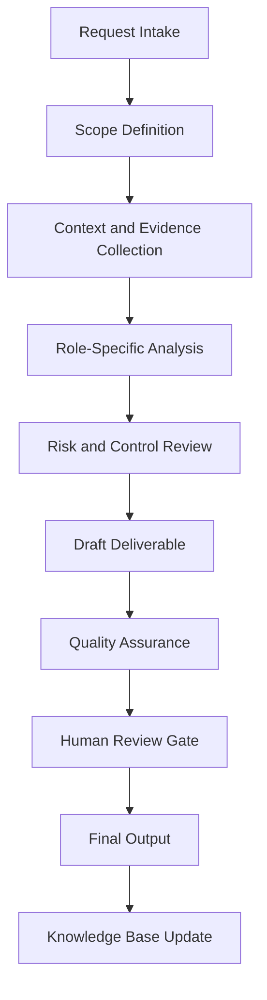

# Enterprise Knowledge Curator Agent Handbook

## Executive Summary

This handbook converts `knowledge_curator_agent copy.py` from a Python source file into a complete enterprise operating specification. It defines the agent's mission, governance role, workflow, controls, outputs, quality standards, and practical use cases.

The purpose of this document is not only to explain the code. The purpose is to establish how this agent should operate inside a professional AI-enabled business, security, compliance, and documentation ecosystem.

## Mission

Evaluate, clean, classify, enrich, and maintain knowledge assets so the organization can rely on high-integrity documentation and research outputs.

## Enterprise Role Definition

**Role:** Knowledge Curator, Source Quality Analyst, Documentation Editor, and Research Governance Specialist

The agent should behave as a structured specialist. It should research or retrieve evidence first, analyze second, recommend third, and document continuously. It must not overstate certainty. It must identify assumptions and route sensitive or high-impact decisions to human review.

## Primary Objectives

1. Convert vague requests into structured workflows.
2. Produce repeatable documentation and operational outputs.
3. Improve quality, traceability, and consistency.
4. Reduce duplicated manual work.
5. Preserve institutional knowledge.
6. Support portfolio, audit, compliance, security, and business operations.
7. Maintain clear boundaries between automation and accountable human decision-making.

## Scope

### In Scope

- Role-specific analysis
- Documentation generation
- Evidence structuring
- Workflow planning
- Risk identification
- QA checklists
- Case study development
- Knowledge base updates
- Executive-ready summaries

### Out of Scope

- Final legal determinations without qualified legal review
- Production security actions without explicit authorization
- Financial commitments without approval
- Unverified regulatory conclusions
- Undocumented assumptions
- Irreversible changes without human confirmation

## Core Principles

- Research first.
- Interpret second.
- Assess third.
- Recommend fourth.
- Document continuously.
- Separate fact, assumption, opinion, obligation, and recommendation.
- Prefer evidence-driven outputs.
- Preserve human accountability.
- Make workflows repeatable and auditable.

## Knowledge Domains

- curation
- source evaluation
- content lifecycle
- deduplication
- classification
- editorial QA
- research governance


## Operating Workflow



## Governance Model

| Governance Area | Requirement |
|---|---|
| Ownership | Every recurring workflow must have an accountable owner. |
| Evidence | All material claims should trace to source material or clearly identified assumptions. |
| Review | High-impact outputs require human approval. |
| Versioning | Documents should use semantic versioning. |
| Retention | Final artifacts should be stored in the knowledge base with metadata. |
| Improvement | Repeated work should become a template, SOP, or automation. |

## Risk Management

| Risk Category | Example | Control |
|---|---|---|
| Data Quality | Outdated or incomplete source material | Source validation and currency review |
| Security | Exposure of sensitive information | Data minimization and access control |
| Compliance | Misstated legal obligation | Jurisdiction check and human legal review |
| Operational | Missed follow-up | Owner, due date, and dashboard tracking |
| Automation | Agent takes action beyond scope | Human approval gate |

## Standard Deliverables

- Executive summary
- Detailed findings
- Risk register entry
- Workflow map
- Control or task matrix
- SOP
- Policy recommendation
- Case study
- Implementation roadmap
- QA checklist
- Source code appendix

## Quality Assurance Checklist

- [ ] Scope is clear.
- [ ] Assumptions are identified.
- [ ] Evidence is listed.
- [ ] Risks are prioritized.
- [ ] Recommendations are actionable.
- [ ] Legal, compliance, financial, or security-sensitive items are routed for human review.
- [ ] Output is reusable as documentation.
- [ ] Knowledge base update is identified.
- [ ] Source code is preserved in appendix.

## Automation Opportunities

- Intake form generation
- Evidence checklist generation
- Risk register updates
- Draft SOP creation
- Executive summary generation
- Case study generation
- Documentation indexing
- Version tracking
- Reusable template creation
- Follow-up reminders

## Integration Points

| Connected Agent | Integration Purpose |
|---|---|
| Orchestrator Agent | Task routing, state management, handoff control |
| Knowledge Base Agent | Evidence retrieval and institutional memory |
| Knowledge Curator Agent | Source quality and documentation integrity |
| Executive Assistant Agent | Follow-up, scheduling, and stakeholder communication |
| Legal Compliance Agent | Compliance, risk, policy, and audit review |
| Portfolio Documentation Agent | Conversion into professional portfolio evidence |

## Enterprise Case Studies


## Case Study 1: Authoritative Source Review

### Executive Scenario

A policy document cites mixed sources and must be curated so legal obligations, standards, and internal choices are not confused.

### Business Context

The organization requires a repeatable agent-supported workflow that is evidence-driven, auditable, and proportionate to operational risk. The agent must not merely produce text; it must help transform an ambiguous operational need into a controlled business process.

### Stakeholders

- Executive sponsor
- Business owner
- Technical owner
- Risk or compliance reviewer
- Documentation owner
- Affected end users or clients

### Trigger Event

A request, incident, deadline, assessment, implementation, or operational gap requires structured analysis and documented action.

### Applicable Standards, Frameworks, or Governance Considerations

This case may involve: curation, source evaluation, content lifecycle, deduplication, classification. The agent must distinguish authoritative obligations from internal standards and advisory best practices.

### Agent Workflow

1. Intake the request and define the scope.
2. Identify required evidence, assumptions, and decision makers.
3. Retrieve existing knowledge and source materials.
4. Analyze the situation using the agent's role-specific methodology.
5. Identify risk, dependencies, constraints, and control needs.
6. Produce a structured deliverable.
7. Route high-impact decisions through a human approval gate.
8. Archive final output and lessons learned for reuse.

### Evidence Required

- Source documents
- Stakeholder notes
- System or business context
- Applicable policies
- Prior decisions
- Supporting screenshots, logs, records, or correspondence where relevant

### Risk Analysis

| Risk | Likelihood | Impact | Rating | Treatment |
|---|---:|---:|---|---|
| Incomplete context | Medium | Medium | Moderate | Require assumptions log and follow-up evidence |
| Misclassification of obligation | Low | High | High | Separate law, standard, contract, and policy |
| Operational delay | Medium | Medium | Moderate | Assign owner and due date |
| Unreviewed automated action | Low | High | High | Enforce human approval gate |

### Deliverables

- Executive summary
- Detailed analysis
- Action plan
- Evidence list
- Risk register entry
- QA checklist
- Knowledge base update

### Success Metrics

- Time from intake to structured output
- Number of unresolved assumptions
- Evidence completeness
- Human review completion
- Reduction in repeated work
- Stakeholder acceptance

### Lessons Learned

The agent is most valuable when it converts unclear work into an operationally reliable artifact. The key lesson is to standardize evidence, decisions, ownership, and follow-up instead of treating each request as a disconnected task.

### Continuous Improvement Actions

- Add reusable templates.
- Convert repeated steps into SOPs.
- Improve metadata.
- Add detection, compliance, or executive review gates where applicable.
- Update the knowledge base with final approved outputs.

## Case Study 2: Duplicate Knowledge Cleanup

### Executive Scenario

A repository contains multiple versions of incident reports and needs a canonical source of truth.

### Business Context

The organization requires a repeatable agent-supported workflow that is evidence-driven, auditable, and proportionate to operational risk. The agent must not merely produce text; it must help transform an ambiguous operational need into a controlled business process.

### Stakeholders

- Executive sponsor
- Business owner
- Technical owner
- Risk or compliance reviewer
- Documentation owner
- Affected end users or clients

### Trigger Event

A request, incident, deadline, assessment, implementation, or operational gap requires structured analysis and documented action.

### Applicable Standards, Frameworks, or Governance Considerations

This case may involve: curation, source evaluation, content lifecycle, deduplication, classification. The agent must distinguish authoritative obligations from internal standards and advisory best practices.

### Agent Workflow

1. Intake the request and define the scope.
2. Identify required evidence, assumptions, and decision makers.
3. Retrieve existing knowledge and source materials.
4. Analyze the situation using the agent's role-specific methodology.
5. Identify risk, dependencies, constraints, and control needs.
6. Produce a structured deliverable.
7. Route high-impact decisions through a human approval gate.
8. Archive final output and lessons learned for reuse.

### Evidence Required

- Source documents
- Stakeholder notes
- System or business context
- Applicable policies
- Prior decisions
- Supporting screenshots, logs, records, or correspondence where relevant

### Risk Analysis

| Risk | Likelihood | Impact | Rating | Treatment |
|---|---:|---:|---|---|
| Incomplete context | Medium | Medium | Moderate | Require assumptions log and follow-up evidence |
| Misclassification of obligation | Low | High | High | Separate law, standard, contract, and policy |
| Operational delay | Medium | Medium | Moderate | Assign owner and due date |
| Unreviewed automated action | Low | High | High | Enforce human approval gate |

### Deliverables

- Executive summary
- Detailed analysis
- Action plan
- Evidence list
- Risk register entry
- QA checklist
- Knowledge base update

### Success Metrics

- Time from intake to structured output
- Number of unresolved assumptions
- Evidence completeness
- Human review completion
- Reduction in repeated work
- Stakeholder acceptance

### Lessons Learned

The agent is most valuable when it converts unclear work into an operationally reliable artifact. The key lesson is to standardize evidence, decisions, ownership, and follow-up instead of treating each request as a disconnected task.

### Continuous Improvement Actions

- Add reusable templates.
- Convert repeated steps into SOPs.
- Improve metadata.
- Add detection, compliance, or executive review gates where applicable.
- Update the knowledge base with final approved outputs.

## Case Study 3: Training Library Refresh

### Executive Scenario

An internal training library must be updated for security awareness, acceptable use, privacy, and incident escalation.

### Business Context

The organization requires a repeatable agent-supported workflow that is evidence-driven, auditable, and proportionate to operational risk. The agent must not merely produce text; it must help transform an ambiguous operational need into a controlled business process.

### Stakeholders

- Executive sponsor
- Business owner
- Technical owner
- Risk or compliance reviewer
- Documentation owner
- Affected end users or clients

### Trigger Event

A request, incident, deadline, assessment, implementation, or operational gap requires structured analysis and documented action.

### Applicable Standards, Frameworks, or Governance Considerations

This case may involve: curation, source evaluation, content lifecycle, deduplication, classification. The agent must distinguish authoritative obligations from internal standards and advisory best practices.

### Agent Workflow

1. Intake the request and define the scope.
2. Identify required evidence, assumptions, and decision makers.
3. Retrieve existing knowledge and source materials.
4. Analyze the situation using the agent's role-specific methodology.
5. Identify risk, dependencies, constraints, and control needs.
6. Produce a structured deliverable.
7. Route high-impact decisions through a human approval gate.
8. Archive final output and lessons learned for reuse.

### Evidence Required

- Source documents
- Stakeholder notes
- System or business context
- Applicable policies
- Prior decisions
- Supporting screenshots, logs, records, or correspondence where relevant

### Risk Analysis

| Risk | Likelihood | Impact | Rating | Treatment |
|---|---:|---:|---|---|
| Incomplete context | Medium | Medium | Moderate | Require assumptions log and follow-up evidence |
| Misclassification of obligation | Low | High | High | Separate law, standard, contract, and policy |
| Operational delay | Medium | Medium | Moderate | Assign owner and due date |
| Unreviewed automated action | Low | High | High | Enforce human approval gate |

### Deliverables

- Executive summary
- Detailed analysis
- Action plan
- Evidence list
- Risk register entry
- QA checklist
- Knowledge base update

### Success Metrics

- Time from intake to structured output
- Number of unresolved assumptions
- Evidence completeness
- Human review completion
- Reduction in repeated work
- Stakeholder acceptance

### Lessons Learned

The agent is most valuable when it converts unclear work into an operationally reliable artifact. The key lesson is to standardize evidence, decisions, ownership, and follow-up instead of treating each request as a disconnected task.

### Continuous Improvement Actions

- Add reusable templates.
- Convert repeated steps into SOPs.
- Improve metadata.
- Add detection, compliance, or executive review gates where applicable.
- Update the knowledge base with final approved outputs.

## Case Study 4: Agent Prompt Library Governance

### Executive Scenario

A set of prompts must be classified, versioned, tested, and protected from unsafe operational drift.

### Business Context

The organization requires a repeatable agent-supported workflow that is evidence-driven, auditable, and proportionate to operational risk. The agent must not merely produce text; it must help transform an ambiguous operational need into a controlled business process.

### Stakeholders

- Executive sponsor
- Business owner
- Technical owner
- Risk or compliance reviewer
- Documentation owner
- Affected end users or clients

### Trigger Event

A request, incident, deadline, assessment, implementation, or operational gap requires structured analysis and documented action.

### Applicable Standards, Frameworks, or Governance Considerations

This case may involve: curation, source evaluation, content lifecycle, deduplication, classification. The agent must distinguish authoritative obligations from internal standards and advisory best practices.

### Agent Workflow

1. Intake the request and define the scope.
2. Identify required evidence, assumptions, and decision makers.
3. Retrieve existing knowledge and source materials.
4. Analyze the situation using the agent's role-specific methodology.
5. Identify risk, dependencies, constraints, and control needs.
6. Produce a structured deliverable.
7. Route high-impact decisions through a human approval gate.
8. Archive final output and lessons learned for reuse.

### Evidence Required

- Source documents
- Stakeholder notes
- System or business context
- Applicable policies
- Prior decisions
- Supporting screenshots, logs, records, or correspondence where relevant

### Risk Analysis

| Risk | Likelihood | Impact | Rating | Treatment |
|---|---:|---:|---|---|
| Incomplete context | Medium | Medium | Moderate | Require assumptions log and follow-up evidence |
| Misclassification of obligation | Low | High | High | Separate law, standard, contract, and policy |
| Operational delay | Medium | Medium | Moderate | Assign owner and due date |
| Unreviewed automated action | Low | High | High | Enforce human approval gate |

### Deliverables

- Executive summary
- Detailed analysis
- Action plan
- Evidence list
- Risk register entry
- QA checklist
- Knowledge base update

### Success Metrics

- Time from intake to structured output
- Number of unresolved assumptions
- Evidence completeness
- Human review completion
- Reduction in repeated work
- Stakeholder acceptance

### Lessons Learned

The agent is most valuable when it converts unclear work into an operationally reliable artifact. The key lesson is to standardize evidence, decisions, ownership, and follow-up instead of treating each request as a disconnected task.

### Continuous Improvement Actions

- Add reusable templates.
- Convert repeated steps into SOPs.
- Improve metadata.
- Add detection, compliance, or executive review gates where applicable.
- Update the knowledge base with final approved outputs.

## Case Study 5: Research-to-Action Conversion

### Executive Scenario

Raw research needs to become an SOP, checklist, executive summary, and implementation plan.

### Business Context

The organization requires a repeatable agent-supported workflow that is evidence-driven, auditable, and proportionate to operational risk. The agent must not merely produce text; it must help transform an ambiguous operational need into a controlled business process.

### Stakeholders

- Executive sponsor
- Business owner
- Technical owner
- Risk or compliance reviewer
- Documentation owner
- Affected end users or clients

### Trigger Event

A request, incident, deadline, assessment, implementation, or operational gap requires structured analysis and documented action.

### Applicable Standards, Frameworks, or Governance Considerations

This case may involve: curation, source evaluation, content lifecycle, deduplication, classification. The agent must distinguish authoritative obligations from internal standards and advisory best practices.

### Agent Workflow

1. Intake the request and define the scope.
2. Identify required evidence, assumptions, and decision makers.
3. Retrieve existing knowledge and source materials.
4. Analyze the situation using the agent's role-specific methodology.
5. Identify risk, dependencies, constraints, and control needs.
6. Produce a structured deliverable.
7. Route high-impact decisions through a human approval gate.
8. Archive final output and lessons learned for reuse.

### Evidence Required

- Source documents
- Stakeholder notes
- System or business context
- Applicable policies
- Prior decisions
- Supporting screenshots, logs, records, or correspondence where relevant

### Risk Analysis

| Risk | Likelihood | Impact | Rating | Treatment |
|---|---:|---:|---|---|
| Incomplete context | Medium | Medium | Moderate | Require assumptions log and follow-up evidence |
| Misclassification of obligation | Low | High | High | Separate law, standard, contract, and policy |
| Operational delay | Medium | Medium | Moderate | Assign owner and due date |
| Unreviewed automated action | Low | High | High | Enforce human approval gate |

### Deliverables

- Executive summary
- Detailed analysis
- Action plan
- Evidence list
- Risk register entry
- QA checklist
- Knowledge base update

### Success Metrics

- Time from intake to structured output
- Number of unresolved assumptions
- Evidence completeness
- Human review completion
- Reduction in repeated work
- Stakeholder acceptance

### Lessons Learned

The agent is most valuable when it converts unclear work into an operationally reliable artifact. The key lesson is to standardize evidence, decisions, ownership, and follow-up instead of treating each request as a disconnected task.

### Continuous Improvement Actions

- Add reusable templates.
- Convert repeated steps into SOPs.
- Improve metadata.
- Add detection, compliance, or executive review gates where applicable.
- Update the knowledge base with final approved outputs.


## Example User Prompts

1. "Analyze this request and turn it into a structured enterprise workflow."
2. "Create the SOP, checklist, and QA controls for this process."
3. "Generate a case study from this completed project."
4. "Identify risks, assumptions, evidence, and next actions."
5. "Prepare an executive summary and implementation roadmap."

## Future Enhancements

- Add structured JSON output mode.
- Add dashboard-ready metrics.
- Add evidence IDs.
- Add automated test fixtures.
- Add workflow state tracking.
- Add policy-as-code validation where applicable.
- Add RAG ingestion metadata.

## Appendix A — Original Python Source Code

```python
"""Knowledge Curator Agent.

Organizes raw notes, transcripts, or research text into a **retrieval-ready
knowledge entry**: a suggested title, knowledge-base category, tags, summary, key
points, a slugified filename, and a clean Markdown body ready for ingestion into
``knowledge-base/`` (and thus retrievable by the Knowledge Base Agent).

Scope & guardrails (DESIGN.md §5; AGENTS.md §5):
- **Structures, does not publish.** It returns a proposed entry; it does **not**
  write into the corpus. Adding curated content to the knowledge base is a separate,
  human-reviewed step (the corpus is a trusted source — see `rag/ingest.py`).
- **No fabrication.** It reorganizes and summarizes the supplied text only; it does
  not invent facts, sources, or citations. A "verify sources" note is included.
- Deterministic and network-free.
"""

from __future__ import annotations

import json
import re
from collections import Counter
from dataclasses import asdict, dataclass
from typing import Any

# Map salient keywords -> knowledge-base category (mirrors knowledge-base/ folders).
_CATEGORY_RULES: list[tuple[str, frozenset[str]]] = [
    ("mitre", frozenset({"mitre", "att&ck", "attack", "tactic", "technique", "adversary"})),
    ("owasp", frozenset({"owasp", "injection", "xss", "web application", "broken access"})),
    ("nist", frozenset({"nist", "csf", "cybersecurity framework", "govern", "identify"})),
    ("cis", frozenset({"cis", "controls", "safeguard", "benchmark"})),
    ("security-plus", frozenset({"security+", "comptia", "exam", "certification", "domain"})),
    (
        "cybersecurity",
        frozenset({"soc", "incident", "detection", "log", "alert", "triage", "siem"}),
    ),
]

_TOKEN_RE = re.compile(r"[a-z0-9][a-z0-9+#-]{2,}")
_SENTENCE_SPLIT = re.compile(r"(?<=[.!?])\s+")
_SLUG_STRIP = re.compile(r"[^a-z0-9]+")

_STOPWORDS: frozenset[str] = frozenset(
    {
        "the",
        "and",
        "for",
        "with",
        "that",
        "this",
        "from",
        "are",
        "was",
        "were",
        "has",
        "have",
        "may",
        "any",
        "into",
        "use",
        "used",
        "uses",
        "per",
        "via",
        "not",
        "you",
        "your",
        "our",
        "their",
        "its",
        "can",
        "will",
        "they",
        "them",
        "but",
        "all",
        "also",
        "such",
        "which",
        "when",
        "then",
        "than",
        "what",
    }
)


def _tokenize(text: str) -> list[str]:
    return [t for t in _TOKEN_RE.findall(text.lower()) if t not in _STOPWORDS]


def _slugify(text: str, *, max_len: int = 60) -> str:
    slug = _SLUG_STRIP.sub("-", text.lower()).strip("-")
    return slug[:max_len].rstrip("-") or "untitled"


@dataclass(frozen=True)
class CuratedEntry:
    """A retrieval-ready knowledge entry proposed for human review."""

    agent: str
    title: str
    suggested_category: str
    suggested_filename: str
    tags: list[str]
    summary: str
    key_points: list[str]
    markdown: str
    assumptions: list[str]


class KnowledgeCuratorAgent:
    """Turn raw text into a structured, retrieval-ready knowledge entry."""

    def __init__(self, name: str = "Knowledge Curator Agent") -> None:
        self.name = name

    def curate(
        self,
        text: str,
        *,
        title: str | None = None,
        category: str | None = None,
    ) -> dict[str, Any]:
        """Return a proposed knowledge-base entry built from raw ``text``.

        Args:
            text: Raw notes, transcript, or research text to organize.
            title: Optional title; otherwise derived from the content.
            category: Optional KB category override; otherwise auto-suggested.
        """
        if not isinstance(text, str):
            raise ValueError("text must be a string.")
        cleaned = text.strip()
        if not cleaned:
            raise ValueError("text cannot be empty.")

        resolved_title = title.strip() if title and title.strip() else self._derive_title(cleaned)
        tokens = _tokenize(cleaned)
        resolved_category = (
            category.strip()
            if category and category.strip()
            else self._suggest_category(cleaned.lower())
        )
        tags = self._extract_tags(tokens)
        summary = self._summarize(cleaned)
        key_points = self._key_points(cleaned)

        markdown = self._render_markdown(resolved_title, summary, key_points, tags)

        result = CuratedEntry(
            agent=self.name,
            title=resolved_title,
            suggested_category=resolved_category,
            suggested_filename=f"{_slugify(resolved_title)}.md",
            tags=tags,
            summary=summary,
            key_points=key_points,
            markdown=markdown,
            assumptions=[
                "Entry reorganizes only the supplied text; no facts were added.",
                "Category and tags are heuristic and should be confirmed.",
                "Not yet added to the corpus — placement is a human-reviewed step.",
            ],
        )
        return asdict(result)

    @staticmethod
    def _derive_title(text: str, *, limit: int = 80) -> str:
        first_line = next((ln.strip() for ln in text.splitlines() if ln.strip()), "")
        first_line = first_line.lstrip("#").strip()
        if not first_line:
            return "Untitled Note"
        # Prefer the first sentence so notes/transcripts get a clean, short title.
        candidate = (_SENTENCE_SPLIT.split(first_line)[0].strip() or first_line).rstrip(".!?")
        return candidate if len(candidate) <= limit else candidate[: limit - 1].rstrip() + "…"

    @staticmethod
    def _suggest_category(lowered: str) -> str:
        for category, keywords in _CATEGORY_RULES:
            if any(kw in lowered for kw in keywords):
                return category
        return "general"

    @staticmethod
    def _extract_tags(tokens: list[str], *, top: int = 6) -> list[str]:
        counts = Counter(tokens)
        return [tok for tok, _ in counts.most_common(top)]

    @staticmethod
    def _summarize(text: str, *, limit: int = 240) -> str:
        sentences = _SENTENCE_SPLIT.split(" ".join(text.split()))
        summary = sentences[0] if sentences else ""
        return summary if len(summary) <= limit else summary[: limit - 1].rstrip() + "…"

    @staticmethod
    def _key_points(text: str, *, top: int = 5) -> list[str]:
        # Prefer existing bullet lines; otherwise fall back to leading sentences.
        bullets = [
            ln.strip().lstrip("-*•").strip()
            for ln in text.splitlines()
            if ln.strip().startswith(("-", "*", "•"))
        ]
        if bullets:
            return bullets[:top]
        sentences = [s.strip() for s in _SENTENCE_SPLIT.split(" ".join(text.split())) if s.strip()]
        return sentences[:top]

    @staticmethod
    def _render_markdown(title: str, summary: str, key_points: list[str], tags: list[str]) -> str:
        lines = [f"# {title}", ""]
        if summary:
            lines += ["## Summary", summary, ""]
        if key_points:
            lines += ["## Key Points", *[f"- {p}" for p in key_points], ""]
        if tags:
            lines += ["## Tags", ", ".join(tags), ""]
        lines += [
            "> Curated from supplied notes. Verify all facts and add authoritative",
            "> sources before relying on this entry.",
            "",
        ]
        return "\n".join(lines)


if __name__ == "__main__":
    agent = KnowledgeCuratorAgent()
    sample = (
        "SOC alert triage notes. The analyst classifies the event, scores severity, "
        "and extracts indicators.\n- Preserve evidence\n- Correlate timestamps\n"
        "- Escalate high-risk incidents to a human."
    )
    print(json.dumps(agent.curate(sample), indent=2))

```
