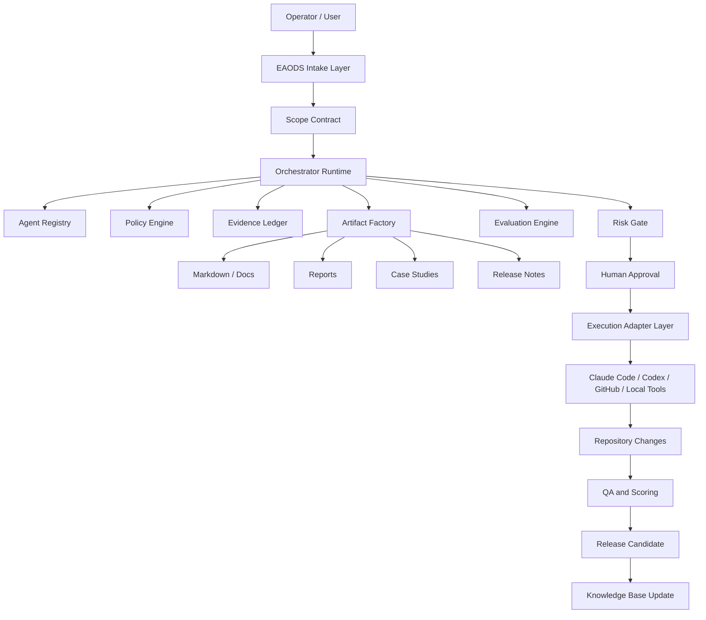

# EAODS v4.1 Target Architecture

## Architecture Name

**EAODS AgentOps Control Plane**

## Concept

EAODS becomes the system that supervises agent work. It does not need to replace Claude Code, Codex, Copilot, Cursor, or Replit. It should govern them.

## Layered Architecture

## Core Design Decision

EAODS should treat every action as a governed transaction.

Each transaction should have:

- request,
- scope,
- owner,
- assigned agent,
- risk tier,
- evidence,
- approval gate,
- output artifact,
- QA score,
- release decision,
- archive location.

## New Runtime Components

| Component | Purpose |
|---|---|
| Policy Engine | Enforces approval gates and rules |
| Evidence Ledger | Records sources, files, decisions, and approvals |
| Capability Registry | Defines what each agent/tool is allowed to do |
| Evaluation Engine | Scores artifacts and blocks low-quality releases |
| Artifact Factory | Generates handbooks, reports, SOPs, releases, case studies |
| Execution Adapter | Future connector layer for Claude Code, Codex, GitHub, MCP, shell |
| Memory Index | Tracks reusable lessons, decisions, and patterns |
| Dashboard Generator | Converts state into executive visibility |

## Strategic Rule

Execution is optional. Governance is mandatory.
