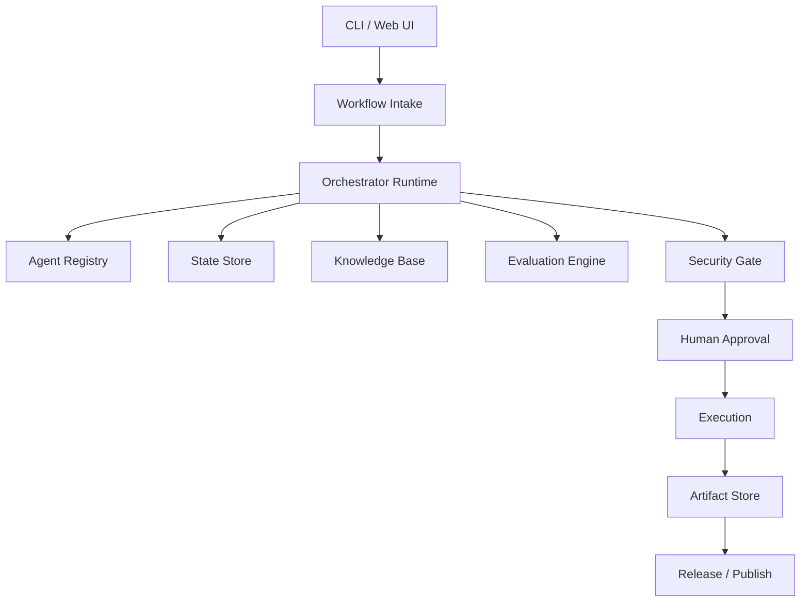

# EAODS v4 Runtime Implementation Roadmap

## Purpose

EAODS v3.2 defines the doctrine. EAODS v4 should implement the runtime.

## Target Architecture

## P0 Features

| Feature | Description | Output |
|---|---|---|
| Agent registry | Define every agent, role, inputs, outputs, and gates | `agents.yaml` |
| Workflow state | Track intake, planning, execution, QA, approval, archive | `workflow_state.yaml` |
| Evaluation CLI | Score artifacts against rubric | `eaods score <file>` |
| Artifact generator | Generate handbook skeletons from agent metadata | Markdown |
| Security gate | Classify requested actions by risk tier | Approval decision |

## P1 Features

| Feature | Description |
|---|---|
| MkDocs publishing workflow | Build and publish documentation |
| Markdown linter | Enforce structure and front matter |
| Evidence registry | Track supporting files and sources |
| Case-study generator | Convert workflows into portfolio-ready case studies |
| Release helper | Generate release notes and changelog |

## P2 Features

| Feature | Description |
|---|---|
| RAG ingestion pipeline | Index approved EAODS documents |
| Executive dashboard | Track artifacts, risks, progress, and QA scores |
| GitHub issue templates | Turn work into tracked documentation tasks |
| Policy-as-code checks | Validate governance requirements |

## Minimum Viable Runtime

The first runnable EAODS implementation should include:

1. `agents.yaml`
2. `workflow_state.yaml`
3. `scorecard.schema.json`
4. `eaods.py` CLI
5. Markdown artifact generator
6. QA scoring command
7. release notes generator

## Definition of Done for V4 Alpha

- Can initialize a repo.
- Can register agents.
- Can create workflow state.
- Can generate an agent handbook.
- Can score a handbook.
- Can produce release notes.
- Can run documentation QA in GitHub Actions.
