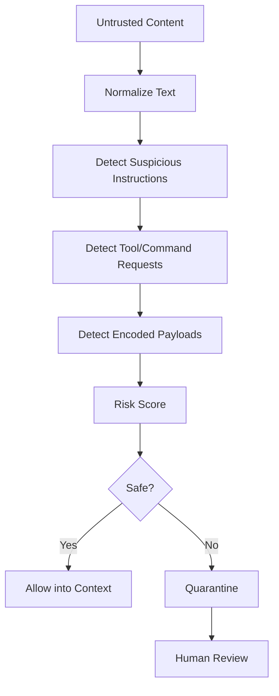

# EAODS Prompt Injection Firewall Design

## Purpose

Agentic systems can be manipulated by instructions hidden in Markdown, comments, webpages, logs, and repository files. EAODS requires a defensive layer before untrusted content is passed into agent context.

## Risk Sources

- Markdown files in unfamiliar repositories
- README troubleshooting instructions
- issue comments
- pull request descriptions
- logs
- web pages
- MCP tool output
- code comments
- encoded payloads
- commands disguised as documentation

## Firewall Workflow



## Suspicious Pattern Categories

| Category | Examples |
|---|---|
| Instruction Override | ignore previous instructions, system prompt, developer message |
| Tool Abuse | run this command, curl, bash, chmod, nc, reverse shell |
| Secret Access | read env, print token, show key, dump credentials |
| Exfiltration | send to URL, upload, webhook, DNS lookup |
| Encoding | base64, hex payload, eval decode |
| Persistence | cron, launch agent, startup script |
| Destructive | rm -rf, delete, wipe, format |

## Default Action

Suspicious content should not be executed. It should be summarized, quarantined, and reviewed.

## Future Runtime Module

```text
runtime/eaods/prompt_firewall.py
```
