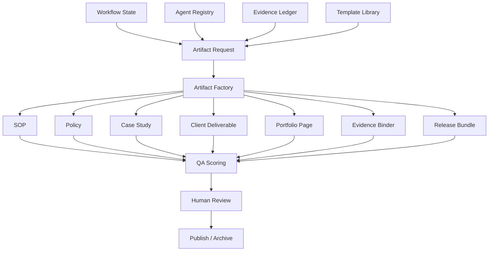

# EAODS Artifact Factory Design

## Purpose

The Artifact Factory turns EAODS from a governance runtime into a production system for structured deliverables.

It generates:

- SOPs
- policies
- case studies
- client-safe deliverables
- portfolio pages
- evidence binders
- release bundles

## Design Principle

Every artifact should be:

1. scoped,
2. versioned,
3. evidence-aware,
4. risk-aware,
5. QA-ready,
6. human-reviewable,
7. reusable,
8. publication-ready.

## Artifact Flow

## Artifact Contract

Each generated artifact must include:

- YAML front matter,
- title,
- version,
- owner,
- generated timestamp,
- classification,
- purpose,
- scope,
- assumptions,
- risks,
- evidence references where available,
- QA checklist,
- human review note.

## Why This Beats Prompt-Only Output

Prompt-only work creates isolated documents. The Artifact Factory creates controlled production artifacts with consistent metadata, quality gates, and lifecycle management.
