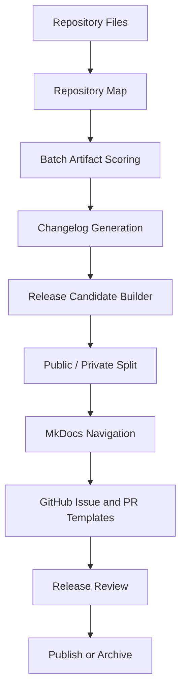

# EAODS GitHub and Publishing Automation Design

## Purpose

EAODS v4.4 adds the publishing layer. The system can now prepare repository-ready documentation assets, score them, package release candidates, and separate public-safe material from private/internal material.

## Publishing Workflow

## Publishing Rules

1. Public bundles must exclude sensitive source appendices unless explicitly approved.
2. Private bundles may include internal governance, working notes, and source appendices.
3. Release candidates must include a manifest.
4. Artifact scoring should be run before release.
5. Files below release threshold should be listed as review-required.
6. GitHub issue and PR text should be generated from workflow state when possible.
7. MkDocs navigation should be generated from Markdown inventory.

## Strategic Improvement

EAODS now has the ability to move from local generation to controlled release operations.
