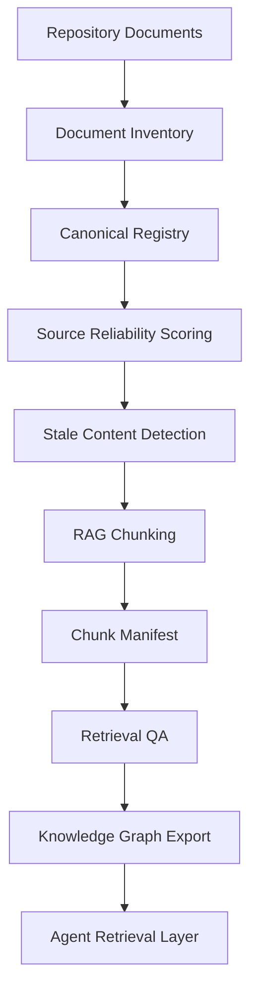

# EAODS RAG and Knowledge Memory Design

## Purpose

EAODS v4.5 adds a knowledge memory layer. The system can now prepare documentation for retrieval-augmented generation, track canonical documents, detect stale files, score source reliability, and export a lightweight knowledge graph.

## Strategic Objective

A serious agent operating system needs durable memory. That memory must be structured, source-aware, version-aware, and quality-aware.

## Knowledge Memory Workflow

## Knowledge Memory Objects

| Object | Purpose |
|---|---|
| Document Registry | Tracks canonical documents and metadata |
| Chunk Manifest | Defines RAG-ready chunks with hashes and source references |
| Reliability Score | Scores source quality and trust level |
| Staleness Report | Flags old or superseded documents |
| Retrieval QA Set | Provides questions and expected source files |
| Knowledge Graph | Exports relationships between agents, documents, topics, and artifacts |

## Memory Principle

Knowledge that cannot identify its source, date, sensitivity, and reliability should not be trusted for high-impact work.
